# 开发指南
* [平台简介](#1)
* [接入流程](#2)
* [快速入门](#3)
    * [基本知识](#3.1)
    * [产品创建](#3.2)
    * [设备开发](#3.3)
    * [自定义云服务开发](#3.4)
    * [APP联调开发](#3.5)
* [开发指导](#4)
    * [Device开发](#4.1)
    	* [Device开发简介](#4.1.1)
        * [开发准备](#4.1.2)
        * [开发指南](#4.1.3)
    * [云端应用开发](#4.2)
        * [云端应用开发简介](#4.2.1)
        * [开发准备](#4.2.2)
        * [开发指南](#4.2.3)
    * [云对接开发](#4.3)
        * [云对接Java SDK简介](#4.3.1)
        * [开发准备](#4.3.2)
        * [开发指南](#4.3.3)
    * [APP开发](#4.4)
        * [iOS](#4.4.1)
        * [Android](#4.4.2)

<h2 id='1'>平台简介</h2>
1 概述

MAX提供设备端、APP端、云端三位一体的开发平台，能够大幅降低物联网产品和应用的开发难度，让厂商的开发者从解决海量设备和用户访问带来的高并发、高可用、安全性等一系列基础问题中解放出来，更多的专注在设备端、App端、应用端的业务逻辑上，专心做好产品和服务的用户体验，并在极短时间内便可完成自身产品的联网智能化。
我们的解决方案中包括：

* 设备端联网固件

* 云应用引擎

* 应用开发SDK

2 设备端联网固件

MAX提供了能够适配多个目前市面上常采购的Wi-Fi厂商的联网固件。
开发者购买WiFi/GPRS联网模块后，将联网固件烧制进去，MCU端修改基本的对接配置，设备便能自动和MAX云端建立安全的数据连接，基于此可以完成远程控制、固件升级、数据上报等。

点击这里了解 MAX 当前支持的联网模块。
3 云应用引擎

物联网产品需要提供优质的服务体验，比如健康管理、用户积分体系等，需要对应进行云端应用的开发，即自定义云端服务。

MAX提供了分布式云端应用引擎，通过弹性扩容的机制提供高并发访问、服务异常情况下容错恢复的特性，让开发者可聚焦云端应用的业务逻辑。

4 应用开发SDK

MAX 提供了 Android 和 iOS 移动应用开发SDK及供 web 后台应用开发的Java、PHP SDK，通过集成SDK快速开发移动App应用或者Web后台应用。
SDK 提供了设备配网、近场通讯、远程控制、固件升级等基础功能，还提供了账号管理、设备管理、设备定时、实时数据等通用服务组件，避免通用云端应用功能的重复开发。

<h2 id='2'>接入流程</h2>
1 MAX注册

需要开发者到MAX官网进行注册，按照页面要求，提供真实完整的申请人基本信息及产品的基本信息。
我们会对每一位注册帐号进行人工审核，审核通过后开通MAX的开发者帐号。

2 商务接洽

信息预审：在注册提交信息后，我们会有相应的工作人员在后台对您提交的信息进行预审。
意向沟通：预审通过后会与您取得联系，与您就合作意向、合作需求进行初步沟通。
签署保密协议：双方确认合作意向后，签署保密协议，互传技术资料。

3 技术评估
双方技术人员沟通确定技术对接方案。

4 商务合同

与客户沟通确定：预估设备量、确定定价、上线时间等合同事宜。
签署合作协议：签署正式合作合同。

5 开发环境产品开发

在开发环境下进行产品功能开发。

6 生产环境产品上线

产品开发完成之后，请联系MAX的客服人员申请上线。MAX后台会将开发环境的配置迁移到生产环境。
开发者再在生产环境进行相关配置后产品正式上线。

`注意：将产品由开发环境转移到生产环境的详细操作步骤详见产品上线操作说明。`

<h2 id='3'>快速入门</h2>
<h3 id='3.1'>产品创建</h3>
1 通用基本概念

在进入正题前，我们简单阐述几个重要的概念，在后续开发中会经常用到。

* 主域：即domain,每个开发者在MAX上的唯一标识；
* 子域：即subdomian,开发者每个产品在MAX上的唯一标识，同一个主域下可以建立多个子域；
* 云应用引擎：云应用引擎是MAX推出的自定义云服务托管平台, 开发者可以基于MAX提供的开发框架开发自定义应用服务并实现云端托管。
* 产品属性：产品属性是用来描述硬件产品功能参数的信息。开发者可以通过在云平台定义产品属性，实现对硬件产品功能参数的持久化存储、查询等相关操作。

>举例：
>
>* 某家电公司在MAX开通了账号，为了标识此公司，MAX给其分配了>代号Galaxy。这个代号我们称之为此公司的主域。
>* 该公司基于MAX开发了一款空调产品叫做Turing，为了标识这款产品，Galaxy公司为其分配了代号turingIV16。这款产品的代号我们称之为子域。
>* 该公司开发者开发了用户活跃积分系统的云端应用服务来提升用户活跃度，此应用服务为自定义云服务，并运行于云应用引擎。
>* 该空调产品包括当前温度、实际温度、风速3个功能参数，开发者在云平台定义了当前温度、实际温度、风速3个产品属性，并通过自定义云服务将产品属性写入云平台。
>

2 物联网应用云架构

下图是物联网应用的基本云架构,MAX 分别提供了设备端、云端、APP 端相对应的 SDK、框架和组件，简化物联网应用的开发复杂度。

* 智能硬件设备搭载了内嵌 MAX 联网固件的联网模块后，即可安全的连接至云端，同各类设备和用户进行安全的数据交互；
* 移动端 App 使用了 MAX App SDK 后，就可以方便快速的针对物联网应用场景做开发；
* 云端开发者在 MAX 云端应用框架的支撑下，可以专注于业务场景，快速开发高可靠分布式的自定义云服务，稳定运行在 MAX 云应用引擎中。

3 主要数据流图

本节中，我们将针对App给设备发送控制指令、设备上报数据这两个场景，从数据流的角度阐述自定义云服务、数据表。

3.1 远程发送控制指令

App给设备发送控制指令的基本流程如下示意图所示：

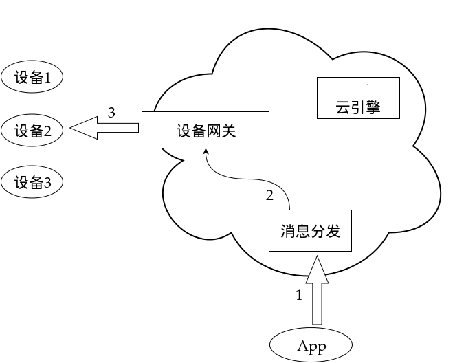

1.App用户通过App上调用的SDK接口（如 sendToDeviceWithOption()），给绑定的某台设备发送控制指令。

2.MAX的接入服务集群对上述消息中的用户身份进行安全认证，对用户访问设备的合法权限进行检查，通过后将控制指令转发给设备网关集群。

3.设备网关集群（GW）通过路由找到设备的长连接通路，将上述控制指令转发至设备。
3.2 设备上报数据

设备上报数据的路径如下示意图所示：

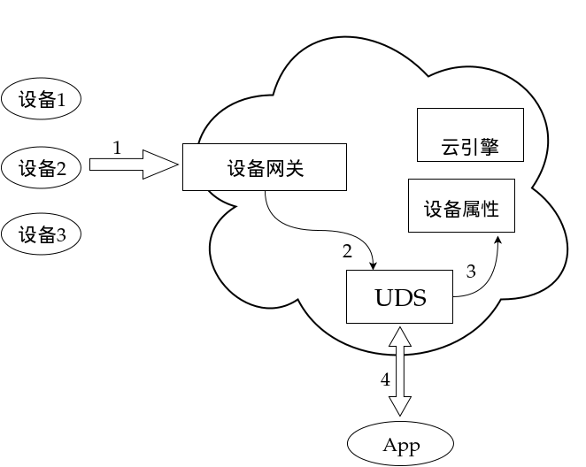

1.设备和MAX设备网关集群建立安全通信链路后，定期或者非定期的上报事件/数据给设备网关集群。

2.设备网关集群按照上报数据帧中包含的基本信息（设备所属的主域和子域），将数据分发至产品对应的自定义服务中。

<h3 id='3.2'>产品创建</h3>
开通账号
首先，开发者需要联系MAX，双方达成合作意向后，获取一个开发者账号，MAX开通客户的账号，确定公司的主域信息。

>转发给自定云服务的消息包括如下基本内容： - 设备所属产品的主域、子域信息，指明设备所属的开发者、产品。 - 设备的唯一标识，如设备的物理 ID。 - 设备实际上报的数据帧。

1.开发者可以在自定义云服务中解析上报的数据帧，识别数据内容，进行相应的处理计算，比如，将上报的数据持久化存储到产品属性中、向此设备绑定的用户发送提醒等。

2.App则可以通过产品属性提供的接口，获取设备有关历史数据。

4 实战进阶
接下来，我们将通过构建一个智能灯demo，来了解如何基于MAX快速打造一款物联网应用。

<h4 id='3.1.2'>创建产品</h4>
1 开通账号

首先，开发者需要联系MAX，双方达成合作意向后，获取一个开发者账号，MAX开通客户的账号，确定公司的主域信息。

2 创建产品

比如我们要开发构建一个物联网应用：智能灯。

对其产品定义如下：

此智能灯可以通过 wifi 连接至云端；
用户可通过物理开关直接控制此灯的开关状态；
用户也可通过 app 控制此灯的开关状态；
用户可以在 app 上看到此灯的开关历史记录；
开发者获取了账号登陆控制台，通过【产品管理 => 新建产品】完成产品新建。

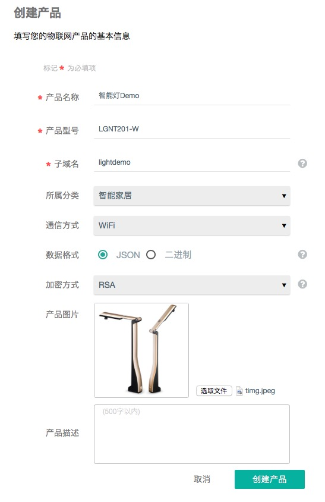

需要注意以下字段：

* 子域名：开发者给产品设置的子域名（主域名、子域名的概念见快速入门-基本知识）。
* 数据格式：如实选择设备和云端通信的数据格式。目前MAX支持 json 或者二进制两种格式的数据流。
* 加密方式：所有连接至 MAX的硬件产品都需要通过加密保证通信链路数据的安全性。可根据可用资源处理能力选择加密类型。

3 定义属性

我们需要知道智能灯的开关状态属性的记录，就需要依赖于产品属性实现。 对产品属性的定义如下：

* switch：智能灯的开关状态属性。
* source：智能灯的操作来源属性。
开发者登录控制台后，通过【产品管理 => 智能灯Demo => 属性管理 => 新建属性 】完成产品属性的定义。


需要注意以下字段：

* 属性名称：属性在控制台上的中文显示名。
* 属性标识：产品维度此属性的唯一标识，不能重复。
* 属性类型：属性的参数类型，例如布尔型、整数型、字符串型等。
创建好的属性如下图所示：


4 创建密钥

设备端可以选择两种安全等级，一是产品级密钥，二是设备级密钥，前者安全性不如后者，但对于设备生产流程而言更方便。

* 产品级秘钥：每个产品的所有设备共享同一个秘钥。
* 设备级秘钥：每个设备一个独立不重复的秘钥。
为了简单，在 demo 中我们选择了使用产品级秘钥。

通过【产品管理 =>（选择产品）=> 管理 => 产品信息】界面，选择【系统生成】来生成一对 RSA 公私钥。 

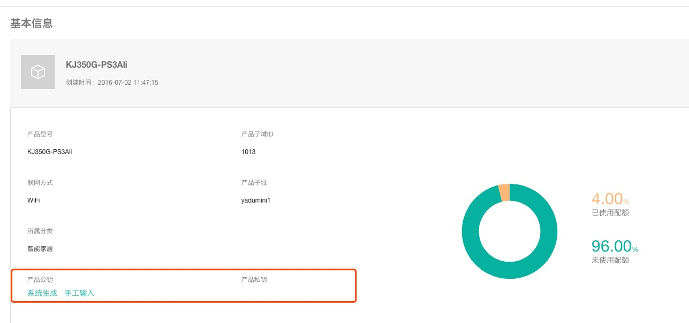

这里生成的设备秘钥对，将在设备开发中使用到。


<h3 id='3.2'>设备开发</h3>
本节中我们将阐述如何获取和烧录设备固件，以及如何使用MCU模拟器进行联网模块配置。

设备端开发和调试涉及如下概念：

* 配网：通过SmartConfig，AirKiss等技术，使WiFi模块获取到路由器的SSID和密码。
* 设备绑定：建立App用户和指定设备间的绑定关系，以实现App用户与指定设备间的访问授权。

1 环境搭建

本demo中，我们以汉枫的WiFi模块LPB100作为WiFi联网模块，以MAX开发的MCU模拟器来模拟MCU。另外，还需要下载并安装用于WiFi配网及设备控制的App（如何下载下面描述）。

>注：如果您使用的WiFi模块不是本Demo中的型号，请联系我们的FAE，我们会提供给您适用于您的WiFi芯片的WiFi固件。目前MAX已经适配了大部分主流的WiFi芯片，具体列表参见合作厂商模块型号。

1.1 软件环境

软件| 说明	| 如何下载 
----|------|----
MCU调试工具	|模拟MCU的软件工具（windows）|请到下载页面的“工具”部分下载
ac-service-android-demo.apk |App Demo调试工具 |	请在下载页面的“Demo下载”部分下载 |
LPBS2W_UPGRADE.bin|	Demo固件|请联系我们获取 
1.2 硬件环境

配置项 | 说明
----|------
USR-WIFI232-G2-EVK V1.2	| WiFi开发板型号
USB串口转接线 |	连接WiFi开发板与PC机
能够连接外网的路由器 |	
环境搭建时各模块连接示意图如下：


汉枫WiFi模块开发板连线图如下：
>需要注意红色方框中跳线帽的连接！


2 开始

环境搭建好后，我们开始按如下步骤实现demo功能：

2.1 烧录WiFi固件

将下载的WiFi固件烧录到您的WiFi芯片中。具体的烧录方法请参见您的WiFi芯片对应的固件升级文档，也可以联系我们的FAE。

>本Demo中的汉枫LPB100的固件升级方法可以参考汉枫LPB100固件升级流程。
>
>固件烧录后，请始终保持WiFi在上电状态。

2.2 配置模拟MCU

在PC端双击MCU模拟器.exe后，在弹出的视窗中填写相应的信息，MCU模拟器界面如下： 

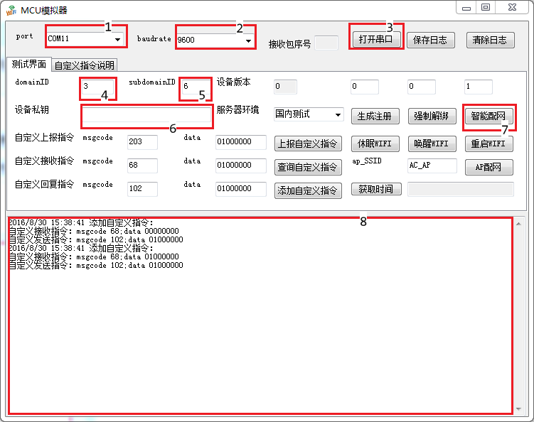


图中，用红框标出的区域为开发者需要关心的地方，其中：

* 窗口1：WiFi连接到PC机上的串口端口号，MCU模拟器会自动检测
* 窗口2：MCU模拟器与WiFi进行串口通信时的波特率，Demo采用的是9600
* 窗口3：串口开关按钮
* 窗口4：开发者的DomainId
* 窗口5：开发者注册的产品的SubDomainId
* 窗口6：开发者注册产品时，生成的RSA密钥对中的私钥
* 窗口7：触发WiFi模块进入配网状态的按钮，处于配网状态的WiFi模块会等待App进行配网以获取路由器的SSID和密码
* 窗口8：MCU模拟器的串口数据输出区，MCU与WiFi模块的交互过程中的log信息会显示在此处

2.3 通过MCU触发配网

点击MCU模拟器中的“打开串口”按钮，之后点击“智能配网”按钮，会使WiFi模块重新进入配网状态，MCU模拟器会显示如下log：

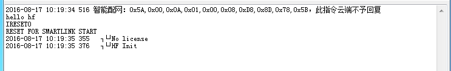

至此，设备还需要通过App完成配网，然后才可以连接云端，并进行绑定、控制等操作。

<h3 id='3.3'>自定义云服务开发</h3>
本节介绍如何将智能灯云端自定义云服务 Demo运行在MAX提供的云应用引擎之上。

>以下内容假设开发者有一定的 Java 基础，确保安装1.7版本及以上版本的JDK。

1 环境安装

首先请按照如下文档安装 IntelliJ IDE 和 Maven（至少 3.2 以上版本）。

* [IntelliJ IDE](http://www.phperz.com/article/15/0923/159066.html)

* [Maven](http://wiki.jikexueyuan.com/project/maven/environment-setup.html)

安装好 Maven 后，使用 `mvn -version` 来检查是否安装成功。

2 本地运行 Demo

开发者首先在本地进行开发和调试自定义云服务，可在本地运行自定义云服务，方便调试和查看问题。

>注意：
>
>1.本机运行自定义云服务要求已安装 Java 的运行时环境 JRE（推荐 1.7 或更新版本）。
>
>2.DemoService只能在英文目录下执行。
>

步骤如下：

Step 1

从 MAX 下载页面下载智能灯的云端 自定义云服务demo。
解压后包括两个部分，其中`/src` 是自定义云服务的源代码，`/package` 的目录结构则是自定义云服务的打包结构、不能随意修改。

Step 2

进入 `/package` 目录。修改 `/config` 文件夹下的 `cloudservice-conf.xml` 文件。

按照下面注释的信息，分别填写开发者 ID、开发者秘钥对、主域子域信息。

>开发者 ID，开发者秘钥对（access-key，secret-key），主域子域等信息，均能登录 MAX 开发者控制台获取：
>
> * 开发者 ID：【个人中心 => 开发者 ID】获取。
> * 开发者秘钥对：【服务管理 => 开发秘钥】任选一对 AK/SK > * 签名秘钥即可（AK/SK 签名原理请参考这里）。
> * 主域：【个人中心 => 主域】获取。
> * 子域：【产品管理】页面上，查看特定产品的子域。

```xml
<?xml version="1.0" encoding="UTF-8"?>
<configuration>
    <developer>
        <!-- 控制台路径：【个人信息->个人信息->开发者ID】 -->
        <id>此处填写你的开发者ID</id>
    </developer>

    <authentication>
        <!-- 控制台路径：【密钥对管理->全部密钥对】，选择已启用的任意一对。 -->
        <access-key>此处填写开发者 access-key</access-key>
        <secret-key>此处填写开发者 secret-key</secret-key>
    </authentication>

    <service>
        <!-- 控制台路径：【产品管理->产品列表->主域名】 -->
        <major-domain>此处填写你的主域名</major-domain>
        <!-- 控制台路径：【产品管理->产品列表->子域名】 -->
        <sub-domain>此处填写自定义云服务对应的产品的子域名</sub-domain>
    </service>
</configuration>
```

Step 3

demo 中为了能够查询开关状态属性纪录，需要持久化存储设备上报的开关记录数据。

通过开发者管理控制台的【产品管理=>智能灯Demo=>属性管理】完成设备上报属性参数的定义。

定义好的属性如下图所示：


Step 4

进入 `/package` 目录。

Linux 下，在终端运行如下命令启动服务：

```
sh start.sh
```
Windows 下，在 cmd 窗口中运行如下命令启动服务：

```
start.cmd
```

至此，本地自定义云服务提供 Restful API 的一个服务就已经启动了，通过文件夹下的 /log 目录可以看到服务运行的日志。

本地启动自定义云服务成功后，可使用 curl 命令进行测试。

>注意： Linux 系统上如果没有 curl 则使用诸如 apt-get install curl（Ubuntu、Debian）或者 yum install curl（RedHat、Fedora）的方式来安装。 Windows 系统上安装 curl 的方法见[这里](http://jingyan.baidu.com/article/a681b0dec4c67a3b1943467c.html)。

测试用的 curl 指令如下：

>注意： 下面的 curl 指令中有两处需开发者自行修改：
>
> 1.将 X-Zc-Major-Domain: DOMAIN_NAME 中的 DOMAIN_NAME 替换成开发者主域。
>
> 2.将 X-Zc-Sub-Domain: SUBDOMAIN_NAME 中的 SUBDOMAIN_NAME 替换成产品子域。
>
>主域和子域参考上述《本地运行 Demo》里的 Step 2。

```
curl -v -X POST -H "Content-Type:application/x-zc-object" -H "X-Zc-User-Id:1" -H "X-Zc-Major-Domain: DOMAIN_NAME" -H "X-Zc-Sub-Domain: SUBDOMAIN_NAME" --data-ascii "{\"action\":\"I am test\"}" "http://localHost:8080/test"
```

简单解释一下上面的 curl 指令（更多 curl 用法请参考 curl 手册）：

* -v 表示 verbose 即显示 HTTP 通信交互详情。
* -x POST 表示使用 HTTP POST 方法。
* -H 表示 HTTP 请求头。
* --data-ascii 表示本请求的 HTTP body 格式是 ASCII。 其余经常用到的格式还有 --data-binary，即按照字节流（octet stream）来发送请求；具体使用请参考 curl 手册，此处不赘述。
* "http://localHost:8080/test" 表示给本地 8080 端口运行的自定义云服务的 test 方法发送请求。 8080 是自定义云服务demo本地默认的端口号，见 /config 文件夹下的 cloudservice-conf.xml 文件，<service> <port> 配置。 test 方法是专供测试使用的一个方法，什么动作都不会触发，只回复一个空HTTP响应（没有任何 payload 的 HTTP 响应）表示请求被正常处理。

发送了上述 curl 指令后，开发者应该可以在控制台上看到类似下面的响应。

```
< HTTP/1.1 200 OK
< Content-Type: application/x-zc-object
< X-Zc-Msg-Name: X-Zc-Ack
< Content-Length: 0
```

其中：

* 200 是 HTTP 返回码（表示 HTTP 请求正常返回）；
* X-Zc-Msg-Name 是 MAX 服务框架自定义的 HTTP 请求头，当此值等于 X-Zc-Ack 时表示请求被正常处理（反之，如果是 X-Zc-Err 则表示出现了错误，并会附带错误码和错误详情）；
至此，我们已完成了本地运行 自定义云服务demo 和发送 curl 指令进行测试。

3 发布服务

接下来，我们将阐述如何编译
自定义云服务demo（见下面的《[编译自定义云服务工程](#3.4)》），并将编译好的自定义云服务发布至云端（见《[发布自定义云服务](#3.4)》。

3.1 编译自定义云服务工程

在上面的环境安装中，开发者已经安装了 maven 并使用 `mvn -version` 验证了安装是否成功。

本节中，将阐述如何利用 maven 来编译自定义云服务工程。

非常简单，只需要如下两步。

Step 1

进入下载的 demo 解压缩后的文件夹，修改 maven 的项目对象模型（project object model）文件 `pom.xml`。

修改下面的部分，其余部分都无需变动。

```
<groupId>com.MAX.demo</groupId>
<artifactId>demo_service</artifactId>
<version>1.1.9</version>
```

上面三项的准确含义，请参考 maven 文档。 简单来说：

* `groupId` 就是服务源代码文件夹所在的目录结构；
* `artifactId` 是开发者给自己的自定义云服务起的名字（可以任意自定义）；
* `version` 就是开发者给自己的自定义云服务标记的版本号（便于开发者管理版本）。
因此，一般来说，开发者可以任性修改 artifactId 和 version，groupId 则保持不变。

Step 2

依然是在上述文件夹（有 pom.xml 文件的文件夹）内，打开终端（Linux）或者 cmd 窗口（Windows），执行 mvn package 开始打包。

初次打包会花费较长时间，等待一段时间后，就能在终端或者 cmd 中看到类似下面的信息。

```
[INFO] BUILD SUCCESS
[INFO] ------------------------------------------------------------------------
[INFO] Total time: 3.582s
[INFO] Finished at: Wed Aug 17 16:34:14 CST 2016
[INFO] Final Memory: 8M/151M
[INFO] ------------------------------------------------------------------------
```

至此，开发者就已经完成了服务编译，可以在项目文件夹的 `package/lib` 路径下找到对应的 jar 包了。
比如，在第一步中开发者设置的 `artifactId` 是 `demo_service`，那么在 `package/lib` 文件夹中就能看到刚打包生成的 `demo_service.jar` 包。

3.2 发布自定义云服务

UDS完成本地开发和测试后，按照要求的目录结构打包成 zip，即可上传到 MAX 云应用引擎完成上线发布。

具体步骤如下：

Step 1

进入 demo 文件夹里的 `package` 路径，然后将 `package` 路径下所有内容打包成 zip。 再次说明：要求 zip 文件解压缩后能直接得到此目录结构，不能存在其它中间层次的目录。

Step 2

登陆管理控制台，通过【服务管理 => 自定义云服务 => 新建服务】可创建产品（子域）级别的自定义云服务，也可以创建主域级别的自定义云服务。

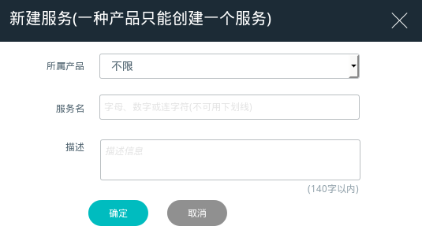

* 所属产品：在下拉菜单中，选择前面我们创建的产品。
* 服务名：填写自定义云服务的名称，如 demo_service。
* 服务描述：填写自定义云服务的描述。

之后，我们就可以在【服务管理 => 自定义云服务】里看到新建的服务了。

Step 3

点击 Step 2 里新建的服务的【配置】，就能进行版本管理，并上传服务到MAX的分布式应用引擎里运行了。

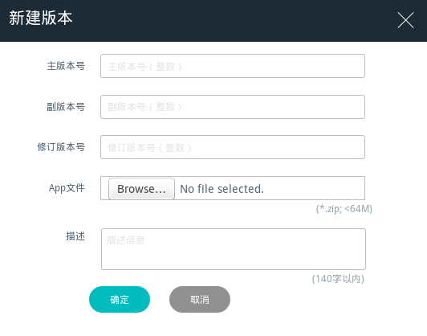

* 主版本、副版本、修订版本号：MAX 对自定义云服务采取的一种版本约定，即类似于上面在 pom.xml 文件里填写的 version 参数（1.9.1）。
* App 文件：Step 1 里打包的 zip 包。
Step 4

我们可通过控制台【服务管理 =>自定义云服务 => 版本管理 => 上线/下线】，管理/查看此自定义云服务版本的运行状态了。

3.3 设置设备转发

创建完成自定义云服务后，设备可以选择将设备转发到指定的UDS服务，回到之前创建的智能灯设备配置之中，选择将设备数据转发到此自定义云服务。
如下图所示。


<h3 id='3.4'>APP联调开发</h3>
本节是《快速入门》的最后一节，开发者将通过App Demo对设备进行配网、绑定设备、控制设备，设备通过上报开关状态和自定义云服务进行联调，通过App查看操作的历史纪录，将App和自定义云服务进行功能联调。

1 App Domain配置

将上一步中下载的App Demo调试工具安装到安卓手机中并运行。
在界面的右上角点击“Domain配置”，在弹出的界面内填写信息，示意如下图：

>注意：
开发者需要填写自己在"注册开发者账号和注册产品"时注册的产品的Domain、DomainId以及SubDomain

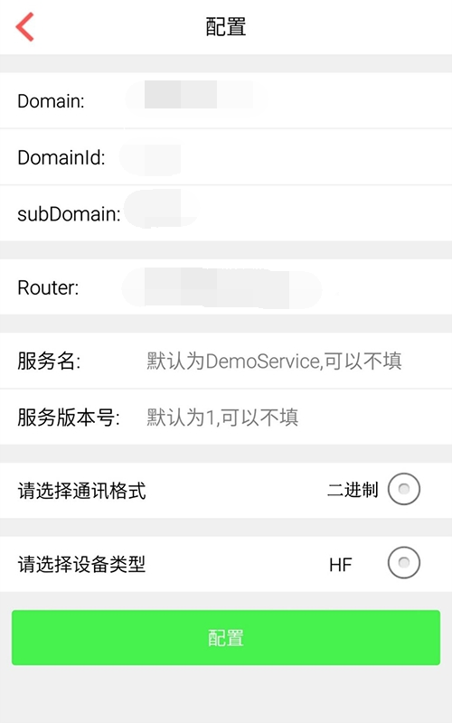

之后，点击“配置”按钮，回到登录界面。

2 App用户注册并登录

Domain配置结束后，在返回的在登录界面里，点击“新用户注册”，在弹出的界面填写用户注册信息：

>注意：
开发者需要填写自己的信息，下图中的内容只是示意。

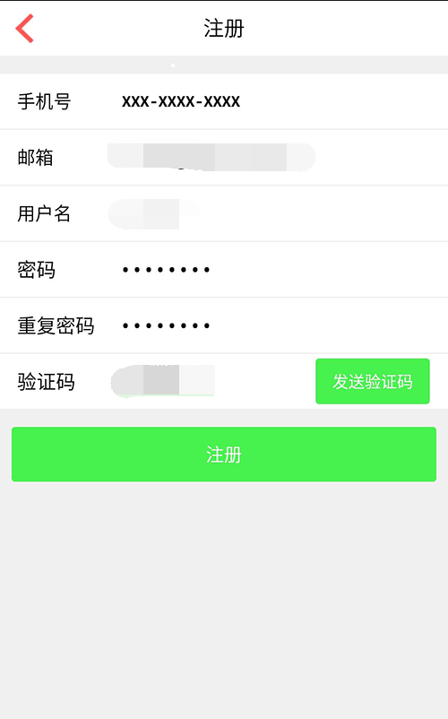

注册成功后，在登录界面输入用户名和密码，点击登录。

3 设备绑定
保证路由器正常工作的前提下，在App上点击“添加新设备”后，输入路由器的信息，WiFi模块会自动连接MAX的云端服务器，在MCU模拟器上显示如下log：

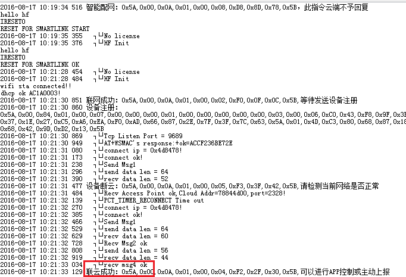

App会弹出如下界面： 

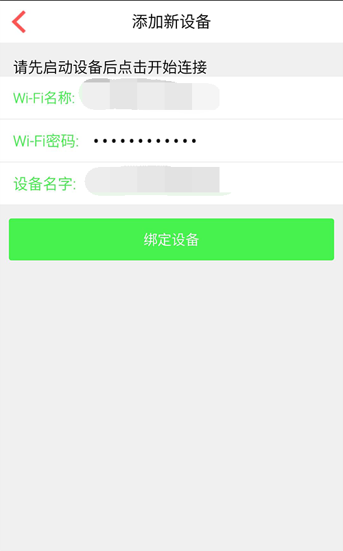

输入用户自定义的设备名称后，点击绑定设备，App会弹出如下界面：


4 设备控制

设备绑定成功后，就可以通过App对设备进行远程控制了，点击App上的开/关灯按钮，在MCU模拟器上会有相应的log打印，表明MCU收到并响应了App的远程控制指令： 

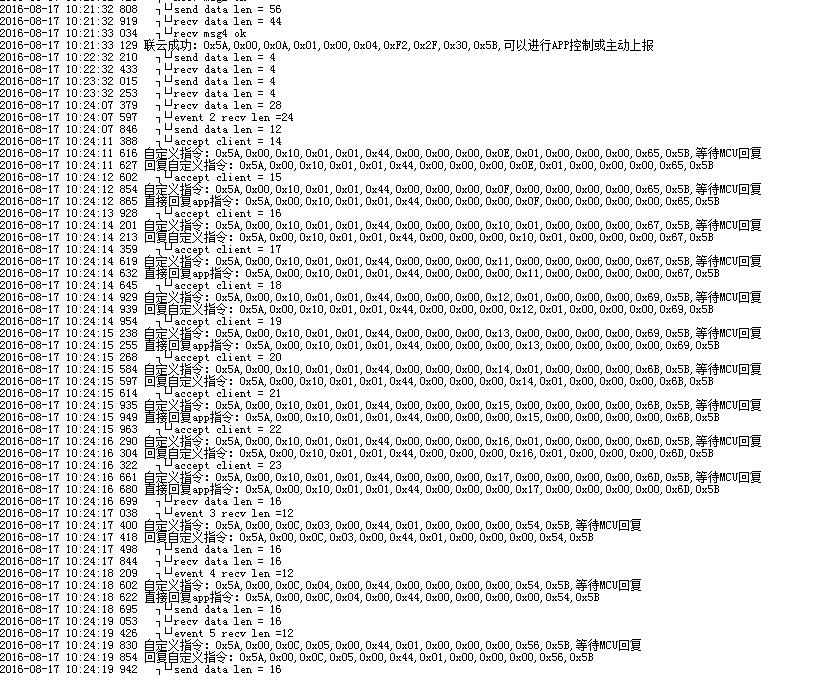

5 查看开关记录

如果在“自定义云服务开发”章节中，按照步骤创建了自定义云服务，则可以在App中查看到对应的

历史开关灯的记录： 

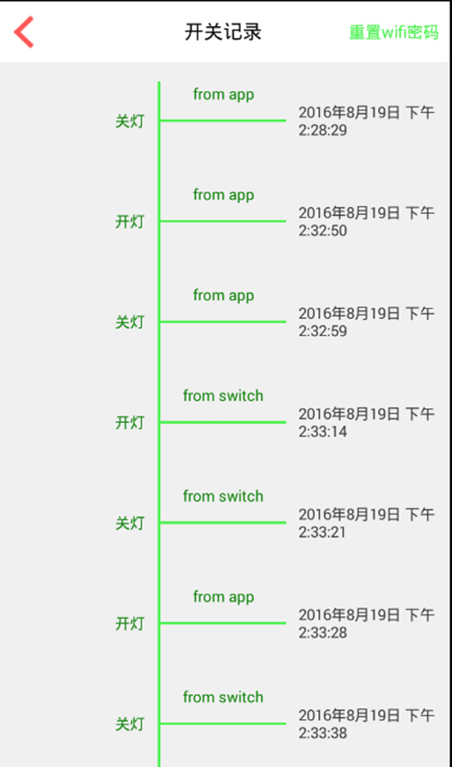

>注意：
想要了解更多自定义云服务实现层面的细节，请阅读自定义云服务开发指导。
至此，一个智能灯的Demo完整运行起来了，涉及准备开发者账号、自定义云服务开发、设备端开发以及App端的配网、绑定、控制、查看历史纪录等功能。

如果中间有任何的疑问，可以联系MAX的技术支持，我们会竭诚为您服务！

<h2 id='4'>开发指导</h2>
<h3 id='4.1'>Device开发</h3>
<h4 id='4.1.1'>Device开发简介</h4>
1 功能与目的

为了快速开发和业务逻辑相关的设备端程序，提高开发者效率，提高企业产品研发/上线的效率，MAX提供了设备接入sdk的lib库和接口c文件。方便开发者将代码添加到正在开发中或者已有的成熟的产品中。	


2 主要功能

序号|功能名称|	详细内容
---|---|---
1.|	通讯加密|	自动将通讯过程中的数据加密解密，保障用户数据安全
2.| 注册认证|	自动跟服务器连接并发送认证
3.|	心跳保持|	自动发送和处理心跳包，可以维持长连接或实时获取设备状态
4.|	消息交互|	与云端、APP端进行消息交互通信
5.|	自动重连|	在网络情况导致tcp连接断开时，自动重新建立tcp连接
6.|	实时消息|	接收云端实时推送的数据
7.|	定时任务|	定时触发自定义任务响应
8.|	OTA升级|	    接收OTA数据，调用自定义接口对设备进行远程升级


<h4 id='4.1.2'>开发准备</h4>
<h5 id='4.1.2.1'>开发准备</h5>
1 SDK发布库
fnic发布的设备端SDK为fnic_cloud_adpter_*.c fnic_cloud_api_*.h和fnic_sdk_lib_*.lib

>注意:
>
>fnic_sdk_lib_*.lib为fnic设备sdk核心库文件，fnic_cloud_adpter_*.c为用户实现功能接口文件，fnic_cloud_api_*.h为fnic设备端核心功能接口文件

2 开发环境设置

- 设备的MCU需要空余20k+的RAM和20k+的ROM
- 设备支持建立TCP连接能力(不区分wifi和gprs)
- 编译器支持c语言编译,并至少支持C98标准
- 原软件架构提供定时器等能够以固定周期调用函数的能力
- 设计堆栈深度不小于1k

<h4 id='4.1.3'>开发指南</h4>
<h5 id='4.1.3.1'>添加设备端sdk到工程</h5>
开发者在使用设备端sdk开发设备时，在保证原有工程能正确编译的情况下，只需要将fnic_sdk_lib_*.lib和fnic_cloud_adpter_*.c添加到工程中即可。使用IDE作为开发环境的，将fnic_sdk_lib_*.lib和fnic_cloud_adpter_*.c添加到工程文件列表中。使用脚本编译开发时，在Makefile中加入 -L fnic_sdk_lib_*.lib,并将fnic_cloud_adpter_*.c添加到Makefile中指定的文件夹下即可

<h5 id='4.1.3.2'>修改fnic_cloud_adpter_*.c文件实现适配</h5>
1 修改设备连接的服务器的IP地址
```
  char *server_ip = "122.97.128.163";
```

2 定义设备ID
```
/*********************************************  */
/*  定义设备ID  每个设备对应唯一的ID            */
/*  根据需求定义设置唯一ID ，不可重复           */
/************************************************/
char  g_u8DeviceId[65] = "GPRS0001";
```

3 定义设备类型
```
/*********************************************  */
/*  定义设备类型                                */
/*  字符串，最长为8个有效字符                   */
/************************************************/
char  g_u8MoudleType[9] = "SIM800";
```

4 定义设备版本
```
/*********************************************  */
/*  定义设备VERSION                             */
/************************************************/
#define VERSION_MAIN     1
#define VERSION_SECOND   0
#define VERSION_LAST     1
uint32_t  DEVICE_VERSION = (int)VERSION_MAIN<<16 | (int)VERSION_SECOND<<8 | (int)(VERSION_LAST);
```

5 定义主域ID和子域ID
```
/*********************************************  */
/*  定义主域ID和子域ID                          */
/*  主域ID默认为1 每类产品对应唯一的子域ID      */
/************************************************/
uint64_t Major_Domain_ID = 1;
uint64_t Sub_Domain_ID = 7;
```

6 定义产品私钥 
```
/*********************************************  */
/*  g_u8ModuleKey 产品私钥 在产品总览中可以查看 */
/*  每个产品对应一个产品私钥                    */
/************************************************/
const uint8_t  g_u8ModuleKey[112] = 
{
	0x9C,0xE3,0xEC,0x9D,0x42,0x2D,0x65,0xA2,0x56,0xC4,0xF4,0x94,0x26,0x4E,0xC2,0x03,
	0x80,0x01,0x3B,0xA3,0xFB,0x4D,0x63,0xEB,0x62,0x1C,0x54,0x22,0x45,0xDA,0xCB,0xA5,
	0xCF,0xCE,0x11,0xBA,0x45,0xD1,0x96,0xFC,0x9D,0x1E,0x4A,0xC2,0x65,0x30,0xC4,0x65,
	0xC1,0x46,0xEB,0x2D,0x5A,0x10,0xED,0x34,0x70,0x86,0xDC,0x8B,0xB3,0x13,0x56,0x41,
	0x9C,0x3E,0x98,0xDD,0xB1,0xB9,0x51,0x09,0x47,0x29,0x8B,0x94,0x76,0x79,0x20,0x71,
	0x2B,0x0A,0x21,0xE0,0xCD,0x87,0xAB,0x6A,0xDC,0x0C,0x0C,0x1C,0xC7,0xD9,0xEC,0x81,
	0xC5,0xA1,0x07,0x9B,0x12,0x7B,0xBB,0x0E,0xF3,0x5C,0xA6,0x66,0x90,0xB2,0xA7,0x27 
};
```

7 实现网络连接初始化功能
```
//网络连接初始化
//如果网络初始化由别处处理，此处可以留空
void Fnic_Network_Init(void)
{
	SIM800_Tcp_Init();
}
```

8 实现获取网络状态功能
```
//获取网络状态
uint8_t Fnic_Check_Net_Status(void)
{
	return FNIC_RET_OK;
}
```

9 实现建立TCP连接功能
```
//建立TCP连接，入参为IP地址和端口号
//返回值 失败:-1  否则返回socket号
int32_t Fnic_Tcp_Connect(char *pIPString,uint16_t port)
{
	
	return SIM800_Tcp_Connect(pIPString,port);

}
```

10 实现关闭TCP连接功能
```
//关闭TCP连接，入参为socket号
//返回值 失败:1 成功 0
uint8_t Fnic_Tcp_Close(uint32_t socket)
{
	uint8_t ret;
	
	ret = SIM800_Tcp_Close();
	
	return ret;
}
```

11 实现关闭TCP数据发送功能
```
//发送TCP数据，入参为socket号，数据指针，数据长度
//返回值 失败:1 成功 0
uint8_t Fnic_Tcp_Send(uint32_t socket,char *pdata,uint16_t len)
{
	uint8_t ret;
	
	ret = SIM800_Tcp_Send(pdata,len);
	
	return ret;
}
```

12 实现关闭TCP数据接收功能
```
//接收TCP数据，入参为socket号，数据指针，数据长度
//返回值 失败:1 成功 0
uint8_t Fnic_Tcp_Recv(uint32_t socket,char *pdata,uint16_t *plen)
{
	uint8_t ret;
	
	ret = SIM800_Tcp_Recv(pdata,plen);
	
	return ret;
}
```

13 实现获取系统时间功能
```
//接收 空
//返回值 系统时间 单位为ms
uint32_t Fnic_Get_System_RunTime(void)
{
	extern uint32_t OSTimeGet (void);
	return OSTimeGet();
}
```

13 实现周期性调用fnic功能，这里以uCOS为例
```
/*********************************************  */
/*  Fnic_Communication_Dispose             */
/*  此函数应周期调用，间隔不多于50ms            */
/************************************************/
extern void Fnic_Communication_Dispose(void);
static uint32_t Fnic__Server_Stk[2048];

extern void OSTimeDly (uint16_t ticks);
extern uint8_t OSTaskCreate (void (*task)(void *p_arg), void *p_arg, uint32_t *ptos,uint8_t prio);

void Fnic_Server(void *pPara)
{

	
	
	while(1)																	
	{
		Fnic_Communication_Dispose();
		OSTimeDly(50);		
	}
}


void Fnic_Server_Init(void)
{
	OSTaskCreate(Fnic_Server,(void*)0,&Fnic__Server_Stk[2048-1],10);
}
```

14 向云端发送消息
```
void AC_SendUserMsg(u8 *pdata)
{
   u16 u16DateLen;
   u8 u8MsgBuildBuffer[20];

   AC_BuildMessage(203, 0, 
       pdata, 10,        /*payload+payload len*/
       NULL,
       u8MsgBuildBuffer, &u16DateLen);
   
   AC_SendMessage(u8MsgBuildBuffer, u16DateLen);
}

u8 sendbuf[10] = {1,2,3,4,5,6,7,8,9,10};
if (PCT_STATE_CONNECT_CLOUD == g_struProtocolController.u8MainState)
{
	AC_SendUserMsg(sendbuf);
}
```


<h3 id='4.2'>云端应用开发</h3>
<h4 id='4.2.1'>云端应用开发简介</h4>
1 功能与目的

为了快速开发和业务逻辑相关的服务端程序，提高开发者效率，提高企业产品研发/上线的效率，MAX提供了统一的服务开发框架，并内嵌了一系列由MAX提供的云端服务。该框架支持开发者开发可运行于MAX云端的自定义后端服务（UDS：User Defined Service）以及定时任务。MAX的服务框架提供了高度封装的RPC服务，client与server通信时，client只需要知道service的名字，并提供相应的访问参数即可。
当前MAX提供Java版本的服务编程框架。

2 主要功能

序号|功能名称|	详细内容
---|---|---
1.|	UDS服务|	可运行于MAX云端的自定义后端服务
2.|定时任务|	可定时触发的自定义定时任务
3.|	正向代理|	通过正向代理服务支持UDS服务访问外部网络
4.|	消息交互|	与设备端、APP端进行消息交互通信
5.|	账号管理|	支持管理用户基本信息并及时做出操作
6.|	设备管理|	支持管理设备的基本信息并及时做出操作
7.|	设备属性|	MAX提供的用于处理及存储设备上报数据的服务
8.|	存储服务|	MAX提供的类似数据库的通用数据存储服务
9.|	文件存储|	对常见的文件/图片类等大文件进行上传下载
10.|	排行榜|	支持按照不同周期、数据获取数据排行
11.|	推送服务|	对APP进行消息推送
12.|	用户意见反馈|	支持快速开发用户意见反馈页
13.|	短信服务|	向当前注册用户发送自定义短信消息
14.|	天气服务|	支持快速获取PM2.5、天气/空气质量等常用天气信息
15.|	定时服务|	定时向设备下发消息
16.|	测试桩|	模拟真实设备或者服务接收并响应消息

<h4 id='4.2.2'>开发准备</h4>
本章先介绍UDS（User Defined Service）在MAX平台上的发布要求，然后以官网上发布的DemoService为基础，介绍如何在本地运行UDS服务，以及如何开发自己的UDS服务。

1 UDS发布说明

在MAX管理控制台中，设备通过长连接上报数据可以由对应产品指定转发的UDS来处理。 其它业务请求（包括设备或其它客户端发起的）也可以由请求发起方选择由指定UDS来处理。

开发者可通过MAX开发者管理控制台提交、运行UDS。提交和运行UDS时，要求压缩包其目录结构与MAX发布的Java版本服务开发框架一致，如下所示。

```
/config
    /cloudservice-conf.xml
/lib
    /MAX-framework-1.5.6.jar
    /ac-java-api-1.6.3.jar
    /commons-collections-3.2.1.jar
    /commons-configuration-1.10.jar
    /commons-lang-2.6.jar
    /slf4j-api-1.7.7.jar
    /...
start.sh
start.cmd
```

>注意事项：
>
>1.所有依赖的第三方jar包，均放在lib文件夹下。其中包括MAX的服务框架MAX-framework-1.5.6.jar和ac-java-api-1.6.3.jar。根据SDK的发行状态，各jar包的版本号可能不同。
>
>2.开发者开发的UDS服务需要编译成jar包，并置于lib文件夹下。另外，开发者自己所引用的第三方jar包，也需要一并置于lib文件夹下。
>
>3.按上述目录结构将所有文件压缩、打包成一个ZIP文件（文件名可自取）。要求ZIP文件解压缩后能直接得到上述目录或文件，不能存在其它中间层次的目录。
>
>4.在开发者管理控制台中提交压缩后的ZIP文件，之后即可通过“上线”/“下线”功能管理UDS的运行状态。

2 本机运行UDS

本机运行UDS要求已安装Java的运行时环境JRE（推荐1.7或更新版本）。

1、首先，从MAX官网下载栏目下载DemoService.zip，解压后进入package目录，修改config文件夹下的cloudservice-conf.xml文件。

```
<?xml version="1.0" encoding="UTF-8"?>
<configuration>
    <developer>
        <!-- 对应“管理控制台->开发者ID” -->
        <id>4</id>
    </developer>

    <authentication>
        <!-- 对应“服务管理->开发密钥”，选择已启用的任意一对。 -->
        <access-key>33df24a54054067e80af49d939b429c2</access-key>
        <secret-key>5e2fec3440e23c5e807910b13b672015</secret-key>
    </authentication>

    <service>
        <!-- 对应“产品管理->产品列表->主域名” -->
        <major-domain>MAX</major-domain>
        <!-- 对应“产品管理->产品列表->子域” -->
        <sub-domain>demo</sub-domain>
    </service>
</configuration>
```

>注：开发者ID，access-key，secret-key等信息，均能登录MAX网站（开发者管理控制台）获取。其它项不需要修改。
2、启动终端，进入package目录下，接下来就可以在本地启动服务并进行测试。

linux下在终端运行如下命令启动服务：
```
sh start.sh
```
windows下在cmd中运行如下命令启动服务：
```
start.cmd
```
本地启动成功后，可使用curl命令进行开灯测试。

linux下使用curl命令：

```
curl -v -X POST -H "Content-Type:application/x-zc-object"  -H "X-Zc-Major-Domain:MAX" -H "X-Zc-Sub-Domain:test" -H "X-Zc-User-Id:1" -d "{\"action\":\"I'm test\"}" 'http://localHost:8080/test'
```
windows下使用curl命令请求：

```
curl -v -X POST -H "Content-Type:application/x-zc-object" -H "X-Zc-Major-Domain:MAX" -H "X-Zc-Sub-Domain:test" -H "X-Zc-User-Id:1" --data-ascii "{\"action\":\"I'm test\"}" "http://localHost:8080/test"
```
>注：X-Zc-Major-Domain是开发者帐号的主域的名字；X-Zc-Sub-Domain是要访问的服务所关联的子域的名字；X-Zc-User-Id是用户的ID。

3 开始自己的UDS程序

3.1 系统准备

在进行开发前，需要对系统以及环境进行设置。目前框架只支持java语言，因此系统准备基本都是和java相关，如JDK、maven等。

* JDK

安装JDK，建议采用1.7版本JDK。

* maven

安装maven，建议采用3.2以上版本。

* Cloud SDK

点此进入下载页 获取MAX云端服务SDK

3.2 新建maven工程

熟悉上述流程之后，可以开始开发自己的UDS程序。以下从开始逐步介绍开发步骤。

Intellij

1、 新建工程

选择新建maven工程，JDK选择正确的版本。

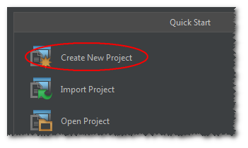

选择maven工程。

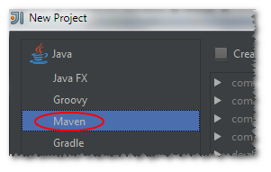

注意JDK版本选择安装的1.7。点击next即可。


进入下一个页面，根据情况填写groupid/artifactid/version等信息。

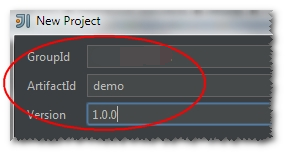


填好后点击next，进入下一步，填写工程名以及存放路径。


然后点击finish完成新建工程向导。


至此，新建工程完成。

2、 部署MAX框架便于本机测试以及提交版本

新建package目录，将MAX-framework-1.4.0.zip解压到package目录下。

>package子目录的结构为config/、lib/、start.sh文件等

3、 设置工程

设置编码方式，建议将字符编码设置为UTF-8或GBK

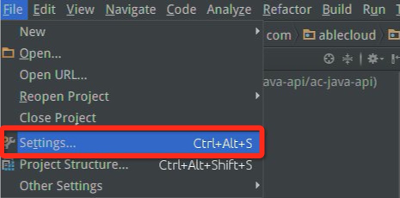


按照步骤1完成了工程的新建，还需对工程属性进行一些设置以方便后续的编译、单测。 点击File -> Project Structure...

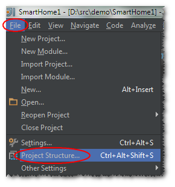

首先设置工程所使用的JDK版本1.7和语言级别7.0。


设置开发服务所要依赖的MAX框架包：同上，打开Project Structure...,然后选择Libraries，点击右边的+号，选择Java，如下图所示。

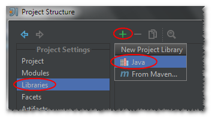

在弹出的对话框中选择下载并解压后的MAX中的lib目录，并点击OK。

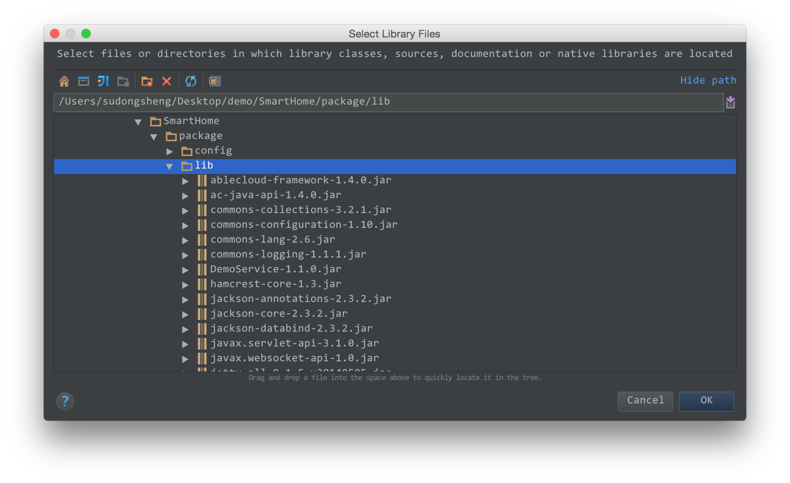

回到上一个窗口后再次点击OK确认。

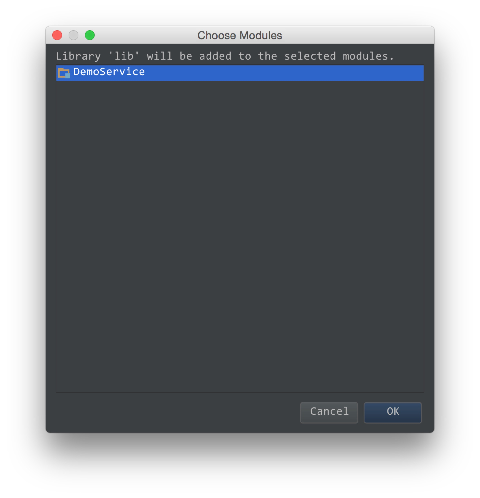

这个过程中，我们可以对添加的lib库重命名（可选），例如这里重命名为MAX-libs。点击OK完成添加。

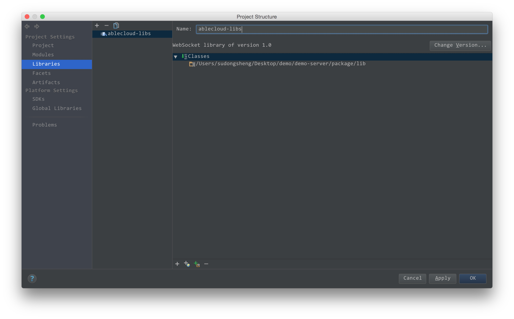

至此，UDS开发所依赖的MAX开发框架库添加成功。

4、 修改pom.xml文件

下面是一个示例服务的完整pom.xml文件：

```
<?xml version="1.0" encoding="UTF-8"?>
<project xmlns="http://maven.apache.org/POM/4.0.0"
         xmlns:xsi="http://www.w3.org/2001/XMLSchema-instance"
         xsi:schemaLocation="http://maven.apache.org/POM/4.0.0 http://maven.apache.org/xsd/maven-4.0.0.xsd">
    <modelVersion>4.0.0</modelVersion>

    <groupId>com.MAX.demo</groupId>
    <artifactId>DemoService</artifactId>
    <version>1.2.0</version>

    <properties>
        <MAX.lib.dir>./package/lib</MAX.lib.dir>
    </properties>

    <build>
        <plugins>
            <plugin>
                <!--this plugin and dependency jars are used for testing-->
                <groupId>org.apache.maven.plugins</groupId>
                <artifactId>maven-surefire-plugin</artifactId>
                <version>2.18.1</version>
                <dependencies>
                    <dependency>
                        <groupId>org.apache.maven.surefire</groupId>
                        <artifactId>surefire-junit47</artifactId>
                        <version>2.18.1</version>
                    </dependency>
                </dependencies>
                <configuration>
                    <additionalClasspathElements>
                        <additionalClasspathElement>${MAX.lib.dir}/MAX-framework-1.5.6.jar</additionalClasspathElement>
                        <additionalClasspathElement>${MAX.lib.dir}/ac-java-api-1.6.3.jar</additionalClasspathElement>
                        <additionalClasspathElement>${MAX.lib.dir}/slf4j-log4j12-1.7.7.jar</additionalClasspathElement>
                        <additionalClasspathElement>${MAX.lib.dir}/slf4j-api-1.7.7.jar</additionalClasspathElement>
                        <additionalClasspathElement>${MAX.lib.dir}/log4j-1.2.17.jar</additionalClasspathElement>
                        <additionalClasspathElement>${MAX.lib.dir}/junit-4.11.jar</additionalClasspathElement>
                        <additionalClasspathElement>${MAX.lib.dir}/hamcrest-core-1.3.jar</additionalClasspathElement>
                        <additionalClasspathElement>${MAX.lib.dir}/commons-configuration-1.10.jar</additionalClasspathElement>
                        <additionalClasspathElement>${MAX.lib.dir}/commons-collections-3.2.1.jar</additionalClasspathElement>
                        <additionalClasspathElement>${MAX.lib.dir}/commons-lang-2.6.jar</additionalClasspathElement>
                        <additionalClasspathElement>${MAX.lib.dir}/commons-logging-1.1.1.jar</additionalClasspathElement>
                        <additionalClasspathElement>${MAX.lib.dir}/jetty-all-9.1.5.v20140505.jar</additionalClasspathElement>
                        <additionalClasspathElement>${MAX.lib.dir}/jackson-core-2.3.2.jar</additionalClasspathElement>
                        <additionalClasspathElement>${MAX.lib.dir}/jackson-annotations-2.3.2.jar</additionalClasspathElement>
                        <additionalClasspathElement>${MAX.lib.dir}/jackson-databind-2.3.2.jar</additionalClasspathElement>
                        <additionalClasspathElement>${MAX.lib.dir}/javax.servlet-api-3.1.0.jar</additionalClasspathElement>
                        <additionalClasspathElement>${MAX.lib.dir}/javax.websocket-api-1.0.jar</additionalClasspathElement>
                        <additionalClasspathElement>${MAX.lib.dir}/gson-2.3.1.jar</additionalClasspathElement>
                        <additionalClasspathElement>${MAX.lib.dir}/okhttp-2.7.1.jar</additionalClasspathElement>
                        <additionalClasspathElement>${MAX.lib.dir}/okio-1.6.0.jar</additionalClasspathElement>
                        <additionalClasspathElement>${MAX.lib.dir}/qiniu-java-sdk-7.0.10.jar</additionalClasspathElement>
                    </additionalClasspathElements>
                </configuration>
            </plugin>
            <plugin>
                <groupId>org.apache.maven.plugins</groupId>
                <artifactId>maven-compiler-plugin</artifactId>
                <configuration>
                    <source>1.7</source>
                    <target>1.7</target>
                    <encoding>UTF-8</encoding>
                    <compilerArguments>
                        <extdirs>${MAX.lib.dir}</extdirs>
                    </compilerArguments>
                </configuration>
            </plugin>

            <plugin>
                <groupId>org.apache.maven.plugins</groupId>
                <artifactId>maven-jar-plugin</artifactId>
                <executions>
                    <execution>
                        <phase>package</phase>
                        <goals>
                            <goal>jar</goal>
                        </goals>
                    </execution>
                </executions>
                <configuration>
                    <outputDirectory>${MAX.lib.dir}</outputDirectory>
                </configuration>
            </plugin>
        </plugins>
    </build>
</project>
```
完整拷贝该示例pom.xml文件内容，其中绝大部分内容都无须修改，开发者仅需修改如下几个配置项即可：
```
<project>
    <groupId>your service group id</groupId>
    <artifactId>your service artifact id</artifactId>
    <version>your service version</version>
</project>
```
5、 修改配置文件

配置文件位于MAX发行库的config文件夹下，名字为`cloudservice-conf.xml`。

```
<?xml version="1.0" encoding="UTF-8"?>
<configuration>
    <developer>
        <!-- 对应“个人信息->个人信息->开发者ID” -->
        <id>4</id>
    </developer>

    <authentication>
        <!-- 对应“密钥对管理->全部密钥对”，选择已启用的任意一对即可。 -->
        <access-key>33df24a54054067e80af49d939b429c2</access-key>
        <secret-key>5e2fec3440e23c5e807910b13b672015</secret-key>
        <timeout>5000</timeout>
    </authentication>

    <framework>
        <!-- 此处为开发环境配置,默认为测试环境,仅本地测试时生效-->
        <router>test.MAX.cn:5000</router>
    </framework>

    <service>
        <!-- 此处为继承ACService的类的相对路径,即UDS的唯一入口 -->
        <class>com.MAX.demo.DemoService</class>
        <!-- 此处为本机启动的端口号 -->
        <port>1234</port>
        <!-- 对应“产品管理->产品列表->主域名” -->
        <major-domain>ac</major-domain>
        <!-- 对应“产品管理->产品列表->子域” -->
        <sub-domain>test</sub-domain>
    </service>

    <!-- Options-->
    <client>
        <!-- UDS所有访问云端接口的超时时间 -->
        <timeout>5000</timeout>
        <!-- UDS所有访问云端接口的重试次数 -->
        <retry-count>1</retry-count>
    </client>
</configuration>
```

>注:开发者ID，access-key，secret-key等信息，均能登录MAX网站（开发者管理控制台）获取。

至此，即完成了新建一个工程所需的所有准备工作以及环境配置，接下来可以开始UDS的业务逻辑开发。

6、 新建Class并继承ACService

参照DemoService或者API文档里关于ACSevice的介绍。

7、 编译单测

在IDE的终端（terminal）或系统终端中运行命令mvn package即可完整的执行编译、单元测试（如果写了单测代码的话），这种方式要求已安装maven环境并配置系统环境变量。另外也可以通过安装MAVEN HELPER的Intellij插件进行编译。

8、 本地运行

如果编译、单测都没有问题，则将编译出来的服务jar包（在服务工程主目录下的target/lib目录下）拷贝到MAX框架的lib目录下。之后，在MAX的框架主目录执行MAX提供的脚本sh start.sh或start.cmd，即可在您的开发机上启动您编写好的服务程序。

>注：服务启动所需的参数，如域名、版本、端口等信息均在xml的配置文件中设置。

9、 提交到平台

将MAX的config目录、lib目录（含编译好的UDS服务jar包），以及start.sh文件等压缩、打包为一个zip文件，通过MAX的Web管理控制台提交。

<h4 id='4.2.3'>开发指南</h4>
<h5 id='4.2.3.1'>服务开发框架</h5>
开发者在使用MAX框架开发服务时，仅需简单的使用前文介绍的基础数据结构，将精力集中在实现应用的业务逻辑上，快速完成服务程序的开发/测试/发布。

1 ACService：UDS

MAX定义了抽象基类ACService，开发者只需要继承该类，并实现各个handler即可。定义如下:

```
public abstract class ACService {
    // 开发者可以调用ac的相关接口直接调用MAX提供的云服务。
    protected AC ac;

    // 以下信息可用于服务内部追踪问题等用，比如打印到日志中
    protected long developerId;         // 开发者id
    protected String majorDomain;       // 服务的主域名
    protected String subDomain;         // 服务的子域名
    protected int majorVersion;         // 服务的主版本号
    protected int minorVersion;         // 服务的副版本号
    protected int patchVersion;         // 服务的修订版本号

    /**
     * 开发者可根据自身需要，重载该方法，在该方法里做一些初始化工作，框架在启动服务时会调用该函数。
     *
     * @throws Exception
     */
    public void init() throws Exception {}

    /**
     * 处理APP-->Service，Service-->Service之间的交互消息
     * @param req   请求消息体
     * @param resp  响应消息体
     * @throws Exception
     */
    public abstract void handleMsg(ACMsg req, ACMsg resp) throws Exception;

    /**
     * 处理匿名请求
     *
     * @param req  请求消息体
     * @param resp 响应消息体
     * @throws Exception
     */
    public void handleAnonymousMsg(ACMsg req, ACMsg resp) throws Exception {}

    /**
     * 处理Device-->Service之间的交互消息
     * 如果服务不处理和设备之间的交互消息，则无须重载该方法。
     * <p/>
     * 该接口处理设备汇报的消息后不做响应处理。
     *
     * @param reportInfo 设备的信息,包括上下文/设备逻辑id/设备物理id/设备ip
     * @param req        请求消息体
     * @throws Exception
     */
    public abstract void handleDeviceMsg(ACDeviceReportInfo reportInfo, ACDeviceMsg req) throws Exception;

    /**
     * 处理Device-->Service之间的交互消息并做响应
     * 与以上方法对比，如果需要给上报的设备回复响应，则重载该方法
     * <p/>
     * 处理设备汇报的消息并做响应。
     *
     * @param reportInfo 设备的信息,包括上下文/设备逻辑id/设备物理id/设备ip
     * @param req        请求消息体
     * @param resp       回复消息体
     * @throws Exception
     */
     public void handleDeviceMsg(ACDeviceReportInfo reportInfo, ACDeviceMsg req, ACDeviceMsg resp) throws Exception {}

     /**
      * 异步处理Device-->Service之间的交互消息(需要在init方法中调用ACThreadPool.init()初始化才能生效)
      *
      * @param reportInfo 设备的信息,包括上下文/设备逻辑id/设备物理id/设备ip
      * @param req        请求消息体
      */
      public void handleAsyncDeviceMsg(ACDeviceReportInfo reportInfo, ACDeviceMsg req) {}

    /**
     * 处理JINDDONG-->Service之间的交互消息，收到Stream点数组，进行设备控制
     *
     * @param context          设备的上下文，其中uid字段为系统填充
     * @param physicalDeviceId 设备的物理id
     * @param req              请求消息体(Stream数组)
     * @param resp             响应消息体
     * @throws Exception
     */
    public void handleJDSetStatusMsg(ACContext context, String physicalDeviceId, List<ACJDMsg> req, ACMsg resp) throws Exception {}

    /**
     * 处理JINDDONG-->Service之间的交互消息,获取设备上所有Stream点
     *
     * @param context          设备的上下文，其中uid字段为系统填充
     * @param physicalDeviceId 设备的物理id
     * @param resp             响应消息体(Stream数组)
     * @throws Exception
     */
    public void handleJDGetStatusMsg(ACContext context, String physicalDeviceId, List<ACJDMsg> resp) throws Exception {}

    /**
     * 处理SUNING-->Service之间的交互消息，收到Stream点数组，进行设备控制
     *
     * @param physicalDeviceId 设备的物理id
     * @param req              请求消息体(Stream数组)
     * @param resp             响应消息体
     * @throws Exception
     */
    public void handleSNSetStatusMsg(ACContext context, String physicalDeviceId, List<ACSNMsg> req, ACMsg resp) throws Exception {
    }

    /**
     * 处理SUNING-->Service之间的交互消息,获取设备上所有Stream点
     *
     * @param physicalDeviceId 设备的物理id
     * @param resp             响应消息体(Stream数组)
     * @throws Exception
     */
    public void handleSNGetStatusMsg(ACContext context, String physicalDeviceId, List<ACSNMsg> resp) throws Exception {
    }

    /**
     * 处理设备强制解绑的消息（不需要调解绑接口，此时不能与设备进行交互）
     * 如果除了解绑设备之外没有任何其他的处理逻辑，则无需继承此方法
     *
     * @param context          设备的上下文，其中uid字段为系统填充
     * @param physicalDeviceId 设备的物理id
     */
    public void handleDeviceForceUnbind(ACContext context, String physicalDeviceId, ACMsg resp) throws Exception {
    }

    /**
     * 处理设备上下线通知
     *
     * @param event 设备上下线的信息
     */
    public void handleDeviceEvent(ACDeviceEvent event) throws Exception {}

    /**
     * 内部调用接口，开发者不用关注且不能修改。
     * 设置服务相关的信息，并将全局AC框架传给服务
     * 服务内部可以使用AC框架提供的各种功能，如
     * 帐号管理、设备管理、存储服务等。
     * @param ac
     * @param config
     */
    public final void setEnv(AC ac, ACConfiguration config) {}

    /**
     * 内部调用接口，开发者不用关注且不能修改。
     * @return
     */
    public final AC getAc() {}
}
```

ACDeviceReportInfo为设备上报的属性信息，包含如下：

```
public class ACDeviceReportInfo {
    //设备上下文
    private ACContext context;
    //设备逻辑id
    private Long deviceId;
    //设备物理id
    private String physicalDeviceId;
    //设备的ip地址
    private String ip;
}
public class ACDeviceEvent {
     //设备上下文,可以获取设备的主子域信息
     private ACContext context;
     //设备物理ID
     private String physicalDeviceId;
     //设备状态 0设备下线 1设备上线
     private int status;
     //设备状态发生变化的时间戳，自1970年UTC时间之后的相对毫秒数
     private long timestamp;
}
``` 
在上述抽象类中，对开发者来说，总共有七个公共接口，其中init提供了默认实现。如果开发者实现的某一服务不需要和设备直接交互，则直接重载handleDeviceMsg为空实现即可。开发者可以将精力集中在handleMsg接口的实现中，该接口处理客户端请求，并作出响应。下文会对该抽象类进行详细介绍。

>注：通常情况下，开发者只需要重点实现handleMsg即可。当然如果需要处理复杂的设备上报数据，则还需要重点实现handleDeviceMsg并根据不同code做不同处理 。

2 ACCronJob：后台任务

2.1 ACCronJob

MAX定义了云端定时任务的抽象基类ACCronJob。开发者需要继承该类，并实现其定义的抽象方法ACCronJob::run，即能完成定时任务的开发。ACCronJob的定义如下：

```
public abstract class ACCronJob {
    // 开发者可以调用ac的相关接口直接调用MAX提供的云服务。
    protected AC ac;

    // 以下信息可用于任务内部追踪问题等用，比如打印到日志中等。
    protected long developerId;         // 开发者id
    protected String majorDomain;       // 服务的主域名
    protected String subDomain;         // 服务的子域名
    protected int majorVersion;         // 服务的主版本号
    protected int minorVersion;         // 服务的副版本号
    protected int patchVersion;         // 服务的修订版本号

    /**
     * 内部调用接口，开发者不用关注且不能修改。
     * 设置服务相关的信息，并将全局AC框架传给服务。服务内部可以使用AC框架提供的各种功能，如帐号管理、设备管理、存储服务等。
     * @param ac
     * @param config
     */
    public final void setEnv(AC ac, ACConfiguration config) {
        this.ac = ac;
        this.developerId = config.getDeveloperId();
        this.majorDomain = config.getServiceMajorDomain();
        this.subDomain = config.getServiceSubDomain();
        this.majorVersion = config.getServiceMajorVersion();
        this.minorVersion = config.getServiceMinorVersion();
        this.patchVersion = config.getServicePatchVersion();
    }

    /**
     * 用于获取AC框架。
     * @return AC对象。
     */
    public final AC getAc() {
        return ac;
    }

    /**
     * 定时任务的执行函数。
     * @return 返回任务的结束后，进程退出时所使用的状态码。
     * @throws Exception
     */
    public abstract int run() throws Exception;
}
```

上述抽象类共定义了三个公共方法：ACCronJob::setEnv，ACCronJob::getAC，以及ACCronJob::run。其中，ACCronJob::run是定时任务的执行函数，要求开发者提供具体实现。

2.2 Crontab

Crontab定时规则由五部分组成，由左至右分别表示分、时、日、月、周。每个部分之间以空格字符分隔。如“30 12 * * *”表示“每天的12:30”。其中，第一个部分的“30”表示30分，第二个部分的“12”表示12点，后面三个部分的“*”分别表示每天、每月及一星期内的每一天。 规则中各部分的取值范围如下（参考http://linux.vbird.org/linux_basic/0430cron.php）：

代表意义|	分钟|	小时|	日期|	月份|	周
---|---|---|--|---|---|
数字范围|	0-59|	0-23|	1-31|	1-12|	0-7
其中，“周”的取值为0或7时都表示“星期天”。除此之外，还有如下辅助字符可用于定义时间规则。

辅助字符 |	代表意义
---|---
*（星号）|	代表任何时刻。例如“30 12 * * *”中日、月、周都是*， 表示“不论何月、何日、星期几的 12:30”。
,（英文逗号）|	用于指定确定的多个值。如果要定义“每天的3:10及6:10”可使用如下规则：“10 3,6 * * *”。
-（连字符）|	用于指定时间范围。如果定义“每天的8点至12点之间每小时的20分钟”可使用如下规则：“20 8-12 * * *”。
/n（斜杠后跟数字）|	表示每个n个单位。例如定义“每5分钟”时可使用如下规则：“*/5 * * * *”。

<h5 id='4.2.3.2'>UDS Demo</h5>
这里我们以一个完整的demo程序做示例，通过真实代码介绍如何基于ACService开发用户自己的服务程序。demo场景不一定完全符合常识，其目的是为了尽量简单而全面的演示服务框架提供的功能。

1 场景介绍

本示例场景有一智能灯，可以通过手机端向云端发消息远程控制灯的开/关，云端服务把这些APP发来的控制行为记录到MAX提供的云存储中。同时，智能灯也可能由用户通过机械开关起停，智能灯将这类开/关事件也主动汇报到服务端，我们写的服务程序将这类主动汇报的开/关数据也存到云存储中。所有存储在云存储中的数据，可提供给APP查询，比如可用于统计用户的作息习惯等。

2 实现步骤

先简单分析下需求，然后梳理出实现步骤。

>1.要开发服务程序，需从ACService派生子类来实现自己的服务框架。本示例中，DemoService就是继承自ACService的子类；
>
>2.服务要接收来自APP对灯的远程控制命令，也会接收来自APP的数据查询请求，因此必须为handleMsg提供具体的实现handler；
>
>3.服务要向智能灯发送控制命令，因此我们需要和灯以及APP端定义具体的控制消息格式LightMsg；
>
>4.服务要接收智能灯汇报的开/关消息，因此必须为handleDeviceMsg提供具体的实现handler。

3 具体实现

3.1 新建设备属性

为了能够查询开关历史纪录，需要持久化存储设备上报的开关记录数据。

通过开发者管理控制台的【产品管理=>智能灯Demo=>属性管理】完成设备上报属性参数的定义。
定义好的属性如下图所示：


3.2 DemoService

`DemoService`为自定义服务的主要逻辑处理类，通过`handleMsg`处理APP端发来的消息，通过`handleDeviceMsg`处理设备上报上来的消息。
本Demo的逻辑比较简单，在`DemoService`中实现了两个具体的处理函数`handleControlLight`（用于响应开关灯的指令）和`handleQueryData`（用于响应查询开关灯历史记录的指令）。
在`DemoService`中只实现了一个具体的处理函数`handleLightReport`（用于处理智能灯上报的消息）。开发者可以根据业务需求任意扩展handler。

```
public class DemoService extends ACService {
    private static final Logger logger = LoggerFactory.getLogger(DemoService.class);

    /**
     * 重载init函数。
     *
     * @throws Exception
     */
    public void init() throws Exception {
    }

    /**
     * 处理来自APP或其它service发来消息的入口函数
     *
     * @param req  请求消息
     * @param resp 响应消息
     * @throws Exception
     */
    public void handleMsg(ACMsg req, ACMsg resp) throws Exception {
        String name = req.getName();
        switch (name) {
            case "controlLight":
                handleControlLight(req, resp);
                break;
            case "fetchHistoryPropertyData":
                fetchHistoryPropertyData(req, resp);
                break;
            case "test":
                logger.info(req.toString());
                resp.put("result", "userId[" + req.getContext().getUserId() + "] is testing, return ack");
                resp.setAck();
                break;
            default:
                logger.warn("got an invalid request, method[" + name + "] is not implemented.");
                resp.setErr(Errors.ERR_MSG_NOT_SUPPORTED.code, Errors.ERR_MSG_NOT_SUPPORTED.error);
                break;
        }
    }

    /**
     * 处理来自设备上报消息的入口函数
     *
     * @param reportInfo 设备的属性
     * @param req        设备上报消息
     * @throws Exception
     */
    public void handleDeviceMsg(ACDeviceReportInfo reportInfo, ACDeviceMsg req) throws Exception {
        int msgCode = req.getCode();
        switch (msgCode) {
            case LightMsg.REPORT_CODE:
                handleLightReport(reportInfo, req.getContent());
                break;
            default:
                logger.warn("got an unknown report, opcode[" + msgCode + "]");
        }
    }

    /**
     * 处理匿名请求。某些特殊请求，如用户注册，没有有效用户的信息，可以考虑使用匿名请求的方式执行。
     *
     * @param req  请求消息体
     * @param resp 响应消息体
     * @throws Exception
     */
    public void handleAnonymousMsg(ACMsg req, ACMsg resp) throws Exception {
        String name = req.getName();
        switch (name) {
            case "register":    // 用户注册。
                handleRegister(req, resp);
                break;
            default:
                logger.warn("got an invalid request, method[" + name + "] is not implemented.");
                resp.setErr(Errors.ERR_MSG_NOT_SUPPORTED.code, Errors.ERR_MSG_NOT_SUPPORTED.error);
                break;
        }
    }

    //////////////////////////////////////
    // 具体的私有handler

    /**
     * 处理来自APP端的智能灯控制命令，再将命令发往具体的设备
     * <p/>
     * 实际上，厂商在实现后端服务的时候，通常情况下自定义服务不用处理APP端发来的设备控制请求也
     * 能实现远程控制。因为MAX在云端提供了设备管理服务，APP通过APP端的sendToDevice
     * 接口可以将控制命令远程发往MAX的设备管理服务，设备管理服务再将控制命令发给设备。
     * <p/>
     * 本示例在开发者自定义的这个服务中实现对灯的控制，一方面是为了展示后端服务的灵活性，可以作
     * 各种事情，包括对设备的控制，比如后端服务在多设备联动的时候，可能会主动往设备发控制命令。
     *
     * @param req  请求消息
     * @param resp 响应消息
     * @throws Exception
     */
    private void handleControlLight(ACMsg req, ACMsg resp) throws Exception {
        long userId = req.getContext().getUserId();
        long lightId = req.getLong("deviceId");
        String action = req.get("action");
        byte deviceAction;
        if (action.equalsIgnoreCase("on")) {
            deviceAction = LightMsg.ON;
        } else
            deviceAction = LightMsg.OFF;
        ACDeviceMsg deviceReqMsg = new ACDeviceMsg(LightMsg.CODE, new byte[]{deviceAction, 0, 0, 0});
        ACDeviceMsg deviceRespMsg;
        try {
            // 获取子域
            // (1) 此处通过已过时的方法 ACConfig.getSubDomain 来指定设备所属的子域名。这是旧的子域级别UDS中的使用方法。
            // 新版的云应用引擎不支持从配置项（ACConfig）中获取子域名（返回值为空字符串）。此时应通过其它方法指定子域，如从请求的上下文中获取（如果存在）、从请求参数中获取等。
            // String subDomainName = this.getAc().getACConfig().getSubDomain();
            // (2) 从请求上下文中获取子域
            String subDomainName = req.getContext().getSubDomainName();
            // (3) 从请求参数中获取子域
            // String subDomainName = req.get("subDomain");

            // 通过ac框架的sendToDevice接口，向灯发送控制命令
            deviceRespMsg = ac.bindMgr(req.getContext()).sendToDevice(subDomainName, lightId, deviceReqMsg, userId);
            // 获取控制开关结果
            byte[] payload = deviceRespMsg.getContent();
            if (payload.length > 0 && payload[0] == 1)
                resp.put("result", "success");
            else
                resp.put("result", "fail");
            resp.setAck();
            logger.info("handle control light ok, action[" + action + "].");
        } catch (ACServiceException e) {
            resp.setErr(e.getErrorCode(), e.getErrorMsg());
            logger.warn("send to device[" + lightId + "] error:", e);
        }
    }

    /**
     * 处理来自APP端的查询智能灯历史属性数据请求
     * @param req  请求消息
     * @param resp 响应消息
     * @throws Exception
     */
    private void fetchHistoryPropertyData(ACMsg req, ACMsg resp) throws Exception {
        long userId = req.getContext().getUserId();
        long lightId = req.getLong("deviceId");
        long startTime = req.getLong("startTime");  // 查询开始时间戳
        long endTime = req.getLong("endTime");      // 查询结束时间戳
        String subDomainName = req.getContext().getSubDomainName();  // 被查询的设备所属的子域的名字。
        //查找所有开灯记录
        List<ACObject> historyData = ac.dstore(subDomainName)
                .scanHistory(lightId)
                .where(ac.filter().whereEqualTo(LightMsg.KEY_SWITCH, 1))
                .startTime(true, startTime) //true为代表闭区间包含的意思即: >= startTime
                .endTime(true, endTime)
                .execute();
        resp.put("data", historyData);
        resp.put("result", "success");
        resp.setAck();
    }

    /**
     * 处理智能灯汇报的消息，在该函数中，服务还将收到的汇报数据写入MAX提供的云端存储中。
     *
     * @param reportInfo 汇报数据的设备的信息。
     * @param payload  汇报的具体消息内容。
     * @throws Exception
     */
    private void handleLightReport(ACDeviceReportInfo reportInfo, byte[] payload) throws Exception {
        try {
            LightMsg lightMsg = new LightMsg(payload);
            // 通过ac框架，将智能灯汇报的数据存入云端存储
            ac.dstore(reportInfo.getContext().getSubDomainName())
                    .create(reportInfo.getDeviceId(), System.currentTimeMillis())
                    .put(LightMsg.KEY_SWITCH, lightMsg.getLedOnOff())
                    .put(LightMsg.KEY_SOURCE, lightMsg.getSource())
                    .execute(true); //true:为存储属性并发布推送 false:只存储属性数据
        } catch (ACServiceException e) {
            logger.warn("handle light report error:", e);
        }
    }

    /**
     * 处理APP端发来的用户注册请求。用户注册的请求使用匿名访问的方式。
     *
     * @param req  请求消息
     * @param resp 响应消息
     * @throws Exception
     */
    private void handleRegister(ACMsg req, ACMsg resp) throws Exception {
        // 实现用户注册的逻辑，并设置响应的结果。
        resp.setAck();    // 注册成功返回OK。
        // 注册失败是返回错误消息。
        // resp.setErr(errCode, errMessage);
    }
}
```

3.3 LightMsg

LightMsg是控制灯开/关的消息（命令），需要设备/APP/服务三方共同确定。如果服务需要和其它类型的智能设备交互，则再定义其它的message即可。

```
public class LightMsg {
    public static final int CODE = 68;
    public static final int RESP_CODE = 102;
    public static final int REPORT_CODE = 203;

    public static final String KEY_SWITCH = "switch";
    public static final String KEY_SOURCE = "source";

    //0代表关，1代表开
    public static final byte ON = 1;
    public static final byte OFF = 0;
    //控制类型，0代表app控制，1代表物理开关控制
    public static final byte FROM_APP = 0;
    public static final byte FROM_SWITCH = 1;

    //开关状态
    private byte ledOnOff;
    //操作来源
    private byte source;

    public LightMsg(byte[] payload) {
        this.ledOnOff = payload[0];
        this.source = payload[1];
    }

    public byte getLedOnOff() {
        return ledOnOff;
    }

    public byte getSource() {
        return source;
    }
}
```

前文的代码实现了本示例的全部功能。在终端运行`mvn package`即可编译成jar包。你可以开发更多好玩的逻辑，比如多设备联动：当某些设备上报的数据达到设置的规则时，触发另外的设备做出响应。 对该服务的测试见后文的相关章节。

<h5 id='4.2.3.3'>数据存储</h5>
1 基础概念

1.1 术语

名字|	中文描述|	语义
---|---|---
schem|a	class的元数据，在前端定义	
class|	数据集|	相当于数据库中的table
group|	数据空间|	相当于数据库中的database，不指定使用默认值
partition|	分区|	数据集水平拆分，当前只支持散列分区
row	|数据行|	相当于数据库上的一行记录
column	|数据列列名|	相当于数据库中的列名
key	|键|	相当于数据库表中某一列的名字
value	|值|	相当于数据库表中某一列的值
primaryKeys	|主键|	数据集中唯一标识一行记录
partitionKeys	|分区键|	数据集用于水平拆分的键
filter	|过滤条件|	过滤结果集中数据的条件，如:a>=10
expr	|表达式|	支持简单运算
connector	|连接符|	AND, OR
operator	|操作符|	<, >, <=, >=, ==, !=, LIKE, in等
join	|联结|	多表查询条件
select	|选择列|	结果集中需要返回的列
ACContext|	上下文标识	

1.2 支持的数据类型

类型|	描述
---|---
整型|	byte, short, int, long
浮点型|	float, double
字符串|	String
布尔型|	Boolean

1.3 支持的接口

名字|	描述
---|---
Create|	创建一行数据（行不存在，则执行创建; 行存在，报错）
BatchCreate|	批量插入数据
Replace|	覆盖一行数据（行存在，则执行覆盖; 行不存在，则执行插入)
BatchReplace|	批量覆盖数据
Delete|	删除一行数据（行存在，则执行删除; 行不存在，不执行）
Update|	更改一行数据（行存在，则执行更改; 行不存在，执行创建）
Modify|	更改一行数据（行存在，则执行更改; 行不存在，不执行）
Find|	查找一行数据（行存在，则返回这行记录; 行不存在，返回NULL）
Scan|	查找多行数据（行存在，则返回多行记录; 行不存在，结果集为空)
BatchDelete|	批量删除数据（行存在，则执行删除; 行不存在，不执行）
BatchUpdate|	批量更新数据（行存在，则执行更新; 行不存在，不执行）
MultiScan|	多表查询（当前只支持处于同一个Group的非分区数据集）
SimpleFullScan|	全表扫描（结果集不保证顺序）

1.4 数据模型

MAX目前提供基于MySQL的分布式存储服务。开发者需要预先设定数据集的结构，同时可以选择对数据进行分区或不分区。为定位数据所在分区，需要定义数据分区键(partitionKeys)，可以为一列或多列。主键（primaryKeys）唯一表示一行数据, 可以为一列或多列。

分区数据集数据模型
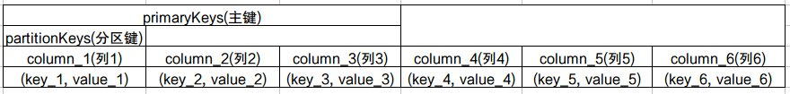


非分区数据集数据模型
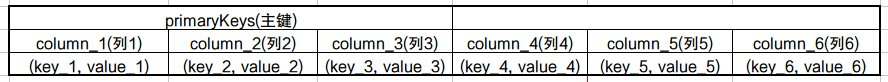


1.5 分区与非分区

什么是分区

分区指的是对数据集进行水平拆分，将同一个数据集中的数据分发到不同的分区，从而可以增大数据存储容量，实现负载均衡。

如何分区

当前是根据用户指定的分区键，内部使用散列分区算法来实现。分区键必须是主键的前缀，同一个分区键的数据会分布到同一个分区。

如何选择

如果是数据随着时间不断增加，建议使用分区数据集，如设备的上报数据，可以将设备ID设置为分区键，(设备ID, 时间戳)做为主键。

如果是数据随着时间变化不大，如设备表，用户表，则建议使用非分区数据集

分区的限制

分区一旦设定，不能更改，对于分区数据集，查询或是执行其它批量操作时，必须明确指定分区键。不能跨分区操作数据

2 基础数据结构

2.1 ACContext

ACContext 包含了用户的MajorDomain, SubDomain, DeveloperId, TraceId, 时间戳, 签名等信息，每个请求都必须带有ACContext才能与云端交互。单个ACContext可以认为是逻辑上一系列请求的唯一标识。

获取方式

```
ACContext ctx = ac.newContext();
```

2.2 ACFilter

ACFilter用于过滤结果集中的数据，当前支持：

名字|	数学表示|	描述
---|---|---
EQUAL|	==|	等于
NOT_EQUAL|	!=|	不等于
GREATER|	>|	大于
GREATE_OR_EQUAL|	>=|	大于等于
LESS|	<|	小于
LESS_OR_EQUAL|	<=|	小于等于
LIKE|	like|	字符串模糊匹配
NOT_LIKE|	not like|	字符串模糊匹配
BINARY_LIKE|	binary like|	区分大小写的字符串模糊匹配
BINARY_NOT_LIKE|	binary not like|	区分大小写的字符串模糊匹配
IN|	in|	基于列表进行查找
NOT_IN|	not in|	基于列表进行查找
AND|	and|	与(与的优化级高于或)
OR|	or|	或

使用实例

```
// 实例1: 创建一个filter(key1>0 and key1<10)
ACFilter f1 = ac.filter().whereGreaterThan("key1", 0).andLessThan("key1", 10);

// 实例2: 创建一个filter(key1<=0 or key1>=10)
ACFilter f1 = ac.filter().whereLessThanOrEqualTo("key1", 0).orGreaterThanOrEqualTo("key1", 10);

// 实例3: 创建一个filter(key1以 "abcd" 为前缀, 不区分大小写)
ACFilter f1 = ac.filter().whereLike("key1", "abcd%");

// 实例4: 创建一个filter(key1以 "abcd" 为前缀, 不区分大小写)
ACFilter f1 = ac.filter().whereLike("key1", "abcd%");

// 实例5: 创建一个filter(key1以 "abcd" 为后缀, 不区分大小写)
ACFilter f1 = ac.filter().whereLike("key1", "%abcd");

// 实例6: 创建一个filter(key1包含子串 "abcd", 不区分大小写)
ACFilter f1 = ac.filter().whereLike("key1", "%abcd%");

// 实例7: 创建一个filter(key1 为 "v1" 或 "v2" 或 "v3"中的一个)
ACFilter f1 = ac.filter().whereIn("key1", String[]{"v1", "v2", "v3"});

// 实例8: 创建一个filter(数据集t1的c1列与数据集t2的c2列相等)
ACFilter f1 = ac.filter().whereEqualToColumn("t1.c1", "t2.c2");
```

2.3 ACJoin

ACJoin在多表查询时用于表示联表条件，当前仅支持内联结

使用实例

```
// t1为基准表，t2是需要联结的表

// 实例1: 联表条件(数据集t1的c1列 与 数据集t2的c2列相等)
ACFilter f1 = ac.filter().whereEqualToColumn("t1.c1", "t2.c2");
ACJoin j1 = ac.innerJoin("t2").where(f1);

// 实例2: 联表条件(数据集t1的c1列 与 数据集t2的c2列相等，并且 数据集t1的c1列的值大于100)
ACFilter f1 = ac.filter().whereEqualToColumn("t1.c1", "t2.c2").andGreaterThan("t1.c1", 100);
ACJoin j1 = ac.innerJoin("t2").where(f1);
```

3 使用实例

以空气净化器为例来说明。每个实例会针对分区数据集和非分区数据集分别说明接口使用方法。

列名 |	类型|	描述
---|---|---
device_id|	字符串|	设备ID
timestamp|	整数|	时间戳
pm25|	浮点数|	pm2.5值
speed|	整数|	当前风机转速
mode|	字符串|	当前净化器状态(auto(自动), high(高速), medium(中速), low(低速))

3.1 device_data(分区数据集)
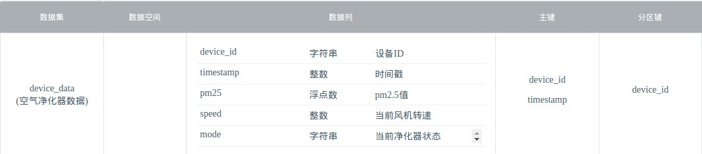


3.2 device_data(非分区数据集)
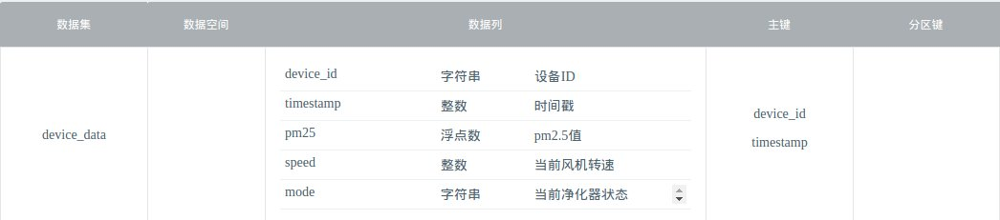


4 数据写入

4.1 Create

在数据集中插入一条数据，如果数据不存在，则执行插入; 如果数据已经存在，则会报错。

>分区数据集和非分区数据集使用方式相同

标准用法

```
ac.store(数据集名字, context).create(键值列表)
        .put(key_1，value_1)
        .put(key_..., value_...)
        .put(key_n, value_n)
        .execute();
```
注意事项

* 主键列表至少包含所有的主键列，可以包含非主键列
* key,value对根据需要选填，如果没有设置，则会填充默认值。整数，浮点数的默认值为0，字符串默认值为空字符串，布尔型的默认值为false

错误码

通用错误码

Exception|	报错位置|	errorCode|	errorMsg|	errorDesc/日志|	说明
---|---|---|---|---|---
ACServiceException|	CLOUD|	3002|	invalid param|	createParam is not set|	createParam没有设置
ACServiceException|	CLOUD|	3924|	data already exist|	row[key1=xxx, keys2=xxx] is already exist|	数据行已经存在，创建失败

使用实例

* 实例1: 插入一条数据（device_id:"001", timestamp:1469098960, pm25:70.5, speed:40, mode:"low"）
```
// 其它所有接口都有以下三种使用方式

// 使用方式一
ac.store("device_data", ctx).create("device_id", "001", "timestamp", 1469098960)
        .put("pm25", 70.5)
        .put("speed", 40)
        .put("mode", "low")
        .execute();

// 使用方式二
ac.store("device_data", ctx).create("device_id", "001", "timestamp", 1469098960, "pm25", 70.5, "speed", 40, "mode", "low")
        .execute();

// 使用方式三
ACObject keyObj = new ACObject();
keyObj.put("device_id", "001");
keyObj.put("timestamp", 1469098960);

ac.store.("device_data", ctx).create(keyObj)
        .put("pm25", 70.5)
        .put("speed", 40)
        .put("mode", "low")
        .execute();
```
类比SQL
```
INSERT INTO `device_data` SET `device_id`='001', `timestamp`=1469098960, `pm25`=70.5, `speed`=40, `mode`='low';
```
4.2 BatchCreate

在数据集中指插入多行数据，如果数据不存在，则执行插入; 如果数据已经存在，则会报错。

>分区数据集和非分区数据集使用方式相同

标准用法
```
// 用法1
ac.store(数据集名字， context).batchCreate()
        .add(ACObject_1)
        ...
        .add(ACObject_n)
        .execute();

// 用法2
List<ACObject> objs = new ArrayList<>();

ac.store(数据集名字, context).batchCreate()
        .put(objs)
        .execute();
```
注意事项

* 一次批量最多支持1000条

错误码

通用错误码

Exception|	报错位置|	errorCode|	errorMsg|	errorDesc/日志|	说明
---|---|---|---|---|---
ACServiceException|	CLOUD|	3002|	invalid param|	batchCreateParam is not set|	batchCreateParam没有设置

使用实例

* 实例1：批量插入三条数据

(device_id:"001", timestamp:1469098960, pm25:70.5, speed:40, mode:"low") (device_id:"001", timestamp:1469098961, pm25:70.6, speed:41, mode:"low") (device_id:"001", timestamp:1469098962, pm25:70.7, speed:42, mode:"low")
```
ACObject obj1 = new ACObject();
obj1.put("device_id", "001");
obj1.put("timestamp", 1469098960);
obj1.put("pm25", 70.5);
obj1.put("speed", 40);
obj1.put("mode", "low");

ACObject obj2 = new ACObject();
obj2.put("device_id", "001");
obj2.put("timestamp", 1469098961);
obj2.put("pm25", 70.6);
obj2.put("speed", 41);
obj2.put("mode", "low");

ACObject obj3 = new ACObject();
obj3.put("device_id", "001");
obj3.put("timestamp", 1469098962);
obj3.put("pm25", 70.7);
obj3.put("speed", 42);
obj3.put("mode", "low");

// 方法一:
ac.store("device_data", ctx).batchCreate()
    .add(obj1, obj2, obj3)
    .execute();

// 方法二:
ac.store("device_data", ctx).batchCreate()
    .add(obj1)
    .add(obj2)
    .add(obj3)
    .execute();

//方法三:
List<ACObject> objs = new ArrayList<>();
objs.add(obj1);
objs.add(obj2);
objs.add(obj3);

ac.store("device_data", ctx).batchCreate()
    .put(objs)
    .execute();
```
类比SQL
```
INSERT INTO `device_data`(`device_id`, `timestamp`, `pm25`, `speed`, `mode`) VALUES ('001', 1469098960, 70.5, 40, 'low'), ('001', 1469098961, 70.6, 41, 'low'), ('001', 1469098962, 70.7, 42, 'low');
```
4.3 Replace

当此行数据不存在时，则插入这行数据，如果已经存在，则覆盖已有数据

>分区数据集和非分区数据集使用方式相同

标准用法
```
ac.store(数据集名字, context).replace(键值列表)
        .put(key_1, value_1)
        .put(key_..., value_...)
        .put(key_n, value_n)
        .execute();
```
注意事项

* 键值列表至少包含所有的主键列，可以包含其它键值
* (key,value)对选填，如果没有设置，则会使用默认值，整数，浮点型的默认值为0，字符串默认值为空字符串，布尔型的默认值为false。

错误码

通用错误码

Exception|	报错位置|	errorCode|	errorMsg|	errorDesc/日志|	说明
---|---|---|---|---|---
ACServiceException|	CLOUD|	3002|	invalid param|	replaceParam is not set|	replaceParam没有设置	

使用实例

* 实例1：覆盖写入一条数据（device_id="001", timestamp:1469098960, pm25:70.5, speed:40, mode:low)

```
// 使用方法一
ac.store("device_data", ctx).replace("device_id", "001", "timestamp", 1469098960)
        .put("pm25", 70.5)
        .put("speed", 40)
        .put("mode", "low")
        .execute();

// 使用方法二
ac.store("device_data", ctx).replace("device_id", "001", "timestamp", 1469098960, "pm25", 70.5, "speed", 40, "mode", "low")
        .execute();
```
类比SQL
```
REPLACE INTO `device_data` SET `device_id`='001', `timestamp`=1469098960, `pm25`=70.5, `speed`=40, `mode`='low';
```
4.4 BatchReplace

在数据集中批量覆盖多行数据，如果数据不存在，则执行插入; 如果数据已经存在，则执行覆盖。

>分区数据集和非分区数据集使用方式相同

标准用法

```
// 用法1
ac.store(数据集名字， context).batchReplace()
        .add(ACObject_1)
        ...
        .add(ACObject_n)
        .execute();

// 用法2
List<ACObject> objs = new ArrayList<>();

ac.store(数据集名字, context).batchReplace()
        .put(objs)
        .execute();
```
注意事项

* 一次批量最多支持1000条

错误码

通用错误码

Exception|	报错位置|	errorCode|	errorMsg|	errorDesc/日志|	说明
---|---|---|---|---|---
ACServiceException|	CLOUD|	3002|	invalid param|	batchReplaceParam is not set|	batchReplaceParam没有设置

使用实例

* 实例1：批量插入三条数据
(device_id:"001", timestamp:1469098960, pm25:70.5, speed:40, mode:"low") (device_id:"001", timestamp:1469098961, pm25:70.6, speed:41, mode:"low") (device_id:"001", timestamp:1469098962, pm25:70.7, speed:42, mode:"low")

```
ACObject obj1 = new ACObject();
obj1.put("device_id", "001");
obj1.put("timestamp", 1469098960);
obj1.put("pm25", 70.5);
obj1.put("speed", 40);
obj1.put("mode", "low");

ACObject obj2 = new ACObject();
obj2.put("device_id", "001");
obj2.put("timestamp", 1469098961);
obj2.put("pm25", 70.6);
obj2.put("speed", 41);
obj2.put("mode", "low");

ACObject obj3 = new ACObject();
obj3.put("device_id", "001");
obj3.put("timestamp", 1469098962);
obj3.put("pm25", 70.7);
obj3.put("speed", 42);
obj3.put("mode", "low");

// 方法一:
ac.store("device_data", ctx).batchReplace()
    .add(obj1, obj2, obj3)
    .execute();

// 方法二:
ac.store("device_data", ctx).batchReplace()
    .add(obj1)
    .add(obj2)
    .add(obj3)
    .execute();

//方法三:
List<ACObject> objs = new ArrayList<>();
objs.add(obj1);
objs.add(obj2);
objs.add(obj3);

ac.store("device_data", ctx).batchReplace()
    .put(objs)
    .execute();
```
类比SQL
```
REPLACE INTO `device_data`(`device_id`, `timestamp`, `pm25`, `speed`, `mode`) VALUES ('001', 1469098960, 70.5, 40, 'low'), ('001', 1469098961, 70.6, 41, 'low'), ('001', 1469098962, 70.7, 42, 'low');
```
5 数据删除
5.1 Delete

删除单行数据，如果这行数据存在，则执行删除，如果数据不存在，不会执行

>分区数据集和非分区数据集使用方式相同

标准用法
```
ac.store(数据集名字, context).delete(键值列表)
        .execute();
```
注意事项

* 键值列表至少含所有的主键列

错误码

通用错误码

Exception|	报错位置|	errorCode|	errorMsg|	errorDesc/日志|	说明
---|---|---|---|---|---
ACServiceException|	CLOUD|	3002|	invalid param|	deleteParam is not set|	deleteParam没有设置

使用实例

* 实例1: 删除一行设备数据记录（ID="001", timestamp=1469098960）
```
ac.store("device_data", ctx).delete("device_id", "001", "timestamp", 1469098960)
        .execute();
```
类比SQL
```
DELETE FROM `device_data` WHERE `device_id`='001' AND `timestamp`=1469098960;
实例2: 删除一行设备数据记录（ID="001", timestamp=1469098960, mode='high'）
ac.store("device_data", ctx).delete("device_id", "001", "timestamp", 1469098960, "mode", "high")
        .execute();
```
类比SQL
```
DELETE FROM `device_data` WHERE `device_id`='001' AND `timestamp`=1469098960 AND `mode`='high';
```
5.2 BatchDelete

根据过滤条件删除多行数据

>分区数据集的使用有限制，键值列表至少包含完整的分区键

标准用法
```
ac.store(数据集名字，context).batchDelete(键值列表)
        .where(filter_1)
        .and(filter_2)
        .or(filter_3)
        .execute();
```

注意事项

* 对于分区数据集，键值列表必须包含完整的分区键
* 对于非分区数据集，键值列表可以为空

错误码

通用错误码

Exception|	报错位置|	errorCode|	errorMsg|	errorDesc/日志|	说明	
---|---|---|---|---|---
ACServiceException|	CLOUD|	3002|	invalid param|	batchDeleteParam is not set|	batchDeleteParam没有设置	

使用实例

* 实例1：删除设备（ID="001", timestamp>=1469098960 and timestamp<=1469102560)之间的所有数据
```
ACFilter filter1 = ac.filter().whereGreaterThanOrEqualTo("timestamp", 1469098960).andLessThanOrEqualTo("timestamp", 1469102560);

ac.store("device_data", context).batchDelete("device_id", "001").
        .where(filter1)
        .execute();
```
类比SQL
```
DELETE FROM `device_data` WHERE `device_id`="001" AND (`timestamp`>=1469098960 AND `timestamp`<=1469102560);
```
实例2：删除设备（ID="001", timestamp>=1469098960 timestamp<=1469102560)之间并且speed大于40的所有数据
```
ACFilter filter1 = ac.filter().whereGreaterThanOrEqualTo("timestamp", 1469098960).andLessThanOrEqualTo("timestamp", 1469102560);
ACFilter filter2 = ac.filter().whereGreaterThan("speed", 40);

ac.store("device_data", context).batchDelete("device_id", "001").
        .where(filter1)
        .and(filter2)
        .execute();
```
类比SQL
```
DELETE FROM `device_data` WHERE `device_id`="001" AND (`timestamp`>=1469098960 AND `timestamp`<=1469102560) AND `speed`>40;
```
6 修改数据

6.1 Update

修改单行数据，如果这行数据不存在则执行插入，如果存在，则修改指定的列。

>分区数据集和非分区数据集使用方式相同

标准用法
```
ac.store(数据集名字, context).update(键值列表)
        .put(key_1, value_1)
        .put(key_..., value_...)
        .put(key_n, value_n)
        .execute();
```
注意事项

* 键值列表至少包含所有主键列
* (key,value)对可选
* 没有更新的列会使用原来的值

错误码

通用错误码

Exception|	报错位置|	errorCode|	errorMsg|	errorDesc/日志|	说明
---|---|---|---|---|---
ACServiceException|	CLOUD|	3002|	invalid param|	updateParam is not set|	updateParam没有设置

使用实例

* 实例1：写入一条数据(device_id="001", timestamp=1469098960, speed=60)数据，如果数据行不存在，则插入此行数据(device_id="001", timestamp=1469098960, speed=60,其它列使用默认值），如果数据行已经存在，则将speed列的值改为60。
```
ac.store("device_data", context).batchUpdate("device_id", "001", "timestamp", 1469098960)
        .put("speed", 60)
        .execute();
```
类比SQL
```
INSERT INTO `device_data` SET `device_id`='001', `timestamp`=1469098960, `speed`=60 ON DUPLICATE KEY update `device_id`='001', `timestamp`=1469098960, `speed`=60;
```
6.2 Modify

修改单行数据，如里数据不存在，则报错，如果数据存在，则将指定列修改为特定的值，可以进行加减运算

>分区数据集和非分区数据集使用方式相同

标准用法
```
ac.store(数据集名字, context).modify(键值列表)
        .where(key_xxx, value_xxx)
        .and(key_xxx, value_xxx)
        .set(key_1, value_1)
        .inc(key_..., value_...)
        .dec(key_n, value_n)
        .execute();
```
注意事项

* 键值列表至少包含所有主键列
* where指的是过滤条件
* set/inc/dec至少使用一个

错误码

通用错误码

Exception|	报错位置|	errorCode|	errorMsg|	errorDesc/日志|	说明
---|---|---|---|---|---	
ACServiceException|	CLOUD|	3002|	invalid param|	modifyParam is not set|	modifyParam没有设置	

使用实例

* 实例1：将(ID="001", timestamp=1469098960)的数据，speed加5,mode设备设置为high, pm25值减1.5
```
ac.store("device_data", context).modify("device_id", "001", "timestamp", 1469098960)
        .inc("speed", 5)
        .set("mode", "high")
        .dec("pm25", 1.5)
        .execute();
```
类比SQL
```
UPDATE `device_data` SET `speed`=`speed`+5, `mode`='high', `pm25`=`pm25`-1.5 WHERE `device_id`="001" AND `timestamp`=1469098960;
```
* 实例2：将(ID="001", timestamp=1469098960 并且 speed=5)的数据，mode设置为high
```
ac.store("device_data", context).modify("device_id", "001", "timestamp", 1469098960)
        .where("speed", 5)
        .set("mode", "high")
        .execute();
```
类比SQL
```
UPDATE `device_data` SET `mode`='high' WHERE `device_id`="001" AND `timestamp`=1469098960 AND `speed`=5;
```
6.3 BatchUpdate

根据条件修改数据

>分区数据集的使用方式有限制，键值列表至少包含完整的分区键

标准用法
```
ac.store(数据集名字, ctx).batchUpdate(键值列表)
        .where(filter_1)
        .or(filter_2)
        .and(filter_3)
        .set(key_n, value_n)
        .inc(key_n, value_n)
        .dec(key_n, value_n)
        .execute();
```
注意事项

* 对于分区数据集，键值列表至少包含所有的分区键
* 对于非分区数据集，键值列表可以为空
* set/inc/dec可以为多个，至少包含一个

错误码

通用错误码

Exception|	报错位置|	errorCode|	errorMsg|	errorDesc/日志|	说明
---|---|---|---|---|---		
ACServiceException|	CLOUD|	3002|	invalid param|	batchUpdateParam is not set|	batchUpdateParam没有设置	

使用实例

* 实例1：将(device_id="001", pm25>40)的数据的mode改为"high", speed加20
```
ACFilter f1 = ac.filter().whereGreaterThan("pm25", 40);

ac.store("device_data", ctx).batchUpdate("device_id", "001")
        .where(f1)
        .set("mode", "high")
        .inc("speed", 20)
        .execute();
```
类比SQL
```
UPDATE `device_data` SET `mode`='high', `speed`=`speed`+20 WHERE `deviceId`='001' AND `pm25`>40;
```
7 查询数据

7.1 find

查询单条数据，如果数据不存在，则返回的数据为空，如果存在，则返回单行数据。

>分区数据集和不分区数据集使用方式相同

标准用法
```
// 如果数据不存在，则返回null
ACObject result = ac.store(数据集名字, ctx).find(键值列表)
                    .select(key1, ..., keyn)
                    .execute();
```
注意事项

* 键值列表必须包含完整的主键列
* select可选，如果没有指定select，则会返回所有的列

错误码

通用错误码

Exception|	报错位置|	errorCode|	errorMsg|	errorDesc|	日志|	说明
---|---|---|---|---|---		
ACServiceException|	CLOUD|	3002|	invalid param|	findParam is not set|	findParam is not set|	没有设置findParam

使用实例

* 实例1：查询(device_id="001", timestamp=1469098960)这一行的所有列
```
ACObject result = ac.store("device_data", ctx).find("device_id", "001", "timestamp", 1469098960)
                .execute();
// 结果集如果为空则, result==null

// 结果集不为空输出数据
String device_id = result.getString("device_id");
Long timestamp = result.getLong("timestamp");
Double pm25 = result.getDouble("pm25");
String mode = result.getString("mode");
Long speed = result.getLong("speed");
System.out.Println(device_id + ", " + timestamp + ", " + pm25 + ", " + mode + ", " + speed);
```
类比SQL
```
SELECT * FROM `device_data` WHERE `device_id`='001' AND `timestamp`=1469098960;
```
* 实例2：查询(device_id="001", timestamp=1469098960)这一行的speed列和mode列
```
ACObject result = ac.store("device_data", ctx).find("device_id", "001", "timestamp", 1469098960)
        .select("speed", "mode")
        .execute();
// 如果为空则, result==null

// 如果结果不为空，取出数据
Long speed = result.getLong("speed");
String mode = result.getString("mode");
System.out.Println(speed + ", " + mode);
```
类比SQL
```
SELECT `speed`, `mode` FROM `device_data` WHERE `device_id`='001' AND `timestamp`=1469098960;
```
7.2 scan

根据条件查询数据，可能有多条。

>分区数据集的使用有限制，键值列表至少包含完整的分区键

标准用法
```
// 如果符合条件的数据不存在，则返回一个空的数组
List<ACObject> results = ac.store(数据集名字, ctx).scan(键值列表)
                      .select(key_1, ...., key_n)
                      .start(键值列表)
                      .end(键值列表)
                      .where(filter_1)
                      .and(filter_2)
                      .or(filter_3)
                      .groupBy(key_1, ..., key_n)
                      .sum(key_1, ..., key_n)
                      .avg(key_1, ..., key_n)
                      .max(key_1, ..., key_n)
                      .min(key_1, ..., key_n)
                      .count()
                      .orderByAsc(key_1, ..., key_n)
                      .orderByDesc(key_1, ..., key_n)
                      .offset(数值)
                      .limit(数值)
                      .execute();
```
注意事项

* select可以包含一列或多列，如果未指定，则表示返回所有列
* start/end至少包含完整的分区键
* start/end最多可以包含一个非主键key
* sum(key1, ..., keyn)指的是对每一列分别求sum
* limit最大为1000, 每次最多返回1000行数据

错误码

通用错误码

Exception|	报错位置|	errorCode|	errorMsg|	errorDesc|	日志|	说明
---|---|---|---|---|---	
ACServiceException|	CLOUD|	3002|	invalid param|	scanParam is not set|	scanParam is not set|	没有设置scanParam

使用实例

* 实例1：查询(device_id="001", timestamp>=1469098960, timestamp<=1469102560) 的pm25值和对应的timestamp
```
List<ACObject> results = ac.store("device_data", ctx).scan("device_id", "001")
        .select("timestamp", "pm25")
        .start("timestamp", 1469098960)
        .end("timestamp", 1469102560)
        .execute();

// 输出结果
for (ACObject result:results) {
    long timestamp = result.getLong("timestamp");
    double pm25 = result.getDouble("pm25");
    System.out.Println(timestamp + "," + pm25)
}
```
类比SQL
```
SELECT `timestamp`, `pm25` FROM `device_data` WHERE `timestamp`>-1469098960 AND `timestamp`<=1469102560;
```
* 实例2：查询(device_id="001", timestamp>=1469098960) 的第11条到第30条的 pm25值和对应的timestamp
```
List<ACObject> results = ac.store("device_data", ctx).scan("device_id", "001")
        .select("timestamp", "pm25")
        .start("timestamp", 1469098960)
        .offset(10)
        .limit(20)
        .execute();

// 输出结果
for (ACObject result:results) {
    long timestamp = result.getLong("timestamp");
    double pm25 = result.getDouble("pm25");
    System.out.Println(timestamp + "," + pm25)
}
```
类比SQL
```
SELECT `timestamp`, `pm25` FROM `device_data` WHERE `device_id`='001' AND `timestamp`>-1469098960 limit 10,20;
```
* 实例3：查询(device_id="001")的最近的20条数据的pm25值和对应的时间戳
```
List<ACObject> results = ac.store("device_data", ctx).scan("device_id", "001")
        .select("timestamp", "pm25")
        .orderByDesc("timestamp")
        .limit(20)
        .execute();

// 输出结果
for (ACObject result:results) {
    long timestamp = result.getLong("timestamp");
    double pm25 = result.getDouble("pm25");
    System.out.Println(timestamp + "," + pm25)
}
```
类比SQL
```
SELECT `timestamp`, `pm25` FROM `device_data` WHERE `device_id`='001' ORDERY BY `timestamp`DESC limit 10,20;
```
实例4：查询device_id="001"并且pm25>40.5的pm25值和时间戳
```
ACFilter f1 = ac.filter().whereGreaterThan("pm25", 40.5);

List<ACObject> results = ac.store("device_data", ctx).scan("device_id", "001")
        .select("timestamp", "pm25")
        .where(f1)
        .execute();

// 输出结果
for (ACObject result:results) {
    long timestamp = result.getLong("timestamp");
    double pm25 = result.getDouble("pm25");
    System.out.Println(timestamp + "," + pm25)
}
```
类比SQL
```
SELECT `timestamp`, `pm25` FROM `device_data` WHERE `device_id`='001' AND `pm25`>40.5 LIMIT 1000;
```
* 实例5：查询device_id="001" 并且 pm25>40.5的数据行数
```
Filter f1 = ac.filter().whereGreaterThan("pm25", 40.5);

List<ACObject> results = ac.store("device_data", ctx).scan("device_id", "001")
        .where(f1)
        .count()
        .execute();

// 输出结果
Long count = results.get(0).getLong("_count");
System.out.Println(count)
```
类比SQL
```
SELECT count(*) FROM `device_data` WHERE `device_id`='001' AND `pm25`>40.5;
```
* 实例6：计算device_id="001" 并且 timestamp>=1469098960 && timestamp<=146910256的pm25平均值
```
List<ACObject> results = ac.store("device_data", ctx).scan("device_id", "001")
        .start("timestamp", 1469098960)
        .end("timestamp", 1469102560)
        .avg("pm25")
        .execute();

// 输出结果
Long avg_pm25 = results.get(0).getLong("_avg_pm25");
System.out.Println(avg_pm25)
```
类比SQL
```
SELECT AVG(`pm25`) as _avg_pm25 FROM `device_data` WHERE `device_id`='001' AND (`timestamp`>=1469098960 AND `timestamp`<=1469102560);
```
* 实例7：查询device_id="001" (mode="auto"并且pm25>40) 或 (mode="high"并且pm25>30)的pm25,mode,timestamp，最多返回500条
```
ACFilter f1 = ac.filter().whereEqualTo("mode", "auto").andGreateThan("pm25", 40);
ACFilter f2 = ac.filter().whereEqualTo("mode", "high").andGreateThan("pm25", 30);

List<ACObject> results = ac.store("device_data", ctx).scan("device_id", "001")
        .select("timestamp", "mode", "pm25")
        .where(f1)
        .or(f2)
        .limit(500)
        .execute();

// 输出结果
for (ACObject result:results) {
    long timestamp = result.getLong("timestamp");
    String mode = result.getString("mode");
    double pm25 = result.getDouble("pm25");
    System.out.Println(timestamp + ", " + mode + ", " + pm25)
}
```
类比SQL
```
SELECT `timestamp`, `mode`, `pm25` FROM `device_data` WHERE `device_id`='001' AND (`mode`='auto' AND `pm25`>40) AND (`mode`='high' AND `pm25`>30) LIMIT 500;
```
* 实例8：查询device_id="001"并且(timestamp>1469098960并且timestamp<=1469102560)的时间戳和pm25值，并按pm25值逆序排列
```
List<ACObject> results = ac.store("device_data", ctx).scan("device_id", "001")
        .start("timestamp", 1469098960)
        .end("timestamp", 1469102560)
        .orderByDesc("pm25")
        .execute();

// 输出结果
for (ACObject result:results) {
    long timestamp = result.getLong("timestamp");
    double pm25 = result.getDouble("pm25");
    System.out.Println(timestamp + ", " + pm25)
}
```
类比SQL
```
SELECT * FROM `device_data` WHERE `device_id`='001' AND (`timestamp`>=1469098960 AND `timestamp`<=1469102560) ORDER BY `pm25`DESC;
```
* 实例9：查询device_id="001"并且(timestamp>1469098960并且timestamp<=1469102560)的数据中的pm25的最大值和时间点
```
List<ACObject> results = ac.store("device_data", ctx).scan("device_id", "001")
        .select("timestamp")
        .start("timestamp", 1469098960)
        .end("timestamp", 1469102560)
        .max("pm25")
        .execute();

// 输出结果
Long timestamp = results.get(0).getLong("timestamp");
Double pm25 = result.get(0).getString("pm25");
```
类比SQL
```
SELECT `timestamp`, MAX(`pm25`) as _max_pm25 FROM `device_data` WHERE `device_id`='001' AND (`timestamp`>=1469098960 AND `timestamp`<=1469102560);
```
* 实例10：查询device_id="001"在使用不同mode时的speed平均值
```
List<ACObject> results = ac.store("device_data", ctx).scan("device_id", "001")
        .select("mode", "speed")
        .groupBy("mode")
        .execute();

// 输出结果
for (ACObject result:results) {
    String mode = result.getString("mode");
    long speed = result.getLong("speed");
    System.out.Println(mode + ", " + speed)
}
```
类比SQL
```
SELECT `mode`, `speed`, AVG(`pm25`) as _avg_pm25 FROM `device_data` WHERE `device_id`='001' GROUP BY(`mode`);
```
8 多表数据查询
同时查询多个数据集的数据

执行多表查询的数据集，必须是非分区数据集，并且属于同一个数据空间
数据集实例

以商场的订单系统为例来说明

user数据集: 商场的用户信息，记录了用户的id, 名字，地址，电话号码
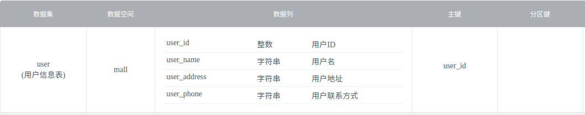

order数据集: 商场的订单数据，记录了订单ID，下订单的用户，商品ID，当时的价格，下订单的时间
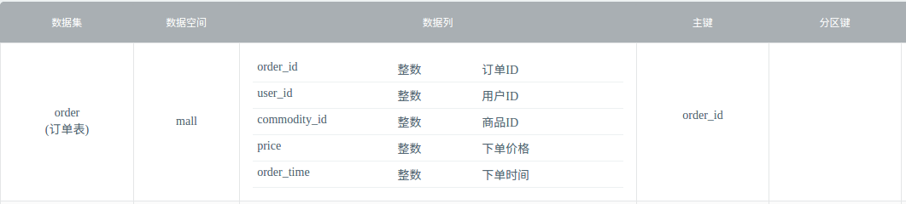


8.1 MultiScan

查询多个数据集的数据

标准用法
```
// 如果符合条件的数据不存在，则返回一个空的数组
// 查询请求和结果中的列名，必须是完整的格式（表名.列表)，不支持使用不完整的列名
List<ACObject> results = ac.store(ctx, "数据集1", "数据集2", "数据集n")
        .multiScan()
        .select(key_1, ..., key_n)
        .from("基准数据集")
        .join(join条件)
        .where(filter条件)
        .and(filter条件)
        .or(filter条件)
        .sum(key_1, ..., key_n)
        .avg(key_1, ..., key_n)
        .max(key_1, ..., key_n)
        .min(key_1, ..., key_n)
        .count()
        .orderByAsc(key_1, ..., key_n)
        .orderByDesc(key_1, ..., key_n)
        .offset(数值)
        .limit(数值)
        .execute();
```        
注意事项

* limit最大为1000, 每次最多返回1000行数据
* 当前仅支持内联结
* 支持多个(>=2)数据集的联表查询
* 如果数据集的数据量很大，则不建议使用多表查询，而是通过使用多次查询来实现

错误码

通用错误码

使用实例

* 实例1: 查询用户名为"jack"的地址和所有订单(订单ID, 商品ID, 下单价格)
```
ACContext ctx = ac.newContext();

ACFilter f1 = ac.filter().whereEqualTo("user.user_name", "jack");
ACFilter f2 = ac.filter().whereEqualToColumn("user.user_id", "order.user_id");
ACJoin j1 = ac.innerJoin("order").where(f2);

List<ACObject> results = ac.store(ctx, "user", "order").multiScan()
        .select("user.user_name", "user.user_address", "order.order_id", "order.commodity_id", "order.price")
        .from("user")
        .join(j1)
        .where(f1)
        .limit(100)
        .execute();

// 输出结果
for (ACObject result:results) {
    String userName = result.getString("user.user_name");
    String userAddress = result.getString("user.user_address");
    long userOrderId = result.getLong("order.order_id");
    long commodityId = result.getLong("order.commodity_id");
    long price = result.getLong("order.price");

    System.out.println(userName + ", " + userAddress + ", " + userOrderId + ", " + commodityId + ", " + price);
}
```
类比SQL
```
SELECT `user`.`user_name`, `user`.`user_address`, `order`.`order_id`, `order`.`commodity_id`, `order`.`price` 
    FROM `user`
    INNER JOIN `order` ON (`user`.`user_id` = `order`.`user_id`)
    WHERE (`user`.`user_name` = 'jack')
    LIMIT 1000;
```
9 常见问题

9.1 无法存储emojis表情

因为数据集用的是UTF-8字符集，所以无法存储emojis表情，但可以将emoji转化为Base64写入数据集，然后读取时，再转化回emojis

使用实例:
```
// emoji转Base64
String srcStr = "Here is a boy: \uD83D\uDC66\uD83C\uDFFF"; // emojis字符串
String desStr = Base64.encodeToString(srcStr.getBytes("UTF-8"), Base64.NO_WRAP); // emojis转Base64

// base64转emoji
String srcStr = "SGVyZSBpcyBhIGJveTog8J+RpvCfj78="; // base64字符串
Byte[] desData = Base64.decode(srcStr, Base64.NO_WRAP); // Base64转emojis
String desStr = new String(desData, "UTF-8");
```
10 通用错误码

10.1 SDK错误

Exception|	errorDesc|	日志|	说明
---|---|---|---
IllegalArgumentException|	param keys is invalid|	param key must not be null|	key名字不能为NULL
IllegalArgumentException|	param keys is invalid|	param key must be string, key[xxx] keyType[xxx]|	key名字必须是字符串
IllegalArgumentException|	param keys is invalid|	param value must not be null, key[xxx]|	value不能为NULL
IllegalArgumentException|	param keys is invalid|	param value type is not supported, key[xxx] value[xxx] valueType[xxx]|	value的数据类型不支持
IllegalArgumentException|	param keys is invalid|	count of param keys must not be 0|	(key-value)数量不能为0
IllegalArgumentException|	param keys is invalid|	count of param keys must be even, count[xxx]|	(key-value)必须是一一对应，所以数量必须是偶数
IllegalArgumentException|	invalid put param|	param key must not be null|	put的key是null
IllegalArgumentException|	invalid put param|	param value must not be null|	put的value是null
IllegalArgumentException|	invalid put param|	param value type is not supported, key[xxx], value[xxx] valueType[xxx]|	put的value的数据类型不支持
IllegalArgumentException|	invalid filter param|	param key must not be null|	filter的key是null
IllegalArgumentException|	invalid filter param|	param value must not be null|	filter的value是null
IllegalArgumentException|	invalid filter param|	param value type is not supported, key[xxx], value[xxx] valueType[xxx]|	filter的value的数据类型不支持
IllegalArgumentException|	invalid expr param|	param key must not be null|	expr的key是null
IllegalArgumentException|	invalid expr param|	param value must not be null|	expr的value是null
IllegalArgumentException|	invalid expr param|	param value type is not supported, key[xxx], value[xxx] valueType[xxx]|	expr的value的数据类型不支持
IllegalArgumentException|	param filter must not be empty|	param filter must not be empty|	filter不能为空
IllegalArgumentException|	param key of select must not be empty|	param key of select must not be empty|	select key不能为空
IllegalArgumentException|	param startKeys is invalid|	param primaryKey must not be null|	startKey名字不能为NULL
IllegalArgumentException|	param startKeys is invalid|	param primaryKey must be string, key[xxx] keyType[xxx]|	startKey名字必须是字符串
IllegalArgumentException|	param startKeys is invalid|	param primaryValue must not be null, key[xxx]|	startValue不能为NULL
IllegalArgumentException|	param startKeys is invalid|	param primaryValue type is not supported, key[xxx] value[xxx] valueType[xxx]|	startValue的数据类型不支持
IllegalArgumentException|	param endKeys is invalid|	param primaryKey must not be null|	endKey名字不能为NULL
IllegalArgumentException|	param endKeys is invalid|	param primaryKey must be string, key[xxx] keyType[xxx]|	endKey名字必须是字符串
IllegalArgumentException|	param endKeys is invalid|	param primaryValue must not be null, key[xxx]|	endValue不能为NULL
IllegalArgumentException|	param endKeys is invalid|	param primaryValue type is not supported, key[xxx] value[xxx] valueType[xxx]|	endValue的数据类型不支持
IllegalArgumentException|	param offset must be >=0, offset[xxx]|	param offset must be >=0, offset[xxx]|	offset必须大于等于0
IllegalArgumentException|	param limit must be >=0 and <=1000, limit[xxx]|	param limit must be >=0 and <=1000, limit[xxx]|	limit必须>=0 and <=1000
IllegalArgumentException|	param key of orderBy is conflict, key[xxx]|	param key of orderBy is conflict, key[xxx]|	orderBy的列设置的排序方式不一致
IllegalArgumentException|	param key of aggregate must not be empty|	param key of aggregate must not be empty|	aggregate指定的key不能为空
IllegalArgumentException|	param key of select must not be empty|	param key of select must not be empty|	select key 不能为null
10.2 云端错误

Exception|	errorCode|	errorMsg|	errorDesc/日志|	说明
---|---|---|---	|---
ACServiceException|	3002|	invalid param|	context is not set|	没有设置context	
ACServiceException|	3002|	invalid param|	majorDomain is not set|	没有设置majorDomain	
ACServiceException|	3002|	invalid param|	common user is not allowed to use store|	普通终端用法无法直接使用store	
ACServiceException|	3002|	invalid param|	class is not set|	没有设置数据集	
ACServiceException|	3002|	invalid param|	param offset must be >=0|	参数offset必须>=0	
ACServiceException|	3002|	invalid param|	param limit must be >=0 and <=1000|	参数limit必须>=0并且<=1000	
ACServiceException|	3004|	not allowed|	common user is not allowed to use store|	普通用户不允许直接访问store	
ACServiceException|	3920|	class not exist|	class[xxx] is not exist|	数据集不存在	
ACServiceException|	3925|	invalid value param|	value of key[xxx] must not be null|	value的值不能为null	
ACServiceException|	3925|	invalid value param|	valueType of key[xxx] is not inconsistent with schema|	value的数据类型与schema中不一致	
ACServiceException|	3927|	invalid filter param|	key[xxx] of filter is not exist in schema|	filter的key在schema中不存在	
ACServiceException|	3927|	invalid filter param|	filter value of key[xxx] must not be null|	filter的value不能为null	
ACServiceException|	3927|	invalid filter param|	filter valueType is not inconsistent with schema|	filter的value的数据类型与schema不一致	
ACServiceException|	3927|	invalid filter param|	not supported filter connector[xxx]|	不支持的filter connector	
ACServiceException|	3927|	invalid filter param|	filter is not set|	filter没有设置	
ACServiceException|	3928|	invalid expr param|	param expr(set, inc, dec) is empty|	表达式参数不存在	
ACServiceException|	3928|	invalid expr param|	expr key[xxx] must not be null|	表达式key是null	
ACServiceException|	3928|	invalid expr param|	expr key[xxx] is not exist|	表达式key在schema不存在	
ACServiceException|	3928|	invalid expr param|	expr operator[xxx] is not supported|	不支持的表达式运算符	
ACServiceException|	3928|	invalid expr param|	expr value of key[xxx] must not be null|	表达式的value是null	
ACServiceException|	3929|	column not exist|	column[xxx] is not exist in schema|	column在schema中不存在	
ACServiceException|	3930|	invalid partition key|	partitionKeys is not set|	没有设置分区键	
ACServiceException|	3930|	invalid partition key|	partitionKey[xxx] is not set|	分区键的某一个key没有设置	
ACServiceException|	3932|	invalid primary key|	primaryKey[xxx] is not set|	主键列不存在	
ACServiceException|	3934|	invalid aggregate param|	keys of aggr[xxx] must not be empty|	聚集函数指定的key不能为空	
ACServiceException|	3934|	invalid aggregate param|	key[xxx] of aggr[xxx] is not exist in schema|	聚焦函数指定的key在schema中不存在	
ACServiceException|	3934|	invalid aggregate param|	not supported aggregate[xxx]|	不支持的聚集函数	
ACServiceException|	3935|	invalid groupBy param|	key[xxx] of groupBy is not exist in schema|	groupBy指定的key在schema中不存在	
ACServiceException|	3936|	invalid orderBy param|	key[xxx] of orderBy is not exist in schema|	orderBy指定的key在schema中不存在	
ACServiceException|	3937|	invalid select param|	key[xxx] of select is not exist in schema|	select的key在schema中不存在	

<h5 id='4.2.3.4'>测试简介</h5>
上一章节，我们一步步开发了一个完整的服务程序DemoService。代码是写完了，如何验证我们写的代码是否正常工作呢？DemoService能否正确处理APP的请求，能否正确控制智能灯，能否正确接收智能灯的汇报消息，能否将汇报数据写入云端存储等，都少不了测试。测试根据阶段分为多种，比如单元测试、模块测试、集成测试等。考虑到后端服务的复杂性，MAX提供了多种测试方案，下面会一一介绍。

1 单元测试

准备工作做好后，就可以开始我们的测试了，我们的单元测试采用org.apache.maven.surefire插件结合junit来完成。

>注：测试用例的执行，也是通过mvn package来驱动并查看测试结果。在MAX提供的示例pom.xml中，配置了该命令除了将开发的服务打包成jar文件外，也会执行单元测试代码——如果开发者编写了单元测试代码。

1.1 测试DemoService

具体的服务代码测试相对复杂，一方面其依赖的云端服务比较多；另一方面作为服务框架，在没有client，没有设备的情况下驱动测试，需要一些技巧。为此，MAX为开发者提供了一系列便于测试用的功能，详细介绍如下。

测试demo

通过前面的介绍，UDS的大部分功能是由handleMsg或handleDeviceMsg的各个handler提供的，因此测试工作也集中于对各个handler的测试。在单元测试过程中，无须通过任何client工具驱动，即可完成自动化的单元测试。

这里通过一个完整的测试代码演示如何对DemoService进行测试。测试代码中有详细的注释。
```
@FixMethodOrder(MethodSorters.NAME_ASCENDING)
public class DemoServiceTest {
    // 记录起始开始测试的时间
    private static long startTime;
    // 我们会在多个测试case中用到以下的成员，并且只需要初始化一次，
    // 因此我们定义为static的
    private static ACConfiguration config;  // 测试过程的配置信息，在cloudservice-conf.xml中配置
    private static AC ac;                   // 测试用的AC框架，正式环境由框架初始化，开发者不用关注
    private static DemoService demoService; // 我们开发的服务
    private static ACAccount account;       // 用于保存测试的帐号信息
    private static ACUserDevice light;      // 用于保存测试的设备信息

    // 在所有的test case执行前初始化一次
    @BeforeClass
    public static void setUp() throws Exception {
        try {
            // 这里初始化config对象
            config = new ACConfiguration("./package/config/cloudservice-conf.xml");
            ac = AC.getTestAc(config);          // 通过AC的接口获取用于测试的ac框架

            demoService = new DemoService();
            demoService.setEnv(ac, config);     // 需要调用该接口，将框架ac赋予demoService
            demoService.init();                 // 初始化demoService

            // 使用开发者权限创建一个测试账号
            try {
                account = ac.accountMgrForTest(ac.newContext()).register("test@MAX.cn", "13100000000", "pswd");
            } catch (ACServiceException e) {
                if (e.getErrorCode() == 3502) {
                    // 帐号已注册
                    account = ac.accountMgrForTest(ac.newContext()).login("test@MAX.cn", "pswd");
                } else {
                    throw e;
                }
            }

            // 使用注册的测试账号绑定一个虚拟的测试设备
            light = ac.bindMgrForTest(ac.newContext()).bindDevice(config.getSubDomain(), "12345678", "light1", account.getUid());
            // 记录起始开始测试的时间
            startTime = System.currentTimeMillis();
        } catch (Exception e) {
            e.printStackTrace();
            fail("set up fail");
        }
    }


    @AfterClass
    public static void tearDown() throws Exception {
        // 执行完test后，需要解绑setUp绑定的测试设备，确保下次单测能顺利通过
        if (light != null && account != null) {
            ac.bindMgrForTest(ac.newContext()).unbindDevice(config.getSubDomain(), light.getId(), account.getUid());
        }
    }

    @Test
    public void test1ControlLight() throws Exception {
        if (account == null || light == null)
            return;

        try {
            // 创建一个用户的context
            ACContext context = ac.newContext(account.getUid());
            // 添加一个灯的桩
            ac.addDeviceStub(config.getSubDomain(), new LightStub());

            // 下面构造client发送的请求参数
            ACMsg req = new ACMsg();
            req.setContext(context);            // 将上面用户的context传入
            req.setName("controlLight");        // 设置请求消息的名字
            req.put("deviceId", light.getId()); // 设置要控制灯的逻辑id
            req.put("action", "on");            // "on"表示开灯

            // 构造响应消息，用于接收服务端返回的消息
            ACMsg resp = new ACMsg();
            // 这里直接调用服务的处理handler，驱动测试
            demoService.handleMsg(req, resp);
            // 服务发送消息给设备后，设备会将处理结果代码返回
            // 在我们实现的LightStub中，比较结果是否正确
            assertEquals("success", resp.get("result"));
            // 成功打开灯之后，模拟设备进行数据上报
            try {
                ACDeviceMsg deviceMsg = new ACDeviceMsg(LightMsg.REPORT_CODE, new byte[]{LightMsg.ON, LightMsg.FROM_APP});
                // 这里直接调用服务的设备消息处理handler，驱动测试
                ACDeviceReportInfo reportInfo = new ACDeviceReportInfo();
                reportInfo.setContext(ac.newContext());
                reportInfo.setDeviceId(light.getId());
                reportInfo.setPhysicalDeviceId(light.getPhysicalId());
                demoService.handleDeviceMsg(reportInfo, deviceMsg);
            } catch (Exception e) {
                e.printStackTrace();
                fail("test light report fail");
            }
        } catch (ACServiceException e) {
            e.printStackTrace();
            fail("test control light fail");
        }
    }

    @Test
    public void test2LightReportAndQuery() throws Exception {
        if (account == null || light == null)
            return;

        // 先测试智能灯上报消息，将上报数据写入设备属性中
        try {
            ACDeviceMsg acDeviceMsg = new ACDeviceMsg(LightMsg.REPORT_CODE, new byte[]{LightMsg.ON, LightMsg.FROM_SWITCH});
            // 这里直接调用服务的设备消息处理handler，驱动测试
            ACDeviceReportInfo reportInfo = new ACDeviceReportInfo();
            reportInfo.setContext(ac.newContext());
            reportInfo.setDeviceId(light.getId());
            reportInfo.setPhysicalDeviceId(light.getPhysicalId());
            demoService.handleDeviceMsg(reportInfo, acDeviceMsg);
        } catch (ACServiceException e) {
            e.printStackTrace();
            fail("test light report fail");
        }

        // 这里用上面写入设备属性存储的数据来驱动测试app发来的数据查询请求处理handler
        try {
            List<ACObject> historyDatas = ac.dstore(ac.newContext())
                    .scanHistory(light.getId())
                    .startTime(true, startTime) //true为代表闭区间包含的意思
                    .endTime(true, System.currentTimeMillis())
                    .execute();
            if (historyDatas != null) {
                assertEquals(2, historyDatas.size());
                for (ACObject zo : historyDatas) {
                    System.out.println(zo.toString());
                    //获取设备的逻辑ID
                    long deviceId = zo.getLong(ACDStore.DEVICE_ID);
                    //获取设备属性历史记录的时间戳
                    long timestamp = zo.getLong(ACDStore.TIMESTAMP);
                    assertEquals(deviceId, light.getId());
                    assertTrue(timestamp >= startTime && timestamp < System.currentTimeMillis());
                }
            }
        } catch (ACServiceException e) {
            e.printStackTrace();
            fail("test query history device data fail");
        }
    }
}
```
>注意：可以看到，所有的单元测试用例均是直接调用handleMsg或handleDeviceMsg驱动测试，无需编写或使用client工具。
>
>此外，非常重要的一点，我们需要使用4.11及以上的junit，并且使用标签@FixMethodOrder(MethodSorters.NAME_ASCENDING)固定测试用例的执行顺序，因为我们的用例可能前后依赖。比如在test1ControlLight中写入数据，在后面的test case中会读取。因此，在为测试函数命名的时候，如果有前后依赖关系，需要考虑按ASCII字典序的命名规则。

测试桩

从前面的场景分析我们知道，开发的DemoService会和灯交互，但是我们在开发服务的过程，很可能智能灯也在研发之中，还没有发布硬件产品。我们后端服务开发者不需要也不应该等待硬件设备开发完毕才做相应的功能测试。为此，MAX在服务开发框架中定义了设备桩ACDeviceStub的接口，开发者只需要依照此接口实现具体的设备桩即可。 示例的桩处理很简单，实际上你可以任意扩展，比如在桩中模拟灯的各种状态。示例代码如下：
```
public class LightStub extends ACDeviceStub {
    private static final Logger logger = LoggerFactory.getLogger(LightStub.class);

    public void handleControlMsg(String majorDomain, String subDomain,
                                 ACDeviceMsg req, ACDeviceMsg resp) throws Exception {
        int code = req.getCode();
        if (code != LightMsg.CODE) {
            logger.warn("got an incorrect opcode[" + code + "]");
            return;
        }
        resp.setCode(LightMsg.RESP_CODE);
        resp.setContent(new byte[]{1, 0, 0, 0});
    }
}
```
2 本地测试
单元测试通过后，我们还需要进行集成测试，因为单元测试的过程，我们并没有真正启动开发的服务，某些场景或代码路径不一定覆盖全，比如网络通信部分、服务框架部分等。 由于大部分逻辑在单元测试阶段均做了，因此集成测试相对简单，大致步骤如下：

2.1 在本地机器或任意开发机上启动服务

按照本机启动DemoService小结的说明，通过运行start.cmd或start.sh启动服务。

注意

1、运行start.cmd或start.sh的条件。执行启动命令的目录的子目录的结构要求如下所示：
```
/config
    /cloudservice-conf.xml
/lib
    /MAX-framework-1.5.6.jar
    /ac-java-api-1.6.3.jar
    /commons-collections-3.2.1.jar
    /commons-configuration-1.10.jar
    /commons-lang-2.6.jar
    /slf4j-api-1.7.7.jar
    /...
start.sh
start.cmd
```
2、服务启动成功后，会在根目录下生成log的文件夹，进入该文件夹查看service.log文件。若能看到如下日志，说明服务已经启动成功，可以进入下一个步骤了。
```
2015-09-08 17:37:47,047 INFO main:1 [ACServer.java:41:main] - Starting service...
2015-09-08 17:37:47,047 INFO main:1 [ACConfiguration.java:331:dumpConfig] - get config item[mode] value[test]
...
2015-09-08 17:37:47,047 INFO main:1 [Log.java:178:initialized] - Logging initialized @147ms
2015-09-08 17:37:47,047 INFO main:1 [Server.java:301:doStart] - jetty-9.1.5.v20140505
2015-09-08 17:37:47,047 INFO main:1 [AbstractConnector.java:266:doStart] - Started ServerConnector@4b27ad{HTTP/1.1}{0.0.0.0:8080}
2015-09-08 17:37:47,047 INFO main:1 [Server.java:350:doStart] - Started @206ms
2015-09-08 17:37:47,047 INFO main:1 [ACServer.java:80:main] - Start service DemoService ok.
```
>服务启动成功后，即可使用任意客户端进行访问，访问过程中会实时在service.log中生成日志。
2.2 通过APP访问本机UDS

查看UDS所在的主机局域网ip地址，将ip地址设置于APP以下接口中即可实现访问本机UDS服务。

以下为Android端的代码，需要配置的代码如下：
```
//设置为访问本机UDS进行本地调试，参数为http://ip+":"+port，在初始化后调用即可。
AC.setSendToLocalUDS("http://192.168.1.1:8080");
```
>注意：APP需要与UDS所在的主机处于同一局域网下
2.3 通过curl请求访问本机UDS

使用任意客户端发送http请求测试自己的接口正确性，例如用curl或自己开发的客户端都可以。以下详细介绍如何使用curl命令进行进一步测试。
```
注：1、MAX提供的多种服务，其client和service之间的通信，底层采用http协议，方法为POST，因此任何能发送http请求的工具均可以用作服务测试的客户端。

2、 Linux 系统上如果没有 curl 则使用诸如 apt-get install curl（Ubuntu、Debian）或者 yum install curl（RedHat、Fedora）的方式来安装。 Windows 系统上安装 curl 的方法见这里。
```
测试用的 curl 指令如下：

linux下使用curl命令
```
curl -v -X POST -H "Content-Type:application/x-zc-object" -H "X-Zc-Major-Domain:MAX" -H "X-Zc-Sub-Domain:test" -H "X-Zc-User-Id:1" -d '{"action":"I am test"}' 'http://localHost:8080/test'
```
windows下使用curl命令请求
```
curl -v -X POST -H "Content-Type:application/x-zc-object" -H "X-Zc-Major-Domain:MAX" -H "X-Zc-Sub-Domain:test" -H "X-Zc-User-Id:1" --data-ascii "{\"action\":\"I am test\"}" "http://localHost:8080/test"
```
简单解释一下上面的 curl 指令（更多 curl 用法请参考 curl 手册）：

* -v 表示 verbose 即显示 HTTP 通信交互详情。
* -x POST 表示使用 HTTP POST 方法。
* -H 表示 HTTP 请求头。
* --data-ascii 表示本请求的 HTTP body 格式是 ASCII。 其余经常用到的格式还有 --data-binary，即按照字节流（octet stream）来发送请求；具体使用请参考 curl 手册，此处不赘述。
* "http://localHost:8080/test" 表示给本地 8080 端口运行的UDS服务的 test 方法发送请求。 8080 是UDS Demo本地默认的端口号，见 /config 文件夹下的 cloudservice-conf.xml 文件，<service> <port> 配置。 test 方法是专供测试使用的一个方法，什么动作都不会触发，只回复一个空HTTP响应（没有任何 payload 的 HTTP 响应）表示请求被正常处理。

发送了上述 curl 指令后，开发者应该可以在控制台上看到类似下面的响应。
```
< HTTP/1.1 200 OK
< Content-Type: application/x-zc-object
< X-Zc-Msg-Name: X-Zc-Ack
< Content-Length: 0
```
其中：

* 200 是 HTTP 返回码（表示 HTTP 请求正常返回）；
* X-Zc-Msg-Name 是 MAX 服务框架自定义的 HTTP 请求头，当此值等于 X-Zc-Ack 时表示请求被正常处理（反之，如果是 X-Zc-Err 则表示出现了错误，并会附带错误码和错误详情）；
至此，我们已完成了本地运行 UDS demo 和发送 curl 指令进行测试。

3 单步调试

集成测试过程中，你可能还需要对UDS服务进行单步调试以解决定位到更具体的问题，此处截图以Intellij idea为例。

>注意：使用单步调试需要更新java sdk到1.4.0以上
1.点击上方的三角形按钮后，点击Edit Configurations...
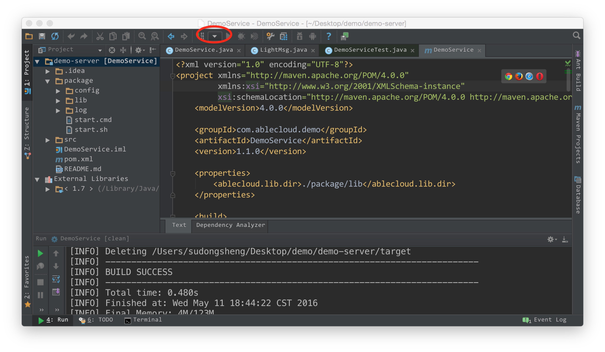

出现如下小窗口后，点击左上角＋号，选择Application
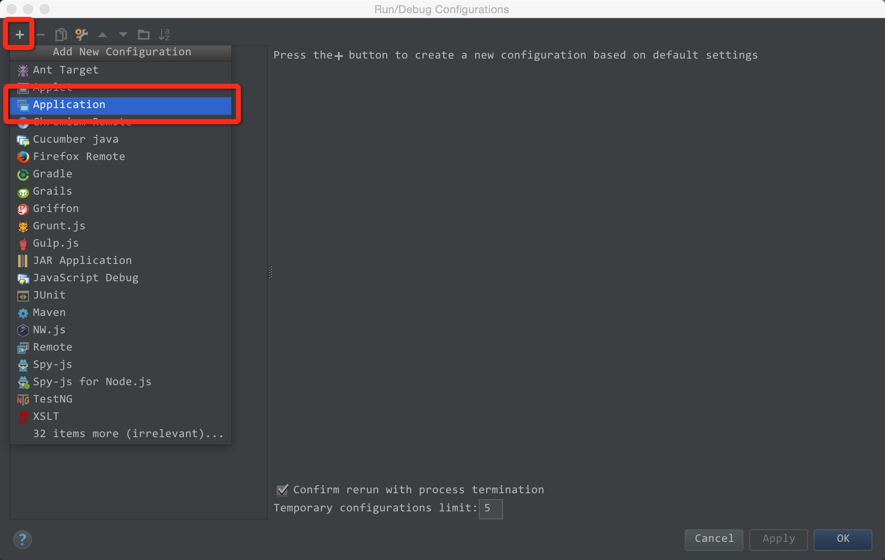

可以看到如下页面，Name默认为Unnamed，修改为工程名字，如DemoService，同时编辑Main Class，输入com.MAX.cloudservice.ACServer，最后确认Use classpath of module项为你的工程的module，点击OK按钮
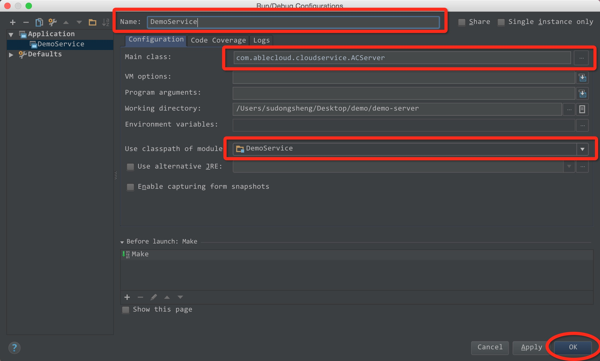

下面可以开始debug你的工程了，首先在您的工程代码处设置断点
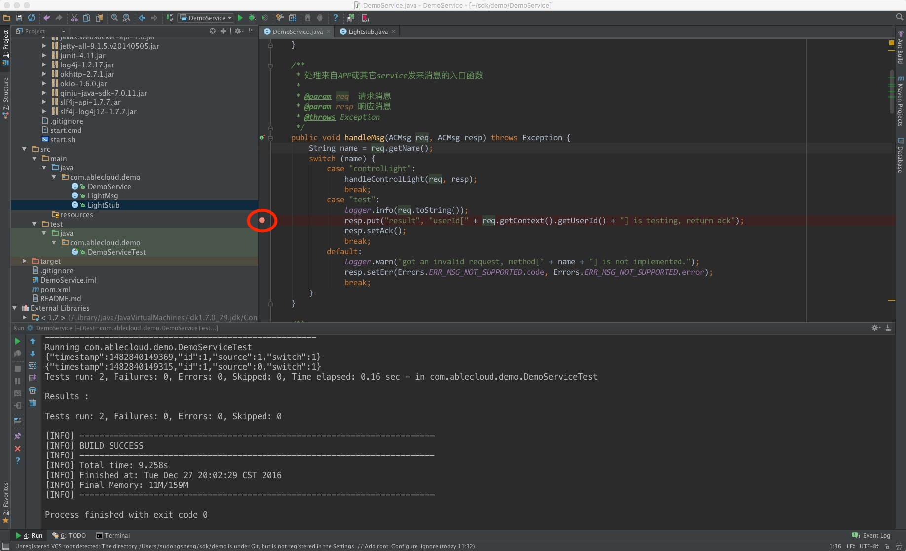

设置完断点后，点击上方小甲虫按钮，可以看到IntelliJ下方出现的Debug工具栏，并有"Connected to the target VM,address..."字样，说明该工程已经进入debug模式
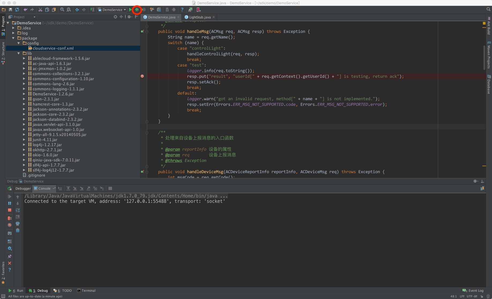

进入debug模式后，您需要通过终端发送指令驱动您的工程，进入接口测试
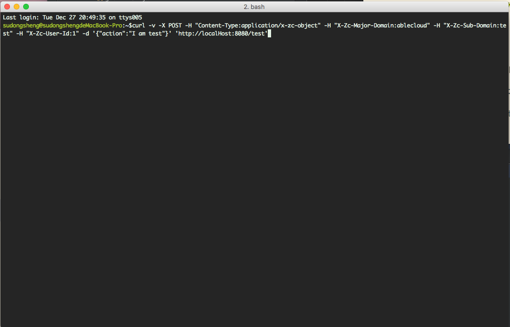

发送控制指令成功后，可以看到Debug工具栏会自动进入到断点处，可以看到终端发送请求的参数等，如下图所示，点击Debug栏的向下执行按钮（或快捷键F8）继续往下执行
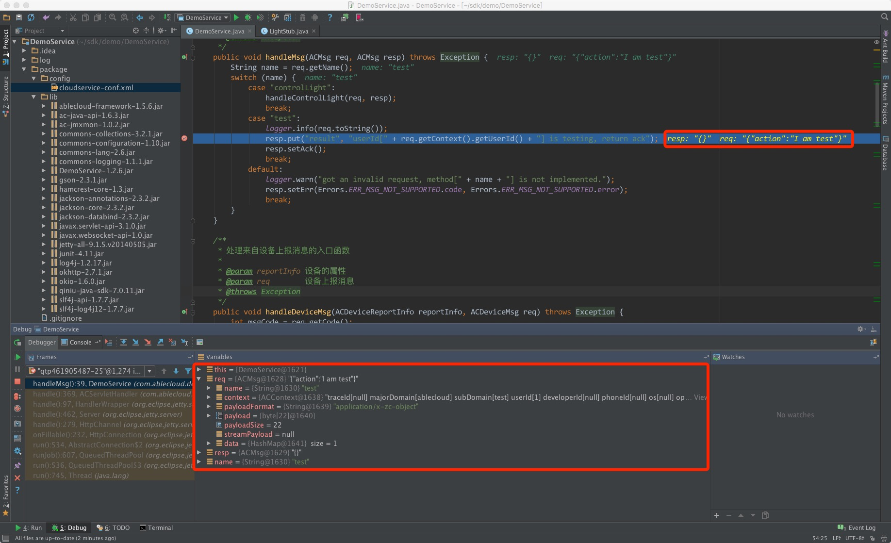

Debug过程中，可以看到终端阻塞着等待程序的处理结果，如下图
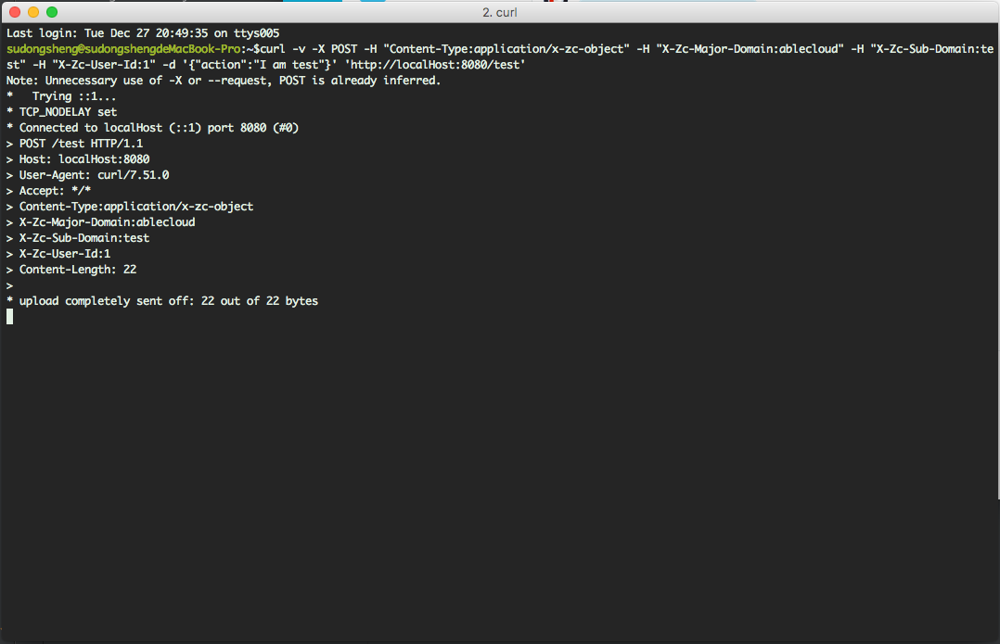

切换到IntelliJ，继续点击向下执行，进入ACServletHandler.class的this.writeResp(reqMsg,resp)后，可以看到终端会自动出现程序处理后的返回结果，调试结束
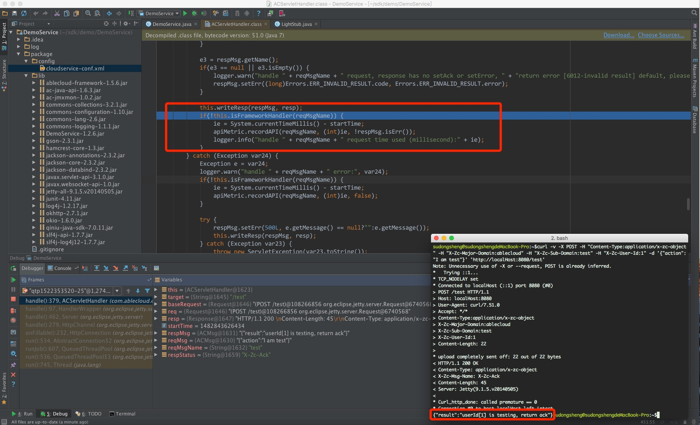

<h5 id='4.2.3.5'>UDS访问外网示例</h5>
UDS运行于MAX云端的内部环境中，可以使用MAX提供的正向代理服务（由类ACHttpClient提供访问接口）访问外部网络。

1 GET
```
@Test
public void testGet() {
    ACHttpClient client = null;
    try {
        //获取访问外网的ACHttpClient客户端
        client = ac.getHttpClient("http://apis.baidu.com/apistore/aqiservice/aqi?city=%E5%8C%97%E4%BA%AC");
        //默认为GET方法
        client.setRequestMethod("GET");
        //默认超时时间为5000
        client.setConnectTime(5000);
        //设置访问外网头域
        client.setHeader("apikey", "caf46348383a17f6070e0bda0e361a28");
        //连接url
        client.connect();
        //MAX签名认证失败
        if (client.getResponseCode() == HttpURLConnection.HTTP_OK) {
            assertEquals(client.getResponseMessage(), "OK");
            //通过getData()或getInputStream()获取response,不能同时一起调用
        }
        client.disconnect();
    } catch (IOException e) {
        if (client != null)
            client.disconnect();
        fail(e.toString());
    }
}
```
2 POST
```
@Test
public void testPost() {
    ACHttpClient client = null;
    try {
        String body = "fromdevice=pc&clientip=10.10.10.0&detecttype=LocateRecognize&languagetype=CHN_ENG&imagetype=1&image=/9j/4AAQSkZJRgABAQEAYABgAAD/2wBDABMNDxEPDBMREBEWFRMXHTAfHRsbHTsqLSMwRj5KSUU+RENNV29eTVJpU0NEYYRiaXN3fX59S12Jkoh5kW96fXj/2wBDARUWFh0ZHTkfHzl4UERQeHh4eHh4eHh4eHh4eHh4eHh4eHh4eHh4eHh4eHh4eHh4eHh4eHh4eHh4eHh4eHh4eHj/wAARCAAfACEDAREAAhEBAxEB/8QAGAABAQEBAQAAAAAAAAAAAAAAAAQDBQb/xAAjEAACAgICAgEFAAAAAAAAAAABAgADBBESIRMxBSIyQXGB/8QAFAEBAAAAAAAAAAAAAAAAAAAAAP/EABQRAQAAAAAAAAAAAAAAAAAAAAD/2gAMAwEAAhEDEQA/APawEBAQEBAgy8i8ZTVV3UY6V1eU2XoWDDZB19S646Gz39w9fkKsW1r8Wm2yo1PYis1be0JG9H9QNYCAgc35Cl3yuVuJZl0cB41rZQa32dt2y6OuOiOxo61vsLcVblxaVyXD3hFFjL6La7I/sDWAgICAgICB/9k=";
        //获取访问外网的ACHttpClient客户端
        client = ac.getHttpClient("http://apis.baidu.com/apistore/idlocr/ocr");
        //默认为GET方法
        client.setRequestMethod("POST");
        //默认超时时间为5000
        client.setConnectTime(5000);
        //设置访问外网头域
        client.setHeader("Content-Type", "application/x-www-form-urlencoded");
        client.setHeader("apikey", "caf46348383a17f6070e0bda0e361a28");
        //连接url
        client.connect();
        //设置访问外网消息体
        client.setEntity(body.getBytes("UTF-8"));
        //获取服务器返回的数据
        if (client.getResponseCode() == HttpURLConnection.HTTP_OK) {
            assertEquals(client.getResponseMessage(), "OK");
            //通过getData()或getInputStream()获取response,不能同时一起调用
        }
        client.disconnect();
    } catch (IOException e) {
        if (client != null)
            client.disconnect();
        e.printStackTrace();
    }
}
```
<h5 id='4.2.3.6'>定时任务Demo</h5>
本小结介绍一个MAX云端定时任务示例。

一个完整的云端定时任务由两部分组成：

1.定时规则：定义任务的执行时间。

MAX支持Crontab格式的时间定义（详见：Crontab定时规则）。

2.定时任务可执行程序

其中，定时规则是由开发者在MAX控制台中创建定时任务时设置。本小结介绍的示例是开发定时任务的可执行程序。

1 场景介绍
本示例的可执行程序完成的任务仅是打印一条日志：任务执行的实际时间。

在MAX控制台中创建该定时任务时，设置的定时规则是“*/2 * * * *”，表示每隔2分钟执行一次本任务。

2 实现思路
按要求从ACCronJob派生子类型，在派生类中实现父类定义的抽象方法ACCronJob::run；
通过MAX控制台创建定时任务，设置任务的定时规则；
通过MAX控制台上传任务的可执行程序，创建定时任务的版本，然后“上线”该版本以启动该定时任务。
3 可执行程序的具体实现
下文示例中，DemoCronJob是ACCronJob的派生类型，并且实现了父类定义的抽象方法ACCronJob::run。
```
package  com.MAX.demo;

import com.MAX.service.ACCronJob;
import org.slf4j.Logger;
import org.slf4j.LoggerFactory;

public class DemoCronJob extends ACCronJob {
    // 日志工具
    private static final Logger logger = LoggerFactory.getLogger(DemoCronJob.class);

    @Override
    public int run() throws Exception {
        // 在日志中记录任务的执行时间
        logger.info("任务执行时间：" + new java.util.Date().toString() + "。");
        return 0;   // 返回状态码0,表示任务执行成功。
    }
}
```
<h5 id='4.2.3.7'>用户定时任务示例</h5>
定时任务支持定时调用UDS的接口

1 示例场景
每天19:00查询当地空气质量，如果空气质量差，则打开空气净化器

2 UDS程序示例
```
package com.MAX.demo;

import com.MAX.common.*;
import com.MAX.service.AC;
import com.MAX.service.ACService;
import com.MAX.service.ACWeatherMgr;

import java.util.List;
import org.slf4j.Logger;
import org.slf4j.LoggerFactory;

/**
 * Created by chenpeng on 15-1-17.
 */
public class DemoService extends ACService {
    private static final Logger logger = LoggerFactory.getLogger(DemoService.class);

    /**
     * 处理来自APP或其它service发来消息的入口函数
     *
     * @param req  请求消息
     * @param resp 响应消息
     * @throws Exception
     */
    public void handleMsg(ACMsg req, ACMsg resp) throws Exception {
        ACContext ctx = req.getContext();
        String name = req.getName();
        try {
            switch (name) {
                case "openAir":
                    handleOpenAirMsg(req, resp);
                    logger.info(String.format("[%s][%d][%s] success", ctx.getTraceId(), ctx.getUserId(), name));
                    resp.setAck();
                    break;
                default:
                    logger.warn("got an invalid request, method[" + name + "] is not implemented.");
                    resp.setErr(Errors.ERR_MSG_NOT_SUPPORTED.code, Errors.ERR_MSG_NOT_SUPPORTED.error);
                    break;
            }
        } catch(ACServiceException e) {
            logger.info(String.format("[%s][%d][%s] error: %d, %s", ctx.getTraceId(), ctx.getUserId(), name, e.getErrorCode(), e.getErrorMsg()));
            resp.setErr(e.getErrorCode(), e.getErrorMsg());
        }
    }

    private void handleOpenAirMsg(ACMsg req, ACMsg resp) throws Exception {
        ACContext ctx = req.getContext();
        ACObject params = req.get("params"); //获取用户自定义参数
        String area = params.get("area"); //获取区域
        long deviceId = params.get("deviceId"); //获取设备Id
        logger.info(String.format("handle open air msg: area[%s], deviceId[%d]", area, deviceId));
        ...
    }

    private void openAirDevice(long deviceId, int pm25) throws Exception {
        logger.info(String.format("open air device: deviceId[%d], pm25[%d]", deviceId, pm25));
    }

    public void handleDeviceMsg(ACDeviceReportInfo reportInfo, ACDeviceMsg req) throws Exception {
    }
}
```
3 APP端SDK接口调用示例
```
ACUserTask task = new ACUserTask();
//设置任务时间周期
task.setTimeCycle("day");
//设置任务执行的时间点，由于时间周期为天，所以只有19点精确到小时以后为有效参数，日期设置无效，即在每天19点执行任务
task.setTimePoint("2000-01-01 19:00:00");
//设置任务名称
task.setName("open-air-device");
//设置任务描述，选填
task.setDescription("open air device");

//具体发送到uds的消息指令,与sendToService参数类似,接口名及参数由UDS实际提供为主
ACMsg req = new ACMsg();
req.setName("openAir");
req.put("area", "北京");
req.put("deviceId", 1L);
//ACUserCommand参数分别为子域名，服务名，请求参数，默认发送到UDS最新版本号
ACUserCommand command = new ACUserCommand(subDomain, serviceName, req);
task.setUserCommand(command);
timerMgr.addTask(task, new PayloadCallback<ACUserTask>() {
     @Override
     public void success(ACUserTask task) {
         //成功添加定时任务，创建后默认为开启状态
     }

     @Override
     public void error(ACException e) {
         //网络错误或其他，根据e.getErrorCode()做不同的提示或处理，此处一般为参数类型错误，请仔细阅读注意事项
     }
});
```
<h3 id='4.3'>云对接开发</h3>
<h4 id='4.3.1'>云对接Java SDK简介</h4>
1 功能与目的
MAX提供了Java语言版本的云对接SDK，包括访问MAX云端服务的API，适合于开发与第三方云或开发者已有业务系统对接的服务或模块。

2 主要功能

序号|	功能名称|	详细内容
---|---|---
1.|	定时任务|	可定时触发的自定义定时任务
2.|	消息交互|	与设备端、APP端进行消息交互通信
3.|	账号管理|	支持管理用户基本信息并及时做出操作
4.|	设备管理|	支持管理设备的基本信息并及时做出操作
5.|	设备属性|	MAX提供的用于处理及存储设备上报数据的服务
6.|	存储服务|	MAX提供的类似数据库的通用数据存储服务
7.|	文件存储|	对常见的文件/图片类等大文件进行上传下载
8.|	排行榜|	支持按照不同周期、数据获取数据排行
9.|	推送服务|	对APP进行消息推送
10.|	用户意见反馈|	支持快速开发用户意见反馈页
11.|	短信服务|	向当前注册用户发送自定义短信消息
12.|	天气服务|	支持快速获取PM2.5、天气/空气质量等常用天气信息

<h4 id='4.3.2'>开发准备</h4>
要求使用JDK v1.7及以上的版本。

1 MAX环境配置
建议ACConfig及AC在实例化时做全局单例处理。

1.1 ACConfig

ACConfig是抽象类，要求开发者在实际应用中提供关于ACConfig的具体实现。 本SDK定义的配置信息如下：
```
/**
 * MAX Java API配置信息。
 * <p/>
 * ACConfig是一个抽象类。开发者应依据具体应用场景的需求，提供本抽象类的实现。
 */
public abstract class ACConfig {
    public static final String TEST_MODE       = "test";        /// 运行模式：测试模式。
    public static final String PRODUCTION_MODE = "production";  /// 运行模式：生产模式。

    // 需要重载的抽象方法。

    /**
     * 取开发者在MAX平台上的帐号的ID（可登录MAX管理控制台查看）。
     *
     * @return 返回开发者帐号的ID。
     */
    public abstract long getDeveloperId();

    /**
     * 取开发者在MAX平台上对应的主域的名字（可登录MAX管理控制台查看）。
     *
     * @return 开发者的主域的名字。
     */
    public abstract String getMajorDomain();

    /**
     * 取运行模式：ACConfig.TEST_MODE 或 ACConfig.PRODUCTION_MODE。
     *
     * @return 返回运行模式：ACConfig.TEST_MODE 或 ACConfig.PRODUCTION_MODE。
     */
    public abstract String getMode();

    // 下列方法均有默认的实现，开发者可选择性地重载。

    /**
     * 取服务所关联的子域的名字。
     *
     * @return 缺省情况下返回空字符串。
     */
    public String getSubDomain() {
        return "";
    }

    /**
     * 设置开发者密钥对。
     *
     * @param ak Access Key。
     * @param sk Secret Key。
     */
    public void setAuthKeyPair(String ak, String sk) {
        synchronized (lockOfAuthKeyPair) {
            authAccessKey = ak;
            authSecretKey = sk;
        }
    }

    /**
     * 取开发者密钥对中的Access Key（可登录MAX管理控制台查看）。
     *
     * @return 开发者密钥对中的Access Key。
     */
    public String getAuthAccessKey() {
        synchronized (lockOfAuthKeyPair) {
            return authAccessKey;
        }
    }

    /**
     * 取开发者密钥对中的Secret Key（可登录MAX管理控制台查看）。
     *
     * @return 开发者密钥对总的Secret Key。
     */
    public String getAuthSecretKey() {
        synchronized (lockOfAuthKeyPair) {
            return authSecretKey;
        }
    }

    /**
     * 设置MAX云端服务的入口地址。
     *
     * @param addrs 可以用英语逗号（,）分隔多个地址。如："192.168.0.1:5000"，或者"192.168.0.1:5000,192.168.0.2:5000"，
     *              或者"http://192.168.0.1:5000"，或者"http://192.168.0.1:5000,https://192.168.0.2:5000"，或者"192.168.0.1:5000,https://192.168.0.2:5000"。
     *              如果地址中没有指定协议（http或者https），则使用http协议。
     */
    public void setRouterAddr(String addrs) {
        synchronized (lockOfRouterAddress) {
            routerAddresses = addrs;
        }
    }

    /**
     * 取MAX云端服务的入口地址。
     *
     * @return 返回的地址的格式是：http://host:port 或 https://host:port。
     */
    public String getRouterAddr() {
        synchronized (lockOfRouterAddress) {
            if (routerAddresses == null || routerAddresses.isEmpty())
                return "";

            // 随机取一个地址
            String[] routerList = routerAddresses.split(",");
            int routerIdx = random.nextInt(routerList.length);
            String addr = routerList[routerIdx].trim();
            if (!addr.startsWith("http://") && !addr.startsWith("https://"))
                addr = "http://" + addr;
            return addr;
        }
    }

    /**
     * 设置代理服务的入口地址。
     *
     * @param addrs 可以用英语逗号（,）分隔多个地址。如："192.168.0.1:5000"，或者"192.168.0.1:5000,192.168.0.2:5000"，
     *              或者"http://192.168.0.1:5000"，或者"http://192.168.0.1:5000,https://192.168.0.2:5000"，或者"192.168.0.1:5000,https://192.168.0.2:5000"。
     *              如果地址中没有指定协议（http或者https），则使用http协议。
     */
    public void setProxyAddr(String addrs) {
        synchronized (lockOfProxyAddress) {
            proxyAddresses = addrs;
        }
    }

    /**
     * 取代理服务的入口地址。
     *
     * @return 返回的地址的格式是：http://host:port 或 https://host:port。
     */
    public String getProxyAddr() {
        synchronized (lockOfProxyAddress) {
            if (proxyAddresses == null || proxyAddresses.isEmpty())
                return "";

            // 随机取一个地址
            String[] proxyList = proxyAddresses.split(",");
            int routerIdx = random.nextInt(proxyList.length);
            String addr = proxyList[routerIdx].trim();
            if (!addr.startsWith("http://") && !addr.startsWith("https://"))
                addr = "http://" + addr;
            return addr;
        }
    }

    public int getAuthTimeout() {
        return 5000;
    }

    public int getClientTimeout() {
        return 5000;
    }

    public int getRetryCount() {
        return 1;
    }
}
```
* 开发UDS时，SDK内部提供了ACConfig的实现，所以开发者只需要配置cloudservice-conf.xml中的参数即可，无需再实现ACConfig。
* 非UDS在实现ACConfig抽象类之后，即可以通过AC ac = new ACCloud(config)获取AC实例，从而通过AC调用各个通用模块接口。AC的具体接口如下所示。

1.2 AC

AC实际上是MAX对抽象服务框架的具体实现，其实现过程对开发者透明。通过AC，开发者可以根据需要获取一系列内嵌服务的功能接口。AC的定义如下：
```
public abstract class AC {
    protected ACConfiguration config;

    /**
     * 构建一个开发者上下文
     * @return
     */
    public ACContext newContext() {}

    /**
     * 构建一个用户上下文，由于是框架创建的，因此也会带着开发者信息，一般用于单测
     * @param userId
     * @return
     */
    public ACContext newContext(long userId) {}

    /**
     * 构建一个用于数据查询的过滤器
     *
     * @return
     */
    public ACFilter filter(){}

    /**
     * 用于对数据分类进行具体的操作，如create/find/delete/update/scan等
     *
     * @param className     要操作的分类名
     * @param context       要进行操作的开发者context
     * @return
     */
    public abstract ACStore store(String className, ACContext context);

    /**
     * 则用于创建数据分类/清空数据等操作。
     * 用于测试之用。
     *
     * @return
     */
    public abstract ACStoreForTest storeForTest(ACContext context);

    /**
     * 往某一服务发送命令/消息
     *
     * @param subDomain 该服务所在产品名
     * @param name      服务名
     * @param version   服务版本
     * @param req       具体的消息内容，此处req无需构造ACContext
     * @return 服务端相应的消息
     * @throws Exception
     */
    public abstract ACMsg sendToService(String subDomain, String name, int version, ACMsg req) throws Exception;

    /**
     * 往JD service发送命令/消息,上报设备上的所有Stream点到JINGDONG Service
     *
     * @param context          设备的上下文，其中uid字段为系统填充
     * @param physicalDeviceId 设备的物理id
     * @param req              请求消息体(Stream数组)
     * @return 服务端相应的消息
     * @throws Exception
     */
    public abstract ACMsg sendToJDService(ACContext context, String physicalDeviceId, List<ACJDMsg> req) throws Exception;

    /**
     * 由于uds本身无法访问正常的外网服务，所以MAX内部实现了正向代理，并提供ACHttpClient访问外网服务
     *
     * @param url 访问外网的url
     * @return ACHttpClient
     * @throws IOException
     */
    public abstract ACHttpClient getHttpClient(String url) throws IOException;

    /**
     * 获取帐号管理器。开发者组实现自定义服务时，
     * 可以调用ACAccountMgr提供的各个通用接口
     *
     * @param context   开发者的context
     * @return
     */
    public abstract ACAccountMgr accountMgr(ACContext context);

    /**
     * 获取用于单元测试的帐号管理器，可以注册用户等
     *
     * @param context   开发者的context
     * @return
     */
    public abstract ACAccountMgrForTest accountMgrForTest(ACContext context);

    /**
     * 获取设备绑定管理器。开发者在实现自定义服务时，
     * 可以调用ACBindMgr提供的各个通用接口
     *
     * @param context 用户的context
     * @return
     */
    public abstract ACBindMgr bindMgr(ACContext context);

    /**
     * 获取用于单元测试的设备绑定管理器，可以绑定/解绑设备等
     *
     * @param context 用户的context
     * @return
     */
    public abstract ACBindMgrForTest bindMgrForTest(ACContext context);

    /**
     * 获取推送通知管理器，可以给用户发送通知消息
     *
     * @param context   开发者的context
     * @return
     */
    public abstract ACNotificationMgr notificationMgr(ACContext context);

    /**
     * 获取用于单元测试的推送通知管理器
     *
     * @param context 开发者的context
     * @return
     */
    public abstract ACNotificationMgrForTest notificationMgrForTest(ACContext context);

    /**
     * 获取定时管理器，可以定时给设备发送消息
     *
     * @param context 开发者的context
     * @return
     */
    public abstract ACTimerTaskMgr timerTaskMgr(ACContext context);

    /**
     * 获取用于单元测试的定时管理器
     *
     * @param context 开发者的context
     * @return
     */
    public abstract ACTimerTaskMgrForTest timerTaskMgrForTest(ACContext context);

    /**
     * 获取数据分析管理器
     *
     * @param context 开发者的context
     * @return
     */
    public abstract ACInspireMgr inspireMgr(ACContext context);

    /**
     * 获取文件管理器，可以上传下载文件。
     * 注意：当前版本的ACFileMgr适用于直接连接互联网的服务器环境，而不适于在UDS中使用。
     *
     * @param context 开发者的context
     * @return
     */
    public abstract ACFileMgr fileMgr(ACContext context);

    /**
     * 获取天气管理器，可以获取pm25,空气质量等相关天气信息
     *
     * @param context 开发者的context
     * @return
     */
    public abstract ACWeatherMgr weatherMgr(ACContext context);

    /**
     * 取设备管理器。
     *
     * @param context  开发者的context
     * @return ACWarehouseMgr对象的实例。
     */
    public abstract ACWarehouseMgr warehouseMgr(ACContext context);

    /**
     * 取产品管理器。
     *
     * @param context 开发者的context
     * @return ACProductMgr实例。
     */
    public abstract ACProductMgr productMgr(ACContext context);

    /**
     * 取用户反馈意见管理器。
     *
     * @param context 开发者的context
     * @return ACFeedbackMgr实例。
     */
    public abstract ACFeedbackMgr feedbackMgr(ACContext context);

    /**
     * 为便于测试，开发者可实现一个服务的桩
     * 在框架中添加一个服务桩，即mock
     *
     * @param name  服务名
     * @param stub  服务桩的实现，实际上也是一个ACService
     */
    public abstract void addServiceStub(String name, ACService stub);

    /**
     * 为便于测试，开发者可实现一个设备的桩
     *
     * @param subDomain     设备所属子域
     * @param stub          设备桩
     */
    public abstract void addDeviceStub(String subDomain, ACDeviceStub stub);

    /**
     * 获取用于单元测试的服务框架ac
     * @param config    单元测试环境构造的config
     * @return
     * @throws Exception
     */
    public static final AC getTestAc(ACConfiguration config) throws Exception {}
}
```
>注意：由于开发者具有超级权限，所以MAX除了提供正常的服务管理器接口外，还提供一些用于单元测试的管理器接口，如ac.accountMgrForTest(ac.newContext())

<h4 id='4.3.3'>开发指南</h4>
<h5 id='4.3.3.1'>帐号管理</h5>
开发者可直接使用MAX平台帐号服务管理用户，也可以将已有帐号系统或其它平台（如QQ、微博等）用户对接至MAX平台。MAX平台将开发者自有帐号系统或来自其它平台的用户统一视为来自第三方平台的用户。

1 用户注册
1.1 直接注册用户

可以使用电子邮箱或手机号直接注册用户。
```
// 实例化ACAccountMgr对象
ACAccountMgr accountMgr = ac.accountMgr(ac.newContext());
// 给用户发送注册验证码
// 参数account为字符串，是用户的电子邮箱或手机号，也是用户注册后的登录帐号。
// 参数template是拟采用的消息模板的编号。
// 参数timeout是验证码的有效时长。单位为秒。
accountMgr.sendVerifyCode(account, template, timeout);
// 注册帐号
// 参数name是用户的昵称；
// 参数email和phone分别指用户的电子邮件及手机号。这两个参数至少需指定一个，以作为用户的登录名。两者俱备时任意一个都可用作登录名；
// 参数password是登录密码；
// 参数verifyCode是验证码。
ACAccount user = accountMgr.register(name, email, phone, password, verifyCode);
```
>注：向用户发送手机或邮箱验证码时，要求开发者在MAX平台已经配置了对应的消息模板等参数。此外，对于向同一用户发送手机短信息有频次限制。

1.2 第三方平台用户注册

来自第三方平台的用户使用其OpenID及平台标识符注册帐号。如微信平台的标识符可为"weixin"。如果是开发者自有的帐号系统，则推荐使用开发者在MAX平台上的主域名作为平台的标识符，用户的OpenID可以使用其在原系统中的ID等能唯一标识其身份的值。
```
// 实例化ACAccountMgr对象
ACAccountMgr accountMgr = ac.accountMgr(ac.newContext());
// 注册帐号
// 第一个参数指定第三方平台；
// 参数openId是用户在第三方平台的标识附；
// 参数unionId是可选参数。针对微信用户，该参数可以用来识别因关注不同公众号而具有不同OpenID的同一用户。
ACAccount user = accountMgr.registerWithOpenId(ACThirdPlatform.WEIXIN, openId, unionId);
```
2 用户登录
直接注册的用户使用帐号密码登录，第三方平台用户则使用OpenID登录。

2.1 帐号密码登录
```
// 实例化ACAccountMgr对象
ACAccountMgr accountMgr = ac.accountMgr(ac.newContext());
// 使用帐号密码登录
ACAccount user = accountMgr.login(account, password);
```
2.2 第三方平台用户登录
```
// 实例化ACAccountMgr对象
ACAccountMgr accountMgr = ac.accountMgr(ac.newContext());
// 使用OpenID登录
// 第一个参数指定第三方平台；
// 参数openId是用户在第三方平台的标识附。
ACAccount user = $accountMgr->loginWithOpenId(ACThirdPlatform.WEIXIN, openId);
```
3 绑定手机号
针对第三方平台用户，MAX只能自动获取其OpenID信息，用户的其它信息需要开发者或用户额外提供。如为安全起见，可以验证并绑定用户的手机。

向用户的手机发送验证码
```
// 获取账号管理对象
ACAccountMgr accountMgr = ac.accountMgr(ac.newContext());
// 发送验证码
// 参数phone为字符串，是用户的手机号。
// 参数template是拟采用的短信模板的编号。
// 参数timeout是验证码的有效时长。单位为秒。
String verifyCode = accountMgr.sendVerifyCode(phone, template, timeout);
```
>注：向用户发送手机验证码时，要求开发者在MAX平台已经配置了手机短信息模板等参数，并且对于向同一用户发送手机短信息有频次限制。

根据验证码绑定用户的手机
```
ACAccountMgr accountMgr = ac.accountMgr(ac.newContext());
// 获取用户对象
// 修改用户手机号
// 来自第三方平台的用户在MAX帐号服务中没有密码，参数password可以使用空字符串。
accountMgr.changePhone(userId, phone, verifyCode, password);
```
4 用户帐号的附加属性
设置用户帐号的附加属性

设置帐号的附加属性之前，应通过开发者管理控制台定义帐号的附加属性列。
```
// 实例化ACAccountMgr对象
ACAccountMgr accountMgr = ac.accountMgr(ac.newContext());
// 设置帐号的附加属性。附加属性以键值对组成的ACObject对象保存，记为profile。
accountMgr.setUserProfile(userId, profile);
```
获取用户帐号的附加属性
```
// 实例化ACAccountMgr对象
ACAccountMgr accountMgr = ac.accountMgr(ac.newContext());
// 获取用户的附加属性
ACObject profile  = accountMgr.getUserProfileById(userId);
```
5 获取用户的OpenID
已知用户在MAX平台上的ID的条件下，可以获取用户来自第三方平台的OpenID。
```
// 实例化ACAccountMgr对象
ACAccountMgr accountMgr = ac.accountMgr(ac.newContext());
// 获取用户的OpenID。
// 第一个参数指定第三方平台；
// 参数userId是用户在MAX平台上的ID；
String openId = accountMgr.getUserOpenId(ACThirdPlatform.WEIXIN, userId);
```
<h5 id='4.3.3.1'>设备管理</h5>
1 设备管理模型简介
MAX平台区分设备的管理员用户与非管理员用户。第一个绑定设备的用户就是设备的管理员用户。其他用户要绑定设备需要得到管理员用户的授权，比如通过管理员发放的分享码来绑定设备。 普通用户可以也仅可以主动解除自己与设备的绑定关系。管理员用户可以解除任意用户（包括自己）与设备的绑定关系。而且，如果管理员用户解除了自己与设备的绑定关系，那么同时也会解除设备与其他所有用户的绑定关系。

1.1 设备绑定

直接绑定
```
// 实例化ACBindMgr对象
ACBindMgr bindMgr = ac.bindMgr(ac.newContext());
// 根据设备物理ID绑定设备
// 参数subDomain是设备所属的子域的名字；
// 参数physicalId是设备的物理ID；
// 参数name是设备绑定后的显示名称；
// 参数userId是要绑定设备的用户的ID。
ACUserDevice device = bindMgr.bindDevice(subDomain, physicalId, name, userId);
```
通过分享码绑定
```
// 实例化ACBindMgr对象
ACBindMgr bindMgr = ac.bindMgr(ac.newContext());
// 通过分享码绑定设备。参数shareCode即是设备分享码。
ACUserDevice device = bindMgr.bindDeviceWithShareCode(shareCode, userId);
```
1.2 设备分享

设备分享是指以设备的管理员用户的身份调用MAX平台的接口生成设备的分享码，其它用户凭借该分享码绑定设备。
```
// 实例化ACBindMgr对象
ACBindMgr bindMgr = ac.bindMgr(ac.newContext());
// 获取分享码
// 参数deviceId是要被分享的设备的逻辑ID；
// 参数adminUserId是设备的管理员用户的ID；
// 参数timeout是设备的分享码的有效时长，单位是秒。
String shareCode = bindMgr.getShareCode(deviceId, adminUserId, timeout);
```
1.3 设备解绑

MAX平台区分设备的管理员用户及非管理员用户。如果管理员用户解除了与设备的绑定关系，那么MAX将自动解除其他用户与设备的绑定关系。
```
// 实例化ACBindMgr
ACBindMgr bindMgr = ac.bindMgr(ac.newContext());
// 解绑设备
// subDomain是设备所属子域的名字；
// deviceId是被解邦设备的逻辑ID；
// userId是要解邦设备的用户的ID。
bindMgr.unbindDevice(subDomain, deviceId, userId);
```
<h5 id='4.3.3.1'>设备属性</h5>
设备属性数据存储指的是设备上报数据的存储，Matrix云平台会为每一个产品创建一个设备属性存储数据集，开发者可以使用UDS JAVA API写入和读取设备属性数据。

基础概念

术语

名字|	中文描述|	语义
---|---|---
property|	设备属性|	设备上报数据
deviceId|	设备逻辑ID|	设备在平台的唯一标识
timestamp|	时间戳|	设备上报数据的时间戳，是相对于1970年的毫秒数
全量上报|	全量上报|	每次上报的属性数据都包含所有预定义属性
差量上报|	差量上报|	每次上报的属性数据不一定包含所有预定义属性
status data|	当前状态数据|	设备各个属性的最新数据
row|	数据行|	代表一次上报数据
column|	数据列|	代表一个属性
filter|	过滤条件|	根据过滤条件查询数据
select|	选择属性|	选择要查询的属性
publish|	发布/推送属性数据|	如果APP订阅了设备属性，则会收到这条数据
null|	空|	表示这个属性在这次上报中没有数据
ACContext|	上下文标识|	

数据模型

deviceId|	timestamp|	key_1|	key_2|	key_3
---|---|---|---|---
device_1|	t1|	value_1	value_2	value_3
device_1|	t2|	value_1	value_2	value_3
device_1|	t3|	value_1	value_2	value_3

属性类型

类型|	描述
整型|	byte,short,int,long
浮点型|	float,double
字符串|	String
布尔型|	Boolean

接口

名字|	描述
create|	写入设备属性数据
find|	查找单行设备属性数据
scan|	查找多行设备属性数据
statistics|	简单的分区间数据统计，可以用于历史数据做图
export|	数据导出
publish|	发布设备属性数据
基础数据结构

ACContext

ACContext 包含了用户的MajorDomain, SubDomain, DeveloperId, TraceId, 时间戳, 签名等信息，每个请求都必须带有ACContext才能与云端交互。单个ACContext可以认为是逻辑上一系列请求的唯一标识。

ACFilter

ACFilter用于过滤结果集中的数据，当前支持：

查询历史数据仅支持: EQUAL, GREATER, GREATER_OR_EQUAL, LESS, LESS_OR_EQUAL, AND。 查询状态数据支持所有类型的ACFilter。

名字|	数学表示|	描述
---|---|---
EQUAL|	==|	等于
NOT_EQUAL|	!=|	不等于
GREATER|	>|	大于
GREATER_OR_EQUAL|	>=|	大于或等于
LESS|	<|	小于
LESS_OR_EQUAL|	<=|	小于或等于
LIKE|	like|	字符串模糊匹配
NOT_LIKE|	not like|	字符串模糊匹配
BINARY_LIKE|	binary like|	区分大小写的字符串模糊匹配
BINARY_NOT_LIKE|	binary not like|	不区分大小写的字符串模糊匹配
IN|	in|	基于列表进行查找
NOT_IN|	not int|	基于列表进行查找
AND|	and|	与(与的优化级高于或)
OR|	or|	或

使用实例
```
// 实例1: 创建一个filter(key1>0 and key1<10)
ACFilter f1 = ac.filter().whereGreaterThan("key1", 0).andLessThan("key1", 10);

// 实例2: 创建一个filter(key1<=0 or key1>=10)
ACFilter f1 = ac.filter().whereLessThanOrEqualTo("key1", 0).orGreaterThanOrEqualTo("key1", 10);

// 实例3: 创建一个filter(key1以 "abcd" 为前缀, 不区分大小写)
ACFilter f1 = ac.filter().whereLike("key1", "abcd%");

// 实例4: 创建一个filter(key1以 "abcd" 为前缀, 不区分大小写)
ACFilter f1 = ac.filter().whereLike("key1", "abcd%");

// 实例5: 创建一个filter(key1以 "abcd" 为后缀, 不区分大小写)
ACFilter f1 = ac.filter().whereLike("key1", "%abcd");

// 实例6: 创建一个filter(key1包含子串 "abcd", 不区分大小写)
ACFilter f1 = ac.filter().whereLike("key1", "%abcd%");

// 实例7: 创建一个filter(key1 为 "v1" 或 "v2" 或 "v3"中的一个)
ACFilter f1 = ac.filter().whereIn("key1", String[]{"v1", "v2", "v3"});}
```
使用实例

以空气净化器为例来说明。

属性名|	类型|	描述
---|---|---
pm25|	整数|	pm2.5值
speed|	整数|	当前风机转速
mode|	字符串|	当前净化器状态(auto(自动), high(高速), medium(中速), low(低速))


数据写入

Create

标准用法
```
ac.dstore(ctx).create(设备ID，时间戳)
              .put(key_1, value_1)
              .put(key_2, value_2)
              .put(key_3, value_3)
              .execute();
```
使用实例

* 实例1: 写入一条数据 (设备ID: 1, 时间戳: 1469098960000, pm25值: 250, 风机转速: 40, 模式: "low")。
```
// 使用方式一

ac.dstore(ctx).create(1, 1469098960000L)
              .put("pm25", 250)
              .put("speed", 40)
              .put("mode", "low")
              .execute();

// 使用方式二

ac.dstore(ctx).create(1, 1469098960000L, "pm25", 250, "speed", 40, "mode", "low").execute();

// 使用方式三

ACObject obj = new ACObject();
obj.put("pm25", 250);
obj.put("speed", 40);
obj.put("mode", "low");

ac.dstore(ctx).create(1, 1469098960000L, obj).execute();
```
类比SQL
```
INSERT INTO `设备属性数据集` SET `设备ID`=1, `时间戳`=1469098960000, `pm25`=250, `speed`=40, `mode`='low';
```
* 实例2: 写入一条数据 (设备ID: 1, 时间戳: 1469098960000, pm25值: 250, 风机转速: 40，模式: "low")，并发布/推送。
```
ac.dstore(ctx).create(1, 1469098960000L)
              .put("pm25", 250)
              .put("speed", 40)
              .put("mode", "low")
              .execute(true);
```
* 实例3: 发布/推送一条数据（设备ID: 1, 时间戳: 1469098960000, pm25值: 250, 风机转速: 40, 模式: "low"), 不存储。
```
ac.dstore(ctx).create(1, 1469098960000L)
              .put("pm25", 250)
              .put("speed", 40)
              .put("mode", "low")
              .publish();
```
* 实例4: 写入一条数据 (设备ID: 1, 时间戳: 取服务器当前时间, pm25值: 250, 风机转速: 40, 模式: "low")。
```
ac.dstore(ctx).create(1, 0)
              .put("pm25", 250)
              .put("speed", 40)
              .put("mode", "low")
              .execute();
```
数据查询

Scan

范围查找数据，可能返回0~n条，当前最多支持返回1000条数据。

标准用法
```
// 查询历史数据(不支持offset, 不支持or)
// 如果没有符合条件的数据，则返回一个空的数组
List<ACObject> results = ac.dstore(ctx).scanHistory(设备ID)
                        .select(key_1, key_2, ..., key_n)
                        .startTime(开闭区间, 开始时间)
                        .endTime(开闭区间，结束时间)
                        .where(filter)
                        .and(filter)
                        .count(key_1, ...)
                        .sum(key_1, ...)
                        .avg(key_1, ...)
                        .max(key_1, ...)
                        .min(key_1, ...)
                        .orderByTimeAsc()
                        .orderByTimeDesc()
                        .limit(limit)
                        .execute();


// 查询状态数据
// 如果没有符合条件的数据，则返回一个空的数组
List<ACObject> results = ac.dstore(ctx).scanStatus()
                        .select(key_1, key_2, ..., key_n)
                        .start(开闭区间, key_1, value_1, key_n, value_n)
                        .end(开闭区间，key_1, value_1, key_n, value_n)
                        .where(filter)
                        .and(filter)
                        .or(filter)
                        .count(key_1, ...)
                        .sum(key_1, ...)
                        .avg(key_1, ...)
                        .max(key_1, ...)
                        .min(key_1, ...)
                        .orderByAsc(key_1, ...)
                        .orderByDesc(key_1, ...)
                        .groupBy(key_1, ...)
                        .offset(offset)
                        .limit(limit)
                        .execute();
```
使用实例

* 实例1: 查询 (设备ID为1，时间范围在[1469098960000, 1469102560000]间的历史数据（包含pm25值和对应的时间戳)，按时间倒序输出)。
```
List<ACObject> results = ac.dstore(ctx).scanHistory(1)
                        .select("pm25", ACDStore.TIMESTAMP)
                        .startTime(true, 1469098960000L)
                        .endTime(true, 1469102560000L)
                        .orderByTimeDesc()
                        .execute();
// 如果没有符合条件的数据，则返回一个空的数组

// 输出方式一(如果是NULL，整数转化为0, 字符串转化为空串，浮点型转化为0f)
for (ACObject result:results) {
  long timestamp = result.getLong(ACDStore.TIMESTAMP);
  long pm25 = result.getLong("pm25");
  System.out.Println(timestamp + ", " + pm25);
}

// 输出方式二(支持NULL)
for (ACObject result:results) {
  Long timestamp = result.getNullLong(ACDStore.TIMESTAMP);
  Long pm25 = result.getNullLong("pm25");
  System.out.Println(timestamp + "," + pm25);
}
```
类比SQL
```
SELECT `时间戳`, `pm25` FROM `设备数据集` WHERE `设备ID`=1 AND (`时间戳`>=1469098960000 AND `时间戳`<=1469102560000) ORDER BY `
时间戳` DESC;
```
* 实例2: 查询 (设备ID为1的最近20条历史数据（pm25和时间戳)，并按时间正序输出)。
```
List<ACObject> results = ac.dstore(ctx).scanHistory(1)
                        .select("pm25", ACDStore.TIMESTAMP)
                        .endTime(true, 1469102560000L)
                        .orderByTimeAsc()
                        .limit(20)
                        .execute();
// 如果没有符合条件的数据，则返回一个空的数组

// 输出
for (ACObject result:results) {
  long timestamp = result.getLong(ACDStore.TIMESTAMP);
  long pm25 = result.getLong("pm25");
  System.out.Println(timestamp + ", " + pm25);
}
```
类比SQL
```
SELECT `时间戳`, `pm25` FROM `设备数据集` WHERE `设备ID`=1 AND `时间戳`<=1469102560000L ORDERY BY `时间戳` DESC LIMIT 20;
```
* 实例3: 查询 (设备ID为1, 时间范围在[1469098960000, 1469102560000]间，并且pm25>200的数据行数)。
```
ACFilter filter = ac.filter().WhereGreaterThan("pm25", 200);

List<ACObject> results = ac.dstore(ctx).scanHistory(1)
                        .startTime(1469098960000L)
                        .endTime(1469102560000L)
                        .where(filter)
                        .count()
                        .execute();

// 输出
long count = result.get(0).getLong("_count");
System.out.Println(count);
```
类比SQL
```
SELECT count(*) as `_count` FROM `设备数据集` WHERE `设备ID`=1 AND (`时间戳`>=1469098960000 AND `时间戳`<=1469102560000) AND `pm25`>200;
```
* 实例4: 查询 (设备ID为1，时间范围在[1469098960000, 1469102560000]间，pm25的平均值)。
```
List<ACObject> results = ac.dstore(ctx).scanHistory(1)
                        .startTime(1469098960000L)
                        .endTime(1469102560000L)
                        .avg("pm25")
                        .execute();

// 输出
long avg = result.get(0).getLong("_avg_pm25");
System.out.Println(avg);
```
类比SQL
```
SELECT AVG(`pm25`) as `_avg_pm25` FROM `设备数据集` WHERE `设备ID`=1 AND (`时间戳`>=1469098960000 AND `时间戳`<=1469102560000);
```
* 实例5: 查询最近1分钟有过上报，并且当前设备模式为"high"的所有设备和数据。
```
ACFilter filter = ac.filter().WhereEqualTo("mode", "high");
Long curTime = System.currentTimeMillis();

List<ACObject> results = ac.dstore(ctx).scanStatus()
                        .select(ACDStore.DEVICE_ID, ACDStore.TIMESTAMP, "pm25", "mode", "speed")
                        .startTime(curTime-60*1000)
                        .where(filter)
                        .execute();
// 如果没有符合条件的数据，则返回一个空的数组

// 输出
for (ACObject result:results) {
  long deviceId = result.getLong(ACDStore.DEVICE_ID);
  long timestamp = result.getLong(ACDStore.TIMESTAMP);
  long pm25 = result.getLong("pm25");
  String mode = result.getString("mode");
  long speed = result.getLong("speed");
  System.out.Println(deviceId + ", " + timestamp + ", " + pm25 + ", " + mode + ", " + speed);
}
```
类比SQL
```
SELECT `设备ID`, `时间戳`, `pm25`, `mode`, `speed` FROM `设备数据集` WHERE `时间戳`>=当前时间-1分钟 AND `mode`='high';
```
Find

查找单条数据，历史数据必须指定设备ID和时间戳，状态数据只须指定设备ID。

标准用法
```
// 查询历史数据
// 如果数据不存在，则返回null
ACObject result = ac.dstore(ctx).find(设备ID，时间戳)
                 .select(key_1, key_2, ...)
                 .execute();

// 查询状态数据
ACObject result = ac.dstore(ctx).find(设备ID)
                 .select(key_, key_2, ...)
                 .execute();
```
使用实例

* 实例1: 查询设备ID为1, 时间戳为1469098960000的上报数据(pm25, mode)。
```
ACObject result = ac.dstore(ctx).findHistroy(1, 1469098960000L)
                 .select("pm25", "mode")
                 .execute();
// 如果数据不存在，则result==null

// 输出
if (result != null) {
  long pm25 = result.getLong("pm25");
  String mode = result.getString("mode");
  System.out.Println(pm25 + ", " + mode);
}
```
类比SQL
```
SELECT `pm25`, `mode` FROM `设备数据集` WHERE `设备ID`=1 AND `时间戳`=1469098960000;
```
* 实例2: 查询设备ID为1的设备的当前状态。
```
ACObject result = ac.dstore(ctx).findStatus(1)
                 .select("pm25", "mode", "speed")
                 .execute();
// 如果数据不存在，则result==null

// 输出
if (result != null) {
  long pm25 = result.getLong("pm25");
  String mode = result.getString("mode");
  long speed = result.getLong("speed");
  System.out.Println(pm25 + ", " + mode + ", " + speed);
}
```
类比SQL
```
SELECT `pm25`, `mode`, `speed` FROM `设备数据集` WHERE `设备ID`=1;
```
数据统计

statistics

数据统计主要用于对一定时间范围内的数据进行数据统计，可以用于数据报表和基于历史数据做图。

标准用法
```
// 对历史数据做简单统计
List<ACObject> results = ac.dstore(ctx).statisticsHistory(设备ID)
                .startAbsoluteTime(起始绝对时间)
                .endAbsoluteTime(结束绝对时间)
                .startRelativeTime(相对时间值, 相对时间单位)
                .endRelativeTime(相对时间值, 相对时间单位)
                .interval(时间间隔值, 时间间隔单位)
                .timeZone(时区)
                .addStatistic(属性1, 聚集函数1, 聚焦函数2, ...)
                .addStatistic(属性2, 聚焦函数1)
                .execute();
* 当某个时间区间没有数据时，默认填充0
* 相对时间单位支持: INTERVAL_SECONDS, INTERVAL_MINUTES, INTERVAL_HOURS, INTERVAL_DAYS, INTERVAL_WEEKS, INTERVAL_MONTHS
聚集函数支持: AGGR_AVG, AGGR_SUM, AGGR_COUNT, AGGR_MAX, AGGR_MIN, AGGR_FIRST, AGGR_LAST
使用实例

* 实例1: 查询 (设备ID为1, 时间范围在[1487300704000, 1487387104000](24小时）间的历史数据, 每1个小时对pm25算一个平均值，一个最大值，一个最小值
````
List<ACObject> results = ac.dstore(ctx).statisticsHistory(1)
                .startAbsoluteTime(1487300704000L)
                .endAbsoluteTime(1487387104000L)
                .interval(1, ACDStore.INTERVAL_HOURS)
                .addStatistic("pm25", ACDStore.AGGR_AVG, ACDStore.AGGR_MAX, ACDStore.AGGR_MIN)
        .execute();

// 如果没有符合条件的数据，则返回一个空的数组

// 输出
for (ACObject result:results) {
  long timestamp = result.getLong(ACDStore.TIMESTAMP);
  long pm25_avg = result.getLong("_avg_pm25");
  long pm25_max = result.getLong("_max_pm25");
  long pm25_min = result.getLong("_min_pm25");
  System.out.Println(timestamp + ", " + pm25_avg + ", " + pm25_max + ", " + pm25_min);
}
```
* 实例2: 查询 (设备ID为1, 开始时间为1487300704000后的24小时内的历史数据，每1个小时对pm25求一个平均值，一个最大值，一个最小值
```
List<ACObject> results = ac.dstore(ctx).statisticsHistroy(1)
        .startAbsoluteTime(1487300704000L)
        .endRelative(1, ACDStore.INTERVAL_DAYS)
                .interval(1, ACDStore.INTERVAL_HOURS)
                .addStatistic("pm25", ACDStore.AGGR_AVG, ACDStore.AGGR_MAX, ACDStore.AGGR_MIN)
        .execute();

// 如果没有符合条件的数据，则返回一个空的数组

// 输出
for (ACObject result:results) {
  long timestamp = result.getLong(ACDStore.TIMESTAMP);
  long pm25_avg = result.getLong("_avg_pm25");
  long pm25_max = result.getLong("_max_pm25");
  long pm25_min = result.getLong("_min_pm25");
  System.out.Println(timestamp + ", " + pm25_avg + ", " + pm25_max + ", " + pm25_min);
}
```
* 实例3: 查询 (设备ID为1, 结束时间为1487387104000前24小时的历史数据, 每一个小时对pm25求一个平均值，一个最大值，一个最小值)
```
List<ACObject> results = ac.dstore(ctx).statisticsHistory(1)
        .startRelative(1, ACDStore.INTERVAL_DAYS)
        .endAbsoluteTime(1487387104000L)
                .interval(1, ACDStore.INTERVAL_HOURS)
                .addStatistic("pm25", ACDStore.AGGR_AVG, ACDStore.AGGR_MAX, ACDStore.AGGR_MIN)
        .execute();

// 如果没有符合条件的数据，则返回一个空的数组

// 输出
for (ACObject result:results) {
  long timestamp = result.getLong(ACDStore.TIMESTAMP);
  long pm25_avg = result.getLong("_avg_pm25");
  long pm25_max = result.getLong("_max_pm25");
  long pm25_min = result.getLong("_min_pm25");
  System.out.Println(timestamp + ", " + pm25_avg + ", " + pm25_max + ", " + pm25_min);
}
```
数据导出

export

导出单个设备指定时间范围的历史数据或是导出所有设备的状态数据

标准用法
```
// 导出单个设备的历史数据
ACDStoreIter iter = ac.dstore(ctx).exportHistory(设备ID)
        .startTime(开始时间)
        .endTime(结束时间)
        .execute();

// 导出所有设备的状态数据
ACDStoreIter iter = ac.dsotre(ctx).exportStatus()
        .execute();
```
使用实例

导出ID为1的的设备，在[1487300704000, 1487387104000]范围内的历史数据.
```
ACDStoreIter iter = ac.dstore(ctx)
                .exportHistory(1)
                .startTime(1487300704000L)
                .endTime(1487387104000L)
                .execute();

while(true) {
    ACObject item = iter.next();
    if (item == null) {
        break;
    } else {
        long timestamp = item.getLong(ACDStore.TIMESTAMP);
        long pm25 = item.getLong("pm25");
        long speed = item.getLong("speed");
        String mode = item.getString("mode");
        System.out.println(timestamp + ", " + pm25 + ", " + speed + ", " + mode);
    }
}
```
导出所有设备的状态数据
```
ACDStoreIter iter = ac.dstore(ctx)
                .exportStatus()
                .execute();

while(true) {
    ACObject item = item.next();
    if (item == null) {
        break;
    } else {
        long deviceId = item.getLong(ACDStore.DEVICE_ID);
        long pm25 = item.getLong("pm25");
        long speed = item.getLong("speed");
        String mode = item.getString("mode");
        System.out.println(deviceId + ", " + pm25 + ", " + speed + ", " + mode);
    }
}
```
<h5 id='4.3.3.1'>设备通信</h5>
SDK中的类ACBindMgr定义了方法sendToDevice用于向设备发送指令。该方法的使用示例如下：
```
// 实例化ACBindMgr对象
ACBindMgr bindMgr = ac.bindMgr(ac.newContext());
// 向设备发送消息

// 第一个参数68表示发送给设备的消息的msgCode。
// 第二个参数参数是拟发送给设备的二进制数据。
ACDeviceMsg reqMsg = new ACDeviceMsg(68, new byte[]{1,0,0,0});
// 参数subDomain是目标设备在MAX平台上所属子域的名字。
// 参数deviceId是目标设备的逻辑ID
// 参数ACDeviceMsg为发送给目标设备的具体消息内容
// 参数userId为发送该消息的用户ID
ACDeviceMsg respMsg = bindMgr.sendToDevice(subDomain, deviceId, reqMsg, userId);
// 其它处理逻辑
```
<h5 id='4.3.3.1'>UDS通信</h5>
SDK中的类AC定义了方法sendToService，用于访问运行在MAX云端的开发者的UDS服务。
```
ACMsg req = new ACMsg();
// 参数methodName为访问UDS的方法名
req.setName("queryData");
req.put("deviceId", deviceId);
req.put("startTime", 0);
req.put("endTime", System.currentTimeMillis());
// 参数subDomain是要访问的服务在MAX平台上所对应的子域的名字。访问主域UDS时使用空字符串。
// 参数serviceName是要访问的UDS服务的名字
// 参数serviceVersion用于指定服务的主版本号
ACMsg resp = AC.sendToService(subDomain, serviceName, serviceVersion, req);
```
<h5 id='4.3.3.1'>定时任务</h5>
>注意：
>
>1、timeZone支持标准时区列表，标准时区列表请参考[wiki](https://en.wikipedia.org/wiki/List_of_tz_database_time_zones)。

1 定时任务管理器
```
ACTimerTaskMgr mgr = ac.timerTaskMgr(ac.newContext());
```
2 addTask
```
//添加定时任务
ACTimerTask task = new ACTimerTask();
task.setName("test-timer-task");
task.setDescription("test-timer-task");
Calendar c = Calendar.getInstance();
c.setTimeZone(TimeZone.getDefault()); //设置时区
c.add(Calendar.DAY_OF_MONTH, 1);
task.setTimePoint(c);
task.setTimeCycle("month");
task.setUser(userId);
task.setDevice(deviceId);
String bytes = "aaaaa";
ACDeviceMsg msg = new ACDeviceMsg(71, bytes.getBytes());
task.setDeviceMessage(msg);
task = mgr.addTask(task);
```
3 deleteTask
```
//删除定时任务
mgr.deleteTask(task.getDevice(), task.getTaskId());
```
4 modifyTask
```
//修改定时任务
task.setName("new-test-timer-task");
mgr.modifyTask(task.getTaskId(), task);
```
5 startTask
```
//启动定时任务
mgr.startTask(task.getDevice(), task.getTaskId());
```
6 stopTask
```
//停止定时任务
mgr.stopTask(task.getDevice(), task.getTaskId());
```
7 listTasks
```
//列出定时任务
ArrayList<ACTimerTask> list = mgr.listTasks(deviceId);
```
8 时区问题说明
java所支持的时区列表是标准时区列表的一个超集，所以使用java的接口设置时区时需要注意时区ID是否是标准时区ID

正面示例
```
Calendar c = Calendar.getInstance();
c.setTimeZone(TimeZone.getTimeZone("Etc/GMT-8")); //东八区，标准时区ID，支持
```
反面示例
```
Calendar c = Calendar.getInstance();
c.setTimeZone(TimeZone.getTimeZone("GMT+8")); //东八区，非标准时区ID，不支持
```
<h5 id='4.3.3.1'>消息推送</h5>
`ACNotificationMgr`集成了友盟推送，并提供了访问MAX消息推送相关的接口。

1 指定设备发送通知
```
// 实例化ACNotificationMgr
ACNotificationMgr notificationMgr = ac.notificationMgr(ac.newContext());
ACNotification notification = new ACNotification("testing", "I'm testing notification");
// 向绑定该设备的所有用户推送消息
// 参数deviceId为设备逻辑ID
ac.notificationMgr(ac.newContext()).sendNotification(deviceId, ACNotificationMgr.NOTIFY_ALL_USER, notification);
```
2 指定用户发送通知
```
// 实例化ACNotificationMgr
ACNotificationMgr notificationMgr = ac.notificationMgr(ac.newContext());
ACNotification notification = new ACNotification("testing", "I'm testing notification");
// 指定用户ID为1和2
List<Long> userList = new ArrayList<Long>();
userList.add(1L);
userList.add(2L);
// 指定用户推送消息
ac.notificationMgr(ac.newContext()).sendNotification(userList, notification);
```
2.1 附录
```
public class ACNotification {
    public static final long GO_APP = 0;
    public static final long GO_URL = 1;
    public static final long GO_ACTIVITY = 2;

    public static final long NOTIFICATION = 0;
    public static final long MESSAGE = 1;

    // 通知显示类型
    // NOTIFICATION 通知，MESSAGE 消息
    private long displayType;

    // 通知标题
    private String title;

    // 通知内容
    private String content;

    // 是否振动
    private boolean vibrate;

    // 是否呼吸灯
    private boolean lights;

    // 是否响铃
    private boolean sound;

    // 点击通知时的动作类型
    // GO_APP:跳转到APP, GO_URL:跳转到指定url, GO_ACTIVITY:跳转到指定activity
    private long openType;

    // 当openType为GO_URL时指定url地址
    private String url;

    // 当openType为GO_ACTIVITY时指定activity
    private String activity;

    // 用户自定义数据
    private Map<String, String> userData;

    // 本地化自定义格式
    private String locKey;

    // 本地化自定义参数
    private List<String> locArgs;

    public ACNotification() {
        this.title = "";
        this.content = "";
        this.vibrate = true;
        this.lights = true;
        this.sound = true;
        this.openType = GO_APP;
        this.url = "";
        this.activity = "";
        this.userData = new HashMap();
        this.locKey = "";
        this.locArgs = new ArrayList();
    }

    public ACNotification(String title, String content) {
        this.displayType = NOTIFICATION;
        this.title = title;
        this.content = content;
        this.vibrate = true;
        this.lights = true;
        this.sound = true;
        this.openType = GO_APP;
        this.url = "";
        this.activity = "";
        this.userData = new HashMap();
        this.locKey = "";
        this.locArgs = new ArrayList();
    }

    //getter
}
```
<h5 id='4.3.3.1'>文件存储</h5>
ACFileMgr提供了访问MAX文件存储服务的接口：上传文件，获取文件的下载链接。如下是上传文件并获取其下载地址的示例。
```
// 实例化ACFileMgr
ACFileMgr fileMgr = ac.fileMgr(ac.newContext());
// 文件的访问权限，设置为所有人可读可写
ACACL acl = new ACACL();
acl.setPublicReadAccess(true);
acl.setPublicWriteAccess(true);
// 要被上传的文件的本地路径。
String filePath = "/tmp/test.txt";
// 文件上传后在云端所属的类别的名字。
String bucket = "test";
// 文件上传后在云端所使用的文件名。
String fileName = "a.txt";
// 指定文件存储方式为public还是private。public文件的下载链接是永久有效的；private文件的下载链接是有实效性的。
boolean isPublic = true;
// 上传文件
fileMgr.uploadFile(filePath, bucket, fileName, acl, isPublic);
// ......
// 获取文件的下载链接。
// 第三个参数用于设置isPublic为false的文件的下载链接的有效期时长。缺省为0，表示不设置有效期。
String url = fileMgr.getDownloadUrl(bucket, fileName, 3600);
```
<h3 id='4.4'>APP开发</h3>
<h4 id='4.4.1'>iOS</h4>
<h4 id='4.4.2'>Android</h4>
<h5 id='4.4.2.1'>APP端Android SDK简介</h5>
1 功能与目的
MAX Android APP是MAX推出的Android平台上用于快速进行物联网APP开发的软件开发工具包。该SDK封装了APP与硬件端及云端的通讯过程，还包括账号管理、设备配网等其他功能。使用该SDK，用户无需关心复杂的通信协议及底层实现，只需要将精力集中在APP的交互及业务层面。

2 主要功能

序号 |	功能名称 |	详细内容
----|---|---
1.|	账号管理|	支持普通账号及第三方账号的注册、登录等
2.|	设备配网|	给WiFi类设备配置WiFi连接所需的SSID及密码
3.|	设备管理|	对设备进行绑定、分享、解绑等操作
4.|	设备数据|	订阅获取设备的属性变化、上下线等设备状态
5.|	设备通信|	以二进制、json等通信格式、云端转发或局域网的通信方式与设备进行通信
6.|	UDS通信|	以普通或者匿名的方式访问UDS服务
7.|	实时消息|	订阅接收云端实时推送的设备端上报数据
8.|	定时任务|	定时触发自定义任务响应
9.|	OTA升级|	对设备进行OTA升级
10.|	推送|	对APP进行消息推送
11.|	文件存储|	对常见的文件/图片类文件进行上传下载
12.|	用户意见反馈|	支持快速开发用户意见反馈页
13.|	获取天气|	支持快速获取PM2.5、天气/空气质量等常用天气信息
14.|	排行榜|	支持按照不同周期、数据获取数据排行

<h5 id='4.4.2.2'>开发准备</h5>
1 SDK发布库
ablcloud发布的android端SDK为ac-service-android-*.jar

>注意:
>
>ac-service-android-release文件夹下有8个子目录，分别为不同模块功能的sdk（非必需项），开发者可根据需求导入对应的sdk，其中包括推送模块sdk、文件管理模块sdk、音视频模块sdk、MTK配网sdk、MX庆科配网sdk、Realtek配网sdk、古北配网sdk、COOEE配网sdk

2 开发环境设置
以下为 MAX Android SDK 需要的所有的权限，请在你的AndroidManifest.xml文件里的<manifest>标签里添加

```
<uses-permission android:name="android.permission.INTERNET"/>
<uses-permission android:name="android.permission.ACCESS_WIFI_STATE"/>
<uses-permission android:name="android.permission.ACCESS_NETWORK_STATE" />
<uses-permission android:name="android.permission.CHANGE_WIFI_STATE" />
<uses-permission android:name="android.permission.CHANGE_NETWORK_STATE"/>
```

3 应用程序初始化
在你的应用使用MAX服务之前，你需要在代码中对MAX SDK进行初始化。 继承Application类，并且在onCreate()方法中调用此方法来进行初始化

开发阶段，请初始化测试环境

```
AC.init(this, MajorDomain, MajorDomainId, AC.TEST_MODE);
```

在完成测试阶段之后，需要迁移到正式环境下

```
AC.init(this, MajorDomain, MajorDomainId);
```

另外，若需要设置特殊的地域环境，则在初始化后调用以下代码

```
/**
 * 设置地域环境
 *
 * @param regional 地域 默认为北京地区AC.REGIONAL_CHINA；华东地区为AC.REGIONAL_EAST_CHINA；东南亚地区为AC.REGIONAL_SOUTHEAST_ASIA;中欧地区为AC.REGIONAL_CENTRAL_EUROPE;北美地区为AC.REGIONAL_NORTH_AMERICA
 */
AC.setRegional(AC.REGIONAL_EAST_CHINA);
```

>主域及主域ID可以通过登录MAX控制台获取

<h5 id='4.4.2.3'>开发指南</h5>
<h6 id='4.4.2.3.1'>帐号管理</h6>
1 普通帐号注册
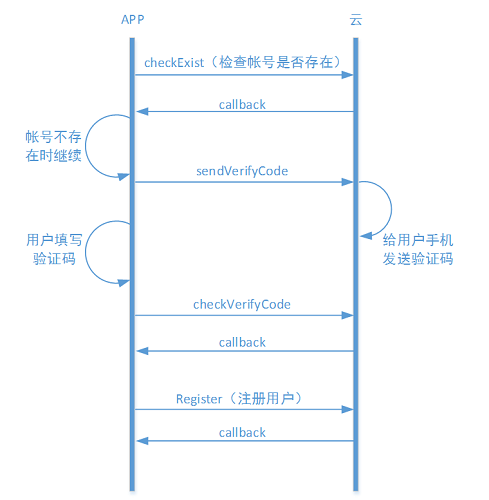

1、获取账号管理器

```
//账号管理器SDK内部的实现为单例模式
ACAccountMgr accountMgr = AC.accountMgr();
```

2、检查手机号是否已注册

```
accountMgr.checkExist(phone, new PayloadCallback<Boolean>() {
    @Override
    public void success(Boolean isExist) {
        if (!isExist) {
            //发送验证码
        } else {
            //提示手机号已被注册 
        }
    }
    @Override
    public void error(ACException e) {
        //网络错误或其他，根据e.getErrorCode()做不同的提示或处理
    }
});
```

3、发送验证码

```
//1代表MAX短信内容模板，具体开发需要先把短信模板提交到MAX管理控制台再获取对应的参数
accountMgr.sendVerifyCode(phone, 1, new VoidCallback() {
    @Override
    public void success() {
        //检测验证码
    }
    @Override
    public void error(ACException e) {
        //网络错误或其他，根据e.getErrorCode()做不同的提示或处理
    }
});
```

>注意：
>1.由于第三方短信服务限制，每个手机账号每天最多只能发送10条短信验证码，请不要做重复发送验证码测试。 >2.当发送手机号为国际号码时候，请将手机号前的“+”转换为“00”。
4、检测验证码正确性

```
accountMgr.checkVerifyCode(phone，verifyCode, new PayloadCallback<Boolean>() {
    @Override
    public void success(Boolean result) {
        if (result) {
            //注册
        } else {
            //提示验证码错误 
        }
    }
    @Override
    public void error(ACException e) {
        //网络错误或其他，根据e.getErrorCode()做不同的提示或处理
    }
});
```

5、注册

```
//emai和phone可以任选其一;nickName为可选项，没有时传空字符串
accountMgr.register(email, phone, password, nickName, verifyCode, new PayloadCallback<ACUserInfo>() {
    @Override
    public void success(ACUserInfo userInfo) {
        //获得用户userId和nickName，由此进入主页或设备管理
    }   
    @Override
    public void error(ACException e) {
        //网络错误或其他，根据e.getErrorCode()做不同的提示或处理
    }
});
```

2 普通账号登录
用户调用登录接口成功之后，会在app本地存储一个token，下次启动app时即默认app已经登录，无需再进行登录，从v1.09版本之后，这个token具有有效期，在长期未使用app的情况下会过期，这个时候需要进行重新登录处理，所以建议在App启动时通过账号管理的isLogin()接口判断是否已登录。

```
ACAccountMgr accountMgr = AC.accountMgr();
if(accountMgr.isLogin()){
    //由此进入主页
    return;
} else{
    //提示让用户输入用户名及密码
}
```

点击登录按钮后，调用登录接口

```
//account为手机号/邮箱
accountMgr.login(account, password, new PayloadCallback<ACUserInfo>() {
    @Override
    public void success(ACUserInfo userInfo) {
        //获得用户userId和nickName，由此进入主页             
    }

    @Override
    public void error(ACException e) {
        //网络错误或其他，根据e.getErrorCode()做不同的提示或处理
    }
});
```

3 验证码登录

```
//account为手机号/邮箱
AC.accountMgr().loginWithVerifyCode(account, verifyCode, new PayloadCallback<ACUserInfo> callback) {
    @Override
    public void success(ACUserInfo userInfo) {
        //获得用户userId和nickName，由此进入主页             
    }

    @Override
    public void error(ACException e) {
        //网络错误或其他，根据e.getErrorCode()做不同的提示或处理
    }
});
```

相关注意事项如下:

>开发者应在调用该接口前检查用户输入的用户名是否合法. 简单的检查如: 检查手机号长度是否是11位等. 标准的检查方法: 使用正则表达式去检查用户输入的手机号/邮箱是否合法.
>若登陆的账户尚未注册，此接口会自动注册此账户并返回账户信息。
>如果该接口返回错误, 请根据错误信息自行检查,包括网络是否通畅, 参数是否正确等.

4 单点登录
若有单点登录相关的业务需求可以通过调用一下接口强制将除本机以外所有客户端上的登录状态过期：

```
AC.accountManager.forceUpdateRefreshToken(new PayloadCallback<ACUserInfo>() {
    @Override
    public void success(ACUserInfo userInfo) {
        //获得用户userId和nickName     
    }

    @Override
    public void error(ACException e) {
        //网络错误或其他，根据e.getErrorCode()做不同的提示或处理
    }
})
```

相关注意事项如下:

>此接口调用后无需再次进行登陆操作，内部自动更新重新生成的用户令牌及用户相关信息。

在其他被强制过期RefreshToken的客户端上可以使用如下回调方法做相应登出操作：

```
AC.accountMgr().setRefreshTokenInvalidCallback(new BaseCallback() {
    @Override
    public void error(ACException e) {
        //RefreshToken过期失效
    }
}
```

5 设置帐号附加属性
使用账号附加属性需要先到MAX管理控制平台上的用户管理添加附加属性

步骤：登录MAX平台–>用户管理–>附加属性–>新建

1、设置/更新用户附加属性

设置用户头像(设置头像不需要在MAX控制台上新建附加属性字段)

```
//picture为图片的二进制流，请自行为其初始化
byte[] picture;
AC.accountMgr().setAvatar(picture, new PayloadCallback<String>() {
    @Override
    public void success(String url) {
        //头像设置成功，返回url，同时也可通过调用getUserProfile接口获取头像url
    }

    @Override
    public void error(ACException e) {
        //上传失败，检查网络问题
    }
});
```

设置除用户头像外的其他属性

```
ACObject userProfile = new ACObject();
//注意此处put进去的key与value类型对应新建附加属性时填写的属性标识与属性类型
userProfile.put("city"， "北京")
userProfile.put("birthday", "1989-10-13")
AC.accountMgr().setUserProfile(userProfile, new VoidCallback() {
    @Override
    public void success() {
        //附加属性设置成功
    }

    @Override
    public void error(ACException e) {
        //网络错误或其他，根据e.getErrorCode()做不同的提示或处理
    }
});
```

2、获取用户自定义附加属性

```
AC.accountMgr().getUserProfile(new PayloadCallback<ACObject>() {
     @Override
     public void success(ACObject object) {
         //可通过object.toString()查看附加属性信息
         String city = object.get("city");
         String birthday= object.get("birthday");
     }

     @Override
     public void error(ACException e) {
         //网络错误或其他，根据e.getErrorCode()做不同的提示或处理
     }
});
```

6 第三方登录
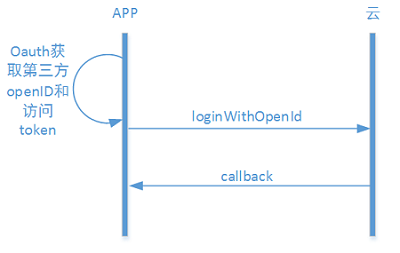

1、直接使用第三方登录

```
//APP端在完成OAuth认证登录之后可以获取到openId和accessToken
AC.accountMgr().loginWithOpenId(ACThirdPlatform.QQ, openId, accessToken, new PayloadCallback<ACUserInfo>() {
    @Override
    public void success(ACUserInfo userInfo) {
        //获得用户userId和nickName，进入主页或设备管理
    }   
    @Override
    public void error(ACException e) {
        //网络错误或其他，根据e.getErrorCode()做不同的提示或处理
    }
});
//绑定一个未被注册的普通帐号；emai和phone可以任选其一;nickName为可选项，没有时传空字符串
AC.accountMgr().bindWithAccount(email, phone, password, nickName, verifyCode, new VoidCallback() {
    @Override
    public void success() {
        //绑定账号成功
    }
    @Override
    public void error(ACException e) {
        //网络错误或其他，根据e.getErrorCode()做不同的提示或处理
    }
});
```

2、在已有普通账号登录时绑定第三方账号

```
AC.accountMgr().bindWithOpenId(ACThirdPlatform.QQ, openId, accessToken, new VoidCallback() {
    @Override
    public void success() {
        //成功绑定第三方账号
    }
    @Override
    public void error(ACException e) {
        //网络错误或其他，根据e.getErrorCode()做不同的提示或处理
    }
});
```

>注：该接口需要在使用普通账户登录之后才可以调用

<h6 id='4.4.2.3.2'>产品管理</h6>
开发者可以获取所有子域产品信息的列表，同时也可以根据子域获取指定的产品信息，需要使用ACProductManager类。 产品信息包含 主域ID及名称、子域ID及名称、产品名称、产品型号、产品展示图片、产品描述。需要使用ACProduct类。 所以需要在项目相关的类的头部添加如下代码:

```
import com.accloud.cloudservice.ACProductManager
import com.accloud.service.ACProduct
```

获取所有产品信息列表

```
AC.productMgr().fetchAllProducts(new PayloadCallback<List<ACProduct>>() {
    @Override
    public void success(List<ACProduct> products) {
        //请求成功处理
    }

    @Override
    public void error(ACException e) {
        //请求失败处理
    }
});
```

相关注意事项如下:

>此接口必须在用户登陆成功后调用.
>返回数据中字段如果没有在控制台中设置，则返回@"".

获取子域对应产品的信息

```
 AC.productMgr().fetchProduct(subDomain, new PayloadCallback<ACProduct>() {
    @Override
    public void success(ACProduct product) {
       //请求成功处理
    }

    @Override
    public void error(ACException e) {
       //请求失败处理
    }
 });
```

相关注意事项如下:

>此接口必须在用户登陆成功后调用.
>调用时请请检查子域是否存在.
>返回数据中字段如果没有在控制台中设置，则返回@"".

<h6 id='4.4.2.3.3'>设备配网</h6>
用户登录/注册后，需要绑定设备才能够使用。对于普通的WIFI连接类型设备，绑定设备之前，首先需在APP上给出配置设备进入SmartConfig状态的提示；然后填写当前手机连接的WiFi和密码，调用startAbleLink将SSID与密码广播给设备，设备拿到WiFi密码后连接到云端然后开始局域网广播自己的物理Id和subdomainId，APP拿到回调后即可以调用bindDevice接口绑定设备。

1 普通SmartLink配网


1.获取设备激活器

MAX提供了ACDeviceActivator激活器供你使用，具体使用步骤如下：

````
//以汉枫模块为例
ACDeviceActivator deviceActivator = AC.deviceActivator(AC.DEVICE_HF);
```

>注：AC.DEVICE_HF表示汉枫的wifi模块，如果用的是其它的wifi模块，则需要改成相对应的值。 目前支持的wifi模块有：AC.DEVICE_MTK(MTK模块)、AC.DEVICE_MX（庆科模块）、AC.DEVICE_MARVELL（MARVELL模块）、AC.DEVICE_MURATA（村田模块）、AC.DEVICE_WM（联盛德模块）、AC.DEVICE_RAK（RAK模块）、AC.DEVICE_TI、AC.DEVICE_ESP8266、AC.DEVICE_REALTEK、AC.DEVICE_AI6060H、AC.DEVICE_MILL、AC.DEVICE_GUBEI(古北模块)。

2.获取WiFi的SSID

```
deviceActivator. getSSID()
```

3.激活设备

APP通过startAbleLink广播自己的WiFi密码，设备成功连上云之后通过广播通知APP同时获取设备物理Id和subDomainId（用来区分设备类型）。只支持配置手机当前连接的WiFi。

```
//ssid为wifi名，password为wifi密码，AC.DEVICE_ACTIVATOR_DEFAULT_TIMEOUT为AC默认的配网超时时间60s，具体可根据实际情况测试进行修改。
deviceActivator.startAbleLink(ssid, password,  AC.DEVICE_ACTIVATOR_DEFAULT_TIMEOUT, new PayloadCallback<List<ACDeviceBind>>() {
    @Override
    public void success(List<ACDeviceBind> deviceBinds) {
        //成功后得到已激活设备的列表，从列表中得到物理id后可调用AC.bindMgr()的bindDevice接口进行绑定
    }

    @Override
    public void error(ACException e) {
        //根据e.getErrorCode()做不同的提示或处理
    }
});
```

以下为该接口详细的错误信息描述

错误码|	错误描述|	可能原因
---|---|---
1960|	局域网内没有发现设备|	设备配网失败、发送广播失败
1961|	MCU注册失败|	MCU与WiFi通信错误
1962|	建立长连接失败|	弱网络环境、路由器未能连接云端
1963|	与云端激活认证失败|	弱网络环境、密钥烧录错误
1999|	网络错误或其他|	app联网错误

>若希望这个配网日志可以上报到云端，通过MAX控制台设备管理查看该设备配网的详细流程，则还需要集成MAX大数据分析SDK即可。

4.停止激活设备

建议在退出激活设备的页面时，调用以下接口。

```
@Override
protected void onDestroy() {
    super.onDestroy();
    if (deviceActivator.isAbleLink())
        deviceActivator.stopAbleLink();
}
```

>如激活设备过程中用户手动停止配网，则调用stopAbleLink接口即可。

2 AP模式配网
配网原理

AP模式配网是指通过APP连接设备发出的AP热点, 然后将设备正常工作时候的WIFI信息发送给设备, 完成设备配网的过程

适用场景

所有支持AP模式的设备, 建议在普通SmartConfig配网模式配网失败的情况下使用。

整体实现流程
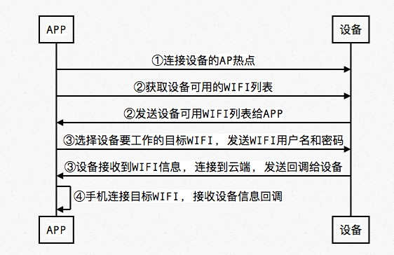


代码示例

1、 APP连接设备的AP热点 APP在UI界面上给出提示，让用户点击设备上对应的进入AP模式的按键, 确认设备进入配网模式，同时提示用户连接该AP热点。

2、 APP获取设备可用WIFI列表 手机连接到设备AP热点后, 切换到APP页面, 发送请求给设备, 以获取设备可用的WIFI列表：

```
ACDeviceActivator deviceActivator = AC.deviceActivator(AC.DEVICE_AP);
//第一个参数为超时时间，单位为毫秒，此处建议为10s
deviceActivator.searchAvailableWifi(10000, new PayloadCallback<List<ACWifiInfo>>() {
    @Override
    public void success(List<ACWifiInfo> wifiInfos) {
        for (ACWifiInfo info : wifiInfos) {
            //WiFi的SSID
            String ssid = info.getSsid();
            //WiFi的信号强度
            String power = info.getPower();
        }
    }

    @Override
    public void error(ACException e) {
        //
    }
});
```

>建议开发者在获取到WIFI列表后,弹窗或者以Spinner控件展示,方便用户点击对应的WIFI直接输入密码.

3、 APP选择设备要工作的目标WIFI, 发送SSID和密码(以SSID:Hello_world, 密码:123456为例)

```
//AC.DEVICE_ACTIVATOR_DEFAULT_TIMEOUT：使用默认超时时间60s
//第一个回调为配置SSID与Password成功与否的回调，建议传null；只用于调试阶段分析问题。
//第二个回调为设备是否连云成功的回调。配置成功与否以第二个回调为主
deviceActivator.startApLink("Hello_world", "123456", AC.DEVICE_ACTIVATOR_DEFAULT_TIMEOUT, null, new PayloadCallback<ACDeviceBind>() {
    @Override
    public void success(ACDeviceBind deviceBind) {
        //设备已成功连接，通过ACDeviceBind获取到物理ID进行绑定设备操作
    }

    @Override
    public void error(ACException e) {
        //此处一般为1993的超时错误，建议处理逻辑为页面上提示配网失败，提示用户检查自己输入的WIFI信息是否正确等，回到上述第一步骤，重新开始所有配网步骤。
    }
});
```

4、 在APP发送SSID和密码的同时，同步更新UI界面，提示用户切换手机WiFi连接到Hello_world（手机进入设置->无限局域网, 选择目标WIFI, 连接. 然后切回到APP界面）, 等待设备将物理ID等信息返回. 开发者拿到ACDeviceBind回调后可调用绑定接口进行设备绑定操作等。

<h6 id='4.4.2.3.4'>设备管理</h6>
1 绑定设备
对于WIFI设备，则需要先经过设备配网后，APP拿到配网的回调调用bindDevice接口绑定设备。
对于GPRS设备，则无需以上设备激活的流程，通过扫码或其他方式获取物理Id后调用bindDevice进行绑定即可。建议流程：若设备上有是否连接上MAX云端的指示灯，则可以提示用户在指示灯亮起的时候绑定设备。若无指示灯，则可在用户点击开始绑定之后，建议通过CountDownTimer每隔2s钟绑定一次设备，在连续绑定几次之后再提示用户失败或成功。

>注意：调用bindDevice接口时要求设备已经连上云端且当前在线。

1.1 普通设备

通过获取到的subdomainID匹配subdomain，然后在成功激活设备后的回调方法中，通过subdomian和物理Id绑定设备。

```
AC.bindMgr().bindDevice(subDomain, physicalDeviceId, deviceName, new PayloadCallback<ACUserDevice>() {
    @Override
    public void success(ACUserDevice userDevice) {
        //绑定成功后返回设备信息
    }

    @Override
    public void error(ACException e) {
        //网络错误或其他，根据e.getErrorCode()做不同的提示或处理
    }
});
```

设备无法绑定时，请检查以下问题：

1.设备已经被其他人绑定过了。
2.设备的domain和subdomain信息有误。
3.确保设备已经连上云端，如电源供电是否正常等。（可通过MAX管理控制台中的 设备管理 查看设备是否在线判断已经连上云端）
绑定成功后，通过listDevice 接口可以列出已经绑定的设备列表。

2 分享设备
第一种分享方式是管理员输入用户的帐号（手机号）直接把设备分享给用户
第二种方式为管理员分享二维码后，用户再通过扫码的形式绑定设备获得设备的使用权。推荐使用第二种分享机制。
管理员直接分享设备给已注册的普通用户

```
AC.bindMgr().bindDeviceWithUser(subDomain, deviceId, account, new VoidCallback() {
    @Override
    public void success() {
        //成功分享设备给account用户
    }

    @Override
    public void error(ACException e) {
        //网络错误或其他，根据e.getErrorCode()做不同的提示或处理
    }
});
```

管理员通过分享设备二维码的形式分享设备

```
//管理员获取分享码
AC.bindMgr().fetchShareCode(deviceId, timeout, new PayloadCallback<String>() {
    @Override
    public void success(String shareCode) {
         //成功获取分享码
    }

    @Override
    public void error(ACException e) {
         //网络错误或其他，根据e.getErrorCode()做不同的提示或处理
    }
});
//普通用户通过扫分享码绑定设备
bindMgr.bindDeviceWithShareCode(shareCode, new PayloadCallback<ACUserDevice>() {
    @Override
    public void success(ACUserDevice userDevice) {
         //成功绑定管理员分享的设备
    }

    @Override
    public void error(ACException e) {
         //网络错误或其他，根据e.getErrorCode()做不同的提示或处理
    }
});
```
注：管理员分享的二维码有有效期。默认为一个小时。调用fetchShareCode接口时开发者可以自定义有效时间。若已存在未过期二维码则返回原有二维码并更新timeout时间，若原有二维码已过期则返回新的二维码。

同时还提供了重新生成分享码的接口（原分享码会失效）
```
AC.bindMgr().refreshShareCode(deviceId, timeout, new PayloadCallback<String>() {
    @Override
    public void success(String shareCode) {
         //成功刷新分享码
    }

    @Override
    public void error(ACException e) {
         //网络错误或其他，根据e.getErrorCode()做不同的提示或处理
    }
});
```
相关注意事项如下:

设备的逻辑ID可以通过调用listDevice接口获取.
如果获取失败, 请检查子域和设备逻辑ID是否在正确.
该接口只有设备管理员才可以调用.
建议开发者将分享码做成二维码, 然后让其他用户通过扫码绑定
3 解绑设备
管理员或普通用户解绑设备
```
bindMgr.unbindDevice(subDomain, deviceId, new VoidCallback() {
    @Override
    public void success() {
        //解绑成功
    }

    @Override
    public void error(ACException e) {
        //网络错误或其他，根据e.getErrorCode()做不同的提示或处理
    }
});
```
注意：如果是管理员解绑设备，那么其他绑定该设备的普通成员也会失去该设备的使用权。
管理员取消其他普通成员对该设备的控制权
```
bindMgr.unbindDeviceWithUser(subDomain, userId, deviceId, new VoidCallback() {
    @Override
    public void success() {
        //解绑成功
    }

    @Override
    public void error(ACException e) {
        //网络错误或其他，根据e.getErrorCode()做不同的提示或处理
    }
});
```
<h6 id='4.4.2.3.5'>设备数据</h6>
设备数据分为设备属性数据与设备状态数据。

他们都可以进行实时消息订阅，进行订阅操作后，APP和云端建立长连接, 设备属性数据的变化与设备状态的变更会通过云端实时推送给APP。
其中设备属性数据同时提供了获取历史属性数据以及当前设备属性数据的接口。
1 代码示例
1.1 设备属性数据

设备属性可前往【控制台->产品管理->属性设置】进行创建。

以空气净化器为例来说明。

属性名 | 类型 | 描述
----|----|---------
pm25   | 整数 | pm2.5值
speed  | 整数 | 当前风机转速
mode   | 字符串 | 当前净化器状态(auto(自动), high(高速), medium(中速), low(低速))


（1）获取设备属性

设备属性的当前数据和历史数据可前往【控制台->设备管理->对应设备详情->属性数据】进行查看。


获取设备历史属性数据
```
//设置过滤条件 pm25 = 10 && speed < 20
Criteria criteria = Criteria.create()
                            .andWhere(Expression.eq("pm25", 10))
                            .andWhere(Expression.lt("speed", 20));

long now = System.currentTimeMillis();
//新建历史数据搜索条件实例
QueryOption option = new QueryOption(criteria)
                    //默认返回**所有**属性字段，如下设置后结果只返回 @"pm25"和@"speed" 字段
                    //.projection(new String[]{"pm25", "speed"})
                    .startTime(now - TimeUnit.DAYS.toMillis(1))
                    .endTime(now)
                    .limit(20);

//发起查询请求
AC.deviceDataMgr().fetchHistoryProperty("subDomain", 45, option,
    new PayloadCallback<List<String>>() {
        @Override
        public void success(List<String> strings) {
            //拉取数据成功后的操作
            ArrayList<AirPropertyRecord> list = new ArrayList<>();
            if (strings != null) {
                Gson gson = new Gson();
                for (String string : strings) {
                    list.add(gson.fromJson(string, AirPropertyRecord.class));
                }
            }
        }

        @Override
        public void error(ACException e) {
            //拉取数据错误提示
        }
    }
);
```
其中AirPropertyRecord是业务相关的JavaBean类
```
public class AirPropertyRecord extends PropertyRecord {
    public int pm25;
    public int speed;
}
```
默认情况下（即QueryOtion.projection == null时），属性数据包含设备ID和该条数据的时间戳，可将PropertyRecord作为基类
```
public class PropertyRecord {
    public long id;
    public long timestamp;
}
```
相关注意事项如下:
option搜索实例，若不设置则默认limit为20条，上限为1000条。
option搜索实例，若不设置搜索起始时间startTime，则默认从最早的数据开始搜索。
option搜索实例，若不设置搜索结束时间endTime，则默认查询到最新一条数据。
option搜索实例，若不设置检索返回属性字段数组projection，则默认返回所有属性字段。也可自定义搜索返回字段如：option.projection(new String[]{"pm25", "speed"});
option搜索实例可以对属性字段设置多种过滤条件，通过Expression类:相等（eq）,小于（lt）,大于（gt）,小于等于（lte）,大于等于（gte)。
返回结果均带有timestamp属性。

获取设备当前属性数据
```
AC.deviceDataMgr().fetchCurrentProperty("subDomain", 45,
     new PayloadCallback<String>() {
         @Override
         public void success(String string) {
             //拉取数据成功后的操作
             if (string != null) {
                 new Gson().fromJson(string, AirPropertyRecord.class);
             }
         }
     }
);     
```
(2)订阅设备属性实时变化
当设备上报属性数据至UDS后，UDS可调用属性数据存储并推送接口，对对应设备进行属性数据实时推送，此时APP只需要订阅该设备的属性数据推送并设置了回调处理函数，则可以实现实时数据的获取与处理。
订阅设备属性数据实时推送消息:
```
AC.deviceDataMgr().subscribeProperty("subDomain", 45,
    new VoidCallback() {
        @Override
        public void success() {
            //订阅成功提示
        }

        @Override
        public void error(ACException e) {
            //订阅失败提示
        }
    }
);
```
相关注意事项如下:
SubDomain为设备所属的子域
deviceId为设备的激活id
如果回调结果无错误则表明订阅操作成功

取消订阅设备属性数据实时推送消息:

```
AC.deviceDataMgr().unSubscribeProperty("subDomain", 45,
    new VoidCallback() {
        @Override
        public void success() {
            //取消订阅提示
        }
        @Override
        public void error(ACException e) {
            //取消订阅提示
        }
    }
);
```

相关注意事项如下:

SubDomain为设备所属的子域
deviceId为设备的激活id
如果回调结果无错误则表明取消订阅操作成功
下面同时提供了取消订阅所有设备实时属性数据推送的接口。

取消订阅所有设备属性数据实时推送消息:
```
AC.deviceDataMgr().unSubscribeAllProperty();
```
设置设备属性数据实时消息回调:
```
// 注册回调
AC.deviceDataMgr().registerPropertyReceiver(/*ACDeviceDataMgr.PropertyReceiver*/ receiver);

// 解注册回调
AC.deviceDataMgr().unregisterPropertyReceiver(/*ACDeviceDataMgr.PropertyReceiver*/ receiver);
```
PropertyReceiver是回调接口
```
interface PropertyReceiver {
    void onPropertyReceive(String subDomain, long deviceId, String value);
}
```
相关注意事项如下:

SubDomain为设备所属的子域
deviceId为设备的激活id
value为设备新增的所有属性键值
此回调方法可以在您代码的任意位置进行设置。

可以用JavaBean类来表示value的值，比如空气净化器的属性
```
AirProperty status = new Gson().fromJson(value, AirProperty.class);

public class AirProperty {
    public int pm25;
    public int speed;
}

```
1.2 设备状态数据

订阅设备状态实时消息
```
AC.deviceDataMgr().subscribeOnlineStatus("subDomain", 45,
    new VoidCallback() {
        @Override
        public void success() {
            //订阅成功提示
        }

        @Override
        public void error(ACException e) {
            //订阅失败提示
        }
    }
);
```
相关注意事项如下:

SubDomain为设备所属的子域
deviceId为设备的激活id
如果回调结果无错误则表明订阅操作成功
下面同时提供了取消订阅所有设备状态推送的接口。

取消订阅设备状态实时消息
```
AC.deviceDataMgr().unSubscribeOnlineStatus("subDomain", 45,
    new VoidCallback() {
        @Override
        public void success() {
            //取消订阅提示
        }

        @Override
        public void error(ACException e) {
            //取消订阅提示
        }
    }
);
```

相关注意事项如下:

SubDomain为设备所属的子域
deviceId为设备的激活id
如果回调结果无错误则表明取消订阅操作成功

取消订阅所有设备状态推送消息:
```
AC.deviceDataMgr().unSubscribeAllOnlineStatus();
```
设置设备实时状态回调:
```
// 注册回调
AC.deviceDataMgr().registerOnlineStatusListener(/*ACDeviceDataMgr.OnlineStatusListener*/ listener);

// 解注册回调
AC.deviceDataMgr().unregisterOnlineStatusListener(/*ACDeviceDataMgr.OnlineStatusListener*/ listener);
```
OnlineStatusListener是回调接口
```
interface OnlineStatusListener {
    void onStatusChanged(String subDomain, long deviceId, boolean online);
}
```
相关注意事项如下:

SubDomain为设备所属的子域
deviceId为设备的激活id
online为设备状态，true为在线，false为离线
此回调方法可以在您代码的任意位置进行设置。
1.3 设备故障数据

获取设备当前故障属性属性值
其中AirWarningRecord是业务相关的JavaBean类
```
AC.deviceDataMgr().subscribeWarning("subDomain", 45,
    new VoidCallback() {
        @Override
        public void success() {
            //订阅成功提示
        }

        @Override
        public void error(ACException e) {
            //订阅失败提示
        }
    }
);
```

相关注意事项如下:
SubDomain为设备所属的子域
deviceId为设备的激活id
如果回调结果无错误则表明订阅操作成功
下面同时提供了取消订阅所有设备故障属性数据推送的接口。

取消订阅所有故障属性数据推送消息:
```
AC.deviceDataMgr().unSubscribeAllWarning();
```

取消订阅设备故障属性数据实时消息
```
AC.deviceDataMgr().unSubscribeWarning("subDomain", 45,
    new VoidCallback() {
        @Override
        public void success() {
            //取消订阅提示
        }

        @Override
        public void error(ACException e) {
            //取消订阅提示
        }
    }
);
```

相关注意事项如下:

SubDomain为设备所属的子域
deviceId为设备的激活id
如果回调结果无错误则表明取消订阅操作成功

设置设备实时故障属性数据回调:
```
// 注册回调
AC.deviceDataMgr().registerWarningReceiver(/*ACDeviceDataMgr.WarningReceiver*/ receiver);

// 解注册回调
AC.deviceDataMgr().unregisterWarningReceiver(/*ACDeviceDataMgr.WarningReceiver*/ receiver);
```

WarningReceiver是回调接口
```
interface WarningReceiver {
    void onWarningReceive(String subDomain, long deviceId, String value);
}
```

相关注意事项如下:

SubDomain为设备所属的子域
deviceId为设备的激活id
value为设备故障属性数据，其中键值对与管理平台中产品故障属性定义相对应。 其中键"_overall"的数据代表 0：整机无故障，1：整机有故障。
此回调方法可以在您代码的任意位置进行设置。

<h6 id='4.4.2.3.6'>设备通信</h6>
说明：在设备尚未开发完成时，在管理后台可以启动虚拟设备用于APP的调试。虚拟设备和真实设备使用方法相同，需要先绑定再使用。虚拟设备能够显示APP发到设备的指令，上报数据到云端、填入数据供APP查询。

1 发送消息到设备
1.1 使用二进制通信格式

例如：以开关设备为例,协议如下:
```
//请求数据包
{ 68 ：
    //开关灯(二进制流，由厂商自己解析)，其中0代表关灯，1代表开灯
    [ 0/1 , 0 , 0 , 0 ]
}
//响应数据包  
{ 102 ：
    //结果(二进制流，由厂商自己解析)，其中0代表失败，1代表成功
    [ 0/1 , 0 , 0 , 0 ]
}
```
截取开灯代码，如下:
```
public class LightMsg {
    public static final int REQ_CODE = 68;
    public static final int RESP_CODE = 102;

    //0代表关，1代表开
    public static final byte ON = 1;
    public static final byte OFF = 0;

    private byte ledOnOff;

    public LightMsg(byte ledOnOff) {
        this.ledOnOff = ledOnOff;
    }

    public byte[] getLedOnOff() {
        return new byte[]{ledOnOff, 0, 0, 0};
    }

    public String getDescription(){
        if(ledOnOff == OFF)
            return "close light";
        else 
            return "open light";
    }
}
```

```
LightMsg lightMsg = new LightMsg(LightMsg.ON);
//初始化ACDeviceMsg对象消息体，设置发送的msgCode及消息内容
ACDeviceMsg deviceMsg = new ACDeviceMsg(LightMsg.REQ_CODE, lightMsg.getLedOnOff(), lightMsg.getDescription());

//设置局域网通讯加密方式，不设置则默认为动态加密
//deviceMsg.setSecurityMode(ACDeviceSecurityMode.DYNAMIC_ENCRYPTED);

//AC.LOCAL_FIRST代表优先走局域网，局域网不通的情况下再走云端
bindMgr.sendToDeviceWithOption(subDomain, physicalDeviceId, deviceMsg, AC.LOCAL_FIRST, new PayloadCallback<ACDeviceMsg>() {
    @Override
    public void success(ACDeviceMsg deviceMsg) {
        byte[] resp = deviceMsg.getContent();
        if(resp[0] == 1){
            //开灯成功
        } else {
            //开灯失败
        }
    }

    @Override
    public void error(ACException e) {
        //网络错误或其他，根据e.getErrorCode()做不同的提示或处理
    }
});
```

发送到设备sendToDeviceWithOption的参数枚举如下：

AC.LOCAL_FIRST代表优先走局域网，局域网不通的情况下走云端通讯
AC.CLOUD_FIRST代表优先走云端，云端不通的情况下走局域网通讯
AC.ONLY_LOCAL代表仅通过局域网通讯
AC.ONLY_CLOUD代表仅通过云端通讯

1.2 使用json通信格式

例如：以开关设备为例,协议如下:1.2 使用json通信格式

例如：以开关设备为例,协议如下:
```
//请求数据包
{ 70 ：
    {
        //开关灯，其中0代表关灯，1代表开灯
        "switch" : 0/1
    }
}
//响应数据包  
{
     //结果，其中false代表失败，1代表成功
     "result" : false/true
}
```

```
JSONObject req = new JSONObject();
try {
    req.put("switch", 1);
} catch (JSONException e) {
}
//初始化ACDeviceMsg对象消息体，设置发送的msgCode及消息内容
ACDeviceMsg deviceMsg = new ACDeviceMsg(70, req.toString().getBytes(), "open light");

//设置局域网通讯加密方式，不设置则默认为动态加密
//deviceMsg.setSecurityMode(ACDeviceSecurityMode.DYNAMIC_ENCRYPTED);

//AC.LOCAL_FIRST代表优先走局域网，局域网不通的情况下再走云端
bindMgr.sendToDeviceWithOption(subDomain, physicalDeviceId, deviceMsg, AC.LOCAL_FIRST, new PayloadCallback<ACDeviceMsg>() {
    @Override
    public void success(ACDeviceMsg deviceMsg) {
        try {
            JSONObject resp = new JSONObject(new String(deviceMsg.getContent()));
        } catch (JSONException e) {
        }
        boolean result = resp.optBoolean("result");
        if (result) {
            //开灯成功
        } else {
            //开灯失败
        }
    }

    @Override
    public void error(ACException e) {
        //网络错误或其他，根据e.getErrorCode()做不同的提示或处理
    }
});
```

发送到设备sendToDeviceWithOption的参数枚举如下：

AC.LOCAL_FIRST代表优先走局域网，局域网不通的情况下走云端通讯
AC.CLOUD_FIRST代表优先走云端，云端不通的情况下走局域网通讯
AC.ONLY_LOCAL代表仅通过局域网通讯
AC.ONLY_CLOUD代表仅通过云端通讯


2 局域网通信
以下按照两种不同的适用场景进行讲解。

2.1 纯局域网下控制设备

适用场景:在已知完全没有外网的情况下控制设备，建议使用不加密/静态加密的方式控制设备。如选择不加密／静态加密方式，设备端亦需要配合修改初始化参数。

获取局域网内的设备列表
```
//AC.FIND_DEVICE_DEFAULT_TIMEOUT为获取局域网内设备的超时时间，默认3s，
AC.findLocalDevice(AC.FIND_DEVICE_DEFAULT_TIMEOUT, new PayloadCallback<List<ACDeviceFind>>() {
    @Override
    public void success(List<ACDeviceFind> deviceFinds) {
        //没有发现局域网内设备的情况下则返回deviceFinds为空的ArrayList
        //ACDeviceFind对象中包含设备的物理ID及IP，可用于更新界面或者判断当前设备是否在线。
    }

    @Override
    public void error(ACException e) {
        //此处一般是在手机主动关闭了WiFi连接时才会返回
        if(e.getErrorCode == ACException.NO_WIFI_CONNECTED)
                Toast.makeText(this, "请您打开WiFi便于控制设备", Toast.LENGTH_LONG).show();
    }
});
```

只有实时发现的设备列表可以实现局域网的控制。
发送消息到设备

以msgCode为64，payload为[1，0，0，0]为设备开灯协议举例
```
ACDeviceMsg deviceMsg = new ACDeviceMsg(64, new byte[]{1,0,0,0}, "open light");

//设置局域网通讯加密方式，此处设置静态加密，不设置则默认为动态加密
deviceMsg.setSecurityMode(ACDeviceSecurityMode.STATIC_ENCRYPTED);

//AC.ONLY_LOCAL代表仅通过局域网直连控制
bindMgr.sendToDeviceWithOption(subDomain, physicalDeviceId, deviceMsg, AC.ONLY_LOCAL, new PayloadCallback<ACDeviceMsg>() {
    @Override
    public void success(ACDeviceMsg deviceMsg) {
        //成功发送设备指令并收到设备响应
    }

    @Override
    public void error(ACException e) {
        //网络错误或其他，根据e.getErrorCode()做不同的提示或处理
    }
});
```

2.2 局域网/云端优先控制设备

适用场景：若通过局域网控制设备失败后，仍需要通过云端发送消息到设备；反之亦相同。

从云端获取已绑定设备的列表

获取设备列表（在网络环境差或者没有外网的情况下如果获取不到设备列表会从本地缓存里取设备列表）。

```
//获取设备列表
public void getDeviceList() {
    bindMgr.listDevicesWithStatus(new PayloadCallback<List<ACUserDevice>>() {
        @Override
        public void success(List<ACUserDevice> deviceList) {
            for(ACUserDevice device:deviceList){
                /**
                 * 设备在线状态(listDeviceWithStatus时返回，listDevice不返回该值)
                 * 0不在线 1云端在线 2局域网在线 3云端和局域网同时在线
                 * 若只选择直连的通讯方式，则只有在2和3的状态下才能往设备发送成功
                 */
                device.getStatus();
            }
        }

        @Override
        public void error(ACException e) {
            //建议不做处理
        }
    });
}
```

注意：app启动初始化MAX时会自动获取局域网设备，由于获取局域网设备是一个异步过程（默认时间为2s，可以根据实际情况设置AC.INIT_APP_DEFAULT_TIMEOUT的值，建议为闪屏页的时间），所以建议在启动app到打开设备列表页面之间增加一个闪屏页面。
定时刷新界面上的局域网状态

注意：若不需要在APP界面上实时显示局域网的状态，则不需要此步骤，直接进入下一步骤发送消息到设备

因为局域网通讯要求设备与APP处于同一个WiFi下，若网络环境变化，如切换手机WiFi，或者设备掉线时，直连的状态需要发生改变，所以建议在设备页通过定时器定时更新局域网状态，具体可参照ac-service-android-demo的实现
```

//定时更新设备当前的局域网状态
public void refreshDeviceStatus() {
    //当设备掉线或网络环境不稳定导致获取局域网显示状态不准确时，需要手动刷新设备列表与局域网状态
    AC.findLocalDevice(AC.FIND_DEVICE_DEFAULT_TIMEOUT, new PayloadCallback<List<ACDeviceFind>>() {
        @Override
        public void success(List<ACDeviceFind> deviceFinds) {
            //成功获取局域网内的设备列表，通过匹配已有的设备列表更新界面上的局域网状态，以下为示例参考代码：
            //局域网状态是否发生改变,是否需要更新界面
            boolean isRefresh = false;
            //遍历当前用户绑定的所有设备列表
            for (ACUserDevice device : adapter.deviceList) {
                //判断当前设备是否局域网本地在线
                boolean isLocalOnline = false;
                //遍历当前发现的局域网在线列表
                for (ACDeviceFind deviceFind : deviceFinds) {
                    //通过设备的物理Id进行匹配,若当前设备在发现的局域网列表中,则置为局域网在线
                    if (device.getPhysicalDeviceId().equals(deviceFind.getPhysicalDeviceId())) {
                        isLocalOnline = true;
                    }
                }
                if (isLocalOnline) {
                    //当前设备由不在线更新为局域网在线
                    if (device.getStatus() == ACUserDevice.OFFLINE) {
                        device.setStatus(ACUserDevice.LOCAL_ONLINE);
                        isRefresh = true;
                    //当前设备由云端在线更新为云端局域网同时在线
                    } else if (device.getStatus() == ACUserDevice.NETWORK_ONLINE) {
                        device.setStatus(ACUserDevice.BOTH_ONLINE);
                        isRefresh = true;
                    }
                } else {
                    //当前设备由局域网在线更新为不在线
                    if (device.getStatus() == ACUserDevice.LOCAL_ONLINE) {
                        device.setStatus(ACUserDevice.OFFLINE);
                        isRefresh = true;
                    //当前设备由云端局域网同时在线更新为云端在线
                    } else if (device.getStatus() == ACUserDevice.BOTH_ONLINE) {
                        device.setStatus(ACUserDevice.NETWORK_ONLINE);
                        isRefresh = true;
                    }
                }
            }
            //局域网状态需要发生改变,更新列表界面
            if (isRefresh)
                adapter.notifyDataSetChanged();
        }

        @Override
        public void error(ACException e) {
            //发生IO错误，将所有设备的局域网状态置为不在线，以下为示例参考代码：
            //局域网状态可能发生改变,判断是否需要更新界面上的列表显示
            boolean isRefresh = false;
            for (ACUserDevice device : adapter.deviceList) {
                //没有设备当前局域网在线,所以把所有当前显示局域网在线的设备状态重置
                if (device.getStatus() == ACUserDevice.LOCAL_ONLINE) {
                    device.setStatus(ACUserDevice.OFFLINE);
                    isRefresh = true;
                } else if (device.getStatus() == ACUserDevice.BOTH_ONLINE) {
                    device.setStatus(ACUserDevice.NETWORK_ONLINE);
                    isRefresh = true;
                }
            }
            //局域网状态需要发生改变,更新列表界面
            if (isRefresh)
                adapter.notifyDataSetChanged();
        }
    });
}

```

发送消息到设备

以msgCode为64，payload为[1，0，0，0]为设备开灯协议举例

```
ACDeviceMsg deviceMsg = new ACDeviceMsg(64, new byte[]{1,0,0,0}, "open light");

//设置局域网通讯加密方式，此处设置静态加密，不设置则默认为动态加密
deviceMsg.setSecurityMode(ACDeviceSecurityMode.DYNAMIC_ENCRYPTED);

//AC.LOCAL_FIRST代表优先走局域网，局域网不通的情况下再走云端
bindMgr.sendToDeviceWithOption(subDomain, physicalDeviceId, deviceMsg, AC.LOCAL_FIRST, new PayloadCallback<ACDeviceMsg>() {
    @Override
    public void success(ACDeviceMsg deviceMsg) {
        //成功发送设备指令并收到设备响应
    }

    @Override
    public void error(ACException e) {
        //网络错误或其他，根据e.getErrorCode()做不同的提示或处理
    }
});
```


<h6 id='4.4.2.3.7'>UDS通信</h6>
1 使用示例
1.1 访问普通UDS服务

注意：serviceName对应服务管理里UDS服务里的服务名称，务必保持一致。进入版本管理之后，查看已上线版本。serviceVersion为主版本号，比如1-0-0，则version为1。
```
ACMsg req = new ACMsg();
req.setName("queryData");
req.put("deviceId", deviceId);
req.put("startTime", 0);
req.put("endTime", System.currentTimeMillis());
AC.sendToService(subDomain, serviceName, serviceVersion, req, new PayloadCallback<ACMsg>() {
    @Override
    public void success(ACMsg resp) {
        //发送成功并接收服务的响应消息
    }

    @Override
    public void error(ACException e) {
        //网络错误或其他，根据e.getErrorCode()做不同的提示或处理，此处一般为传递的参数或UDS云端问题，可到MAX平台查看log日志
    }
});
```
1.2 匿名访问UDS服务
```
ACMsg req = new ACMsg();
req.setName("queryData");
req.put("deviceId", deviceId);
req.put("startTime", 0);
req.put("endTime", System.currentTimeMillis());
AC.sendToServiceWithoutSign(subDomain, serviceName, serviceVersion, req, new PayloadCallback<ACMsg>() {
    @Override
    public void success(ACMsg resp) {
        //发送成功并接收服务的响应消息
    }

    @Override
    public void error(ACException e) {
        //网络错误或其他，根据e.getErrorCode()做不同的提示或处理，此处一般为传递的参数或UDS云端问题，可到MAX平台查看log日志
    }
});
```
2 UDS本机调试
UDS通过start.sh脚本进行本机部署后，查看UDS所在的主机局域网ip地址，将ip地址设置于以下接口中即可访问本机UDS服务。
```
//应用程序初始化
AC.init(this, "MAX", 3, AC.TEST_MODE);
//设置为访问本机UDS进行本地调试，参数为ip+port
AC.setSendToLocalUDS("http://192.168.1.1:8080");
```
注意：APP需要与UDS所在的主机处于同一局域网下
<h6 id='4.4.2.3.8'>数据集</h6>
对于存储在数据集中的数据，APP可以进行实时消息订阅，进行订阅后，APP和云端建立长连接, 数据集中的数据发生改变后，云端会将最新的数据实时推送给APP

1 代码示例
使用之前, 需要先到控制台/存储管理/数据集中设置/查看对应的数据集, 以如下数据集为例(设备逻辑id:12):


1.1 订阅数据集实时推送数据
//设置主键值
Map<String, Object> primaryKey = new HashMap<>();
primaryKey.put("deviceId", 12);
//订阅数据集对应主键值的数据推送
AC.classDataMgr().subscribe("light_action_data", primaryKey, ACClassDataMgr.OPTYPE_ALL,
    new VoidCallback() {
        @Override
        public void success() {
            //订阅成功提示
        }

        @Override
        public void error(ACException e) {
            //订阅失败提示
        }
    }
);
相关注意事项如下:

数据集对象中涉及到字符串比较多, 如果遇到订阅失败请检查拼写是否正确
如果一个数据集有两个及以上主键, 则必须按顺序订阅, 即如果要订阅主键二, 则实现方式为订阅主键一和主键二, 不能单独订阅主键二
如果主键是设备Id, 那么该设备必须与当前用户是绑定关系

1.2 取消订阅数据集实时推送数据
```
//设置主键值
Map<String, Object> primaryKey = new HashMap<>();
primaryKey.put("deviceId", 12);
//取消数据集对应主键值的数据推送
AC.classDataMgr().unSubscribe("light_action_data", primaryKey, ACClassDataMgr.OPTYPE_ALL,
    new VoidCallback() {
        @Override
        public void success() {
            //取消订阅提示
        }

        @Override
        public void error(ACException e) {
            //失败提示
        }
    }
);
```
相关注意事项:

我们也提供了一个unSubscribeAll的接口, 如果有需要可以自己选择。
取消订阅所有数据集实时推送数据:
```
AC.classDataMgr().unSubscribeAll()
```
1.3 设置数据集实时推送回调
```
// 注册回调
AC.classDataMgr().registerDataReceiver(/*ACClassDataMgr.ClassDataReceiver*/ receiver);

// 解注册回调
AC.classDataMgr().unregisterDataReceiver(/*ACClassDataMgr.ClassDataReceiver*/ receiver);
```
ClassDataReceiver是回调接口
```
interface ClassDataReceiver {
    void onReceive(String className, int opType, String value);
}
```
相关注意事项如下:

className为数据集名称
opType为操作类型
value为JSON格式数据
此回调方法可以在您代码的任意位置进行设置。

<h6 id='4.4.2.3.9'>定时任务</h6>
注意：

1、timePoint的格式为"yyyy-MM-dd HH:mm:ss"，否则会失败。

2、timeCycle需要在timePoint时间点的基础上,选择循环方式。

"once":单次循环
"hour":在每小时的mm:ss时间点循环执行
"day":在每天的HH:mm:ss时间点循环执行
"month":在每月的dd HH:mm:ss时间点循环执行
"year":在每年的MM-dd HH:mm:ss时间点循环执行
"week[0,1,2,3,4,5,6]":在每星期的HH:mm:ss时间点循环执行(如周一，周五重复，则表示为"week[1,5]")
3、timeZone支持标准时区列表，标准时区列表请参考wiki。
1 设备定时任务
获取设备定时管理器

使用默认时区
```
//设备的逻辑ID
long deviceId = 1L; 
ACDeviceTimerMgr timerMgr = AC.deviceTimerMgr(deviceId);
```
使用自定义时区
```
//设备的逻辑ID
long deviceId = 1L; 
//使用北京时区
ACDeviceTimerMgr timerMgr = AC.deviceTimerMgr(deviceId, TimeZone.getTimeZone("Etc/GTM-8"));
```
自定义时区ID详情参考http://joda-time.sourceforge.net/timezones.html

添加设备定时任务
```
ACDeviceTask task = new ACDeviceTask();
//设置任务时间周期
task.setTimeCycle("day");
//设置任务执行的时间点，由于时间周期为天，所以只有19点精确到小时以后为有效参数，日期设置无效，即在每天19点执行任务
task.setTimePoint("2000-01-01 19:00:00");
//设置任务名称
task.setName("control");
//设置任务描述，选填
task.setDescription("open Air Condition");
//具体下发给设备的消息指令,msgCode与二进制流
ACDeviceMsg msg = new ACDeviceMsg(68, new byte[]{1,0,0,0});
task.setDeviceMsg(msg);
timerMgr.addTask(task, new PayloadCallback<ACDeviceTask>() {
     @Override
     public void success(ACDeviceTask task) {
         //成功添加定时任务，创建后默认为开启状态
     }

     @Override
     public void error(ACException e) {
         //网络错误或其他，根据e.getErrorCode()做不同的提示或处理，此处一般为参数类型错误，请仔细阅读注意事项
     }
});
```
修改设备定时任务

接口为modifyTask，其他参数与定义与创建定时任务相同。

开启设备定时任务
```
//taskId可以通过接口addTask/listTasks返回值获取
timerMgr.openTask(taskId, new VoidCallback() {
     @Override
     public void success() {
         //开启定时任务成功
     }

     @Override
     public void error(ACException e) {
         //参数无误下一般为网络错误
     }
});
```
关闭设备定时任务
```
timerMgr.closeTask(taskId, new VoidCallback() {
     @Override
     public void success() {
         //关闭定时任务
     }

     @Override
     public void error(ACException e) {
         //参数无误下一般为网络错误
     }
});
```
删除设备定时任务
```
timerMgr.deleteTask(taskId, new VoidCallback() {
     @Override
     public void success() {
         //删除定时任务
     }

     @Override
     public void error(ACException e) {
         //参数无误下一般为网络错误
     }
});
```
获取定时任务列表
```
timerMgr.listTasks(new PayloadCallback<List<ACDeviceTask>>(){
     @Override
     public void success(List<ACDeviceTask> tasks) {
         for (ACDeviceTask task : tasks){
             //通过logcat查看获取到的定时任务列表进行显示或下一步操作
             LogUtil.d("TAG", task.toString());
             //如获取taskId
             long taskId = task.getTaskId();
         }
     }

     @Override
     public void error(ACException e) {
         //参数无误下一般为网络错误
     }
});
```
2 设备定时任务组
与普通设备定时任务的区别是，将多个定时任务进行分组管理。 以下场景举例：用户设置每天早上9点上班，下午17点下班。那么我们希望在每天8:30自动关闭空调，下午16:30提前打开空调，实现代码如下：

获取设备定时管理器

使用默认时区
```
//设备的逻辑ID
long deviceId = 1L; 
ACDeviceTimerMgr timerMgr = AC.deviceTimerMgr(deviceId);
```
使用自定义时区
```
//设备的逻辑ID
long deviceId = 1L; 
//使用北京时区
ACDeviceTimerMgr timerMgr = AC.deviceTimerMgr(deviceId, TimeZone.getTimeZone("Etc/GTM-8"));
```
自定义时区ID详情参考http://joda-time.sourceforge.net/timezones.html

创建设备任务组
```
List<ACDeviceTask> tasks = new ArrayList<>();

ACDeviceTask closeTask = new ACDeviceTask();
//任务名字
closeTask.setName("Close air condition");
//任务描述，选填
closeTask.setDescription("Go to work");
//设置任务时间周期为每周工作日
closeTask.setTimeCycle("week[1,2,3,4,5]");
//由于时间周期为周，所以只有早上9点精确到小时为有效参数，日期设置无效
closeTask.setTimePoint("2000-01-01 09:00:00");
//关闭空调的具体控制指令
ACDeviceMsg msg = new ACDeviceMsg(68, new byte[]{0, 0, 0, 0});
closeTask.setDeviceMsg(msg);
tasks.add(closeTask);

ACDeviceTask openTask = new ACDeviceTask();
openTask.setName("Open air condition");
openTask.setDescription("Go off work");
openTask.setTimeCycle("week[1,2,3,4,5]");
openTask.setTimePoint("2000-01-01 17:00:00");
ACDeviceMsg msg = new ACDeviceMsg(68, new byte[]{1, 0, 0, 0});
openTask.setDeviceMsg(msg);
tasks.add(openTask);

timerMgr.addTaskGroup(new ACDeviceGroup("working", tasks), new PayloadCallback<ACDeviceGroup>() {
    @Override
    public void success(ACDeviceGroup group) {
        //获取任务组ID等信息
        String groupId = group.getGroupId();
    }

    @Override
    public void error(ACException e) {
        //参数无误下一般为网络错误
    }
});
```
修改设备任务组
```
//groupId可通过接口addTaskGroup/listTaskGroups返回
timerMgr.modifyTaskGroup(new ACDeviceGroup(groupId, groupName, tasks), new VoidCallback() {
    @Override
    public void success() {
        //修改设备任务组成功
    }

    @Override
    public void error(ACException e) {
        //参数无误下一般为网络错误
    }
});
```

关闭设备任务组
```
timerMgr.closeTaskGroup(groupId, new VoidCallback() {
    @Override
    public void success() {
        //成功关闭任务组
    }

    @Override
    public void error(ACException e) {
        //参数无误下一般为网络错误
    }
});
```
打开设备任务组/删除设备任务组/获取单个任务组详情与该接口类似，分别调用接口openTaskGroup/deleteTaskGroup/getTaskGroup

获取所有设备任务组
```
timerMgr.listTaskGroups(new PayloadCallback<List<ACDeviceGroup>>() {
    @Override
    public void success(List<ACDeviceGroup> groups) {
        for(ACDeviceGroup group : groups){
            //获取任务组ID
            String groupId = group.getGroupId();
            //获取任务组名字
            String groupName = group.getGroupName();
            //获取任务组详情
            List<ACDeviceTask> tasks = group.getTasks();
        }
    }

    @Override
    public void error(ACException e) {
        //参数无误下一般为网络错误
    }
});
```
3 用户定时任务
获取用户定时管理器

使用默认时区
```
ACUserTimerMgr timerMgr = AC.userTimerMgr();
```
使用自定义时区
```
//使用北京时区
ACUserTimerMgr timerMgr = AC.userTimerMgr(TimeZone.getTimeZone("Etc/GTM-8"));
自定义时区ID详情参考http://joda-time.sourceforge.net/timezones.html
```

添加用户定时任务
```
ACUserTask task = new ACUserTask();
//设置任务时间周期
task.setTimeCycle("day");
//设置任务执行的时间点，由于时间周期为天，所以只有19点精确到小时以后为有效参数，日期设置无效，即在每天19点执行任务
task.setTimePoint("2000-01-01 19:00:00");
//设置任务名称
task.setName("control");
//设置任务描述，选填
task.setDescription("open Air Condition");

//具体发送到uds的消息指令,与sendToService参数类似,接口名及参数由UDS实际提供为主
ACMsg req = new ACMsg();
req.setName("openAirCondition");
req.put("deviceId", 1L);
//ACUserCommand参数分别为子域名，服务名，请求参数，默认发送到UDS最新版本号
ACUserCommand command = new ACUserCommand(subDomain, serviceName, req);
task.setUserCommand(command);
timerMgr.addTask(task, new PayloadCallback<ACUserTask>() {
     @Override
     public void success(ACUserTask task) {
         //成功添加定时任务，创建后默认为开启状态
     }

     @Override
     public void error(ACException e) {
         //网络错误或其他，根据e.getErrorCode()做不同的提示或处理，此处一般为参数类型错误，请仔细阅读注意事项
     }
});
```

修改用户定时任务

接口为modifyTask，其他参数与定义与创建定时任务相同。

开启用户定时任务
```
//taskId可以通过接口addTask/listTasks返回值获取
timerMgr.openTask(taskId, new VoidCallback() {
     @Override
     public void success() {
         //开启定时任务成功
     }

     @Override
     public void error(ACException e) {
         //参数无误下一般为网络错误
     }
});
```

关闭用户定时任务
```
timerMgr.closeTask(taskId, new VoidCallback() {
     @Override
     public void success() {
         //关闭定时任务
     }

     @Override
     public void error(ACException e) {
         //参数无误下一般为网络错误
     }
});
```

删除用户定时任务
```
timerMgr.deleteTask(taskId, new VoidCallback() {
     @Override
     public void success() {
         //删除定时任务
     }

     @Override
     public void error(ACException e) {
         //参数无误下一般为网络错误
     }
});
```

获取定时任务列表
```
timerMgr.listTasks(new PayloadCallback<List<ACUserTask>>(){
     @Override
     public void success(List<ACUserTask> tasks) {
         for (ACUserTask task : tasks){
             //通过logcat查看获取到的定时任务列表进行显示或下一步操作
             LogUtil.d("TAG", task.toString());
             //如获取taskId
             long taskId = task.getTaskId();
         }
     }

     @Override
     public void error(ACException e) {
         //参数无误下一般为网络错误
     }
});
```
4 用户定时任务组
与普通定时定时任务的区别是，将多个定时任务进行分组管理。 以下场景举例：用户设置每天早上9点上班，下午17点下班。那么我们希望在每天8:30自动关闭空调，下午16:30提前打开空调，并且在操作完空调后把处理结果推送给用户；这时我们建议将操作空调及推送的功能通过UDS实现，APP通过定时调用UDS提供的接口实现这个需求，APP端实现代码如下：

获取用户定时管理器

使用默认时区
```
ACUserTimerMgr timerMgr = AC.userTimerMgr();
```

使用自定义时区
```
//使用北京时区
ACUserTimerMgr timerMgr = AC.userTimerMgr(TimeZone.getTimeZone("Etc/GTM-8"));
```

自定义时区ID详情参考http://joda-time.sourceforge.net/timezones.html
创建用户任务组
```
List<ACUserTask> tasks = new ArrayList<>();

ACUserTask closeTask = new ACUserTask();
//任务名字
closeTask.setName("Close air condition");
//任务描述，选填
closeTask.setDescription("Go to work");
//设置任务时间周期为每周工作日
closeTask.setTimeCycle("week[1,2,3,4,5]");
//由于时间周期为周，所以只有早上9点精确到小时为有效参数，日期设置无效
closeTask.setTimePoint("2000-01-01 09:00:00");
//具体发送到uds的消息指令,与sendToService参数类似,接口名及参数由UDS实际提供为主
ACMsg req = new ACMsg();
req.setName("closeAirCondition");
req.put("deviceId", 1L);
//ACUserCommand参数分别为子域名，服务名，请求参数，默认发送到UDS最新版本号
ACUserCommand command = new ACUserCommand(subDomain, serviceName, req);
closeTask.setUserCommand(command);
tasks.add(closeTask);

ACUserTask openTask = new ACUserTask();
openTask.setName("Open air condition");
openTask.setDescription("Go off work");
openTask.setTimeCycle("week[1,2,3,4,5]");
openTask.setTimePoint("2000-01-01 17:00:00");
ACMsg req = new ACMsg();
req.setName("openAirCondition");
req.put("deviceId", 1L);
ACUserCommand command = new ACUserCommand(subDomain, serviceName, req);
openTask.setUserCommand(command);
tasks.add(openTask);

timerMgr.addTaskGroup(new ACUserGroup("working", tasks), new PayloadCallback<ACUserGroup>() {
    @Override
    public void success(ACUserGroup group) {
        //获取任务组ID等信息
        String groupId = group.getGroupId();
    }

    @Override
    public void error(ACException e) {
        //参数无误下一般为网络错误
    }
});
```

修改用户任务组
```
//groupId可通过接口addTaskGroup/listTaskGroups返回
timerMgr.modifyTaskGroup(new ACUserGroup(groupId, groupName, tasks), new VoidCallback() {
    @Override
    public void success() {
        //修改设备任务组成功
    }

    @Override
    public void error(ACException e) {
        //参数无误下一般为网络错误
    }
});
```

关闭用户任务组
```
timerMgr.closeTaskGroup(groupId, new VoidCallback() {
    @Override
    public void success() {
        //成功关闭任务组
    }

    @Override
    public void error(ACException e) {
        //参数无误下一般为网络错误
    }
});
```
打开设备任务组/删除设备任务组/获取单个任务组详情与该接口类似，分别调用接口openTaskGroup/deleteTaskGroup/getTaskGroup
获取所有用户任务组
```
timerMgr.listTaskGroups(new PayloadCallback<List<ACUserGroup>>() {
    @Override
    public void success(List<ACUserGroup> groups) {
        for(ACUserGroup group : groups){
            //获取任务组ID
            String groupId = group.getGroupId();
            //获取任务组名字
            String groupName = group.getGroupName();
            //获取任务组详情
            List<ACUserTask> tasks = group.getTasks();
        }
    }

    @Override
    public void error(ACException e) {
        //参数无误下一般为网络错误
    }
});
```
<h6 id='4.4.2.3.10'>OTA</h6>
1 普通WIFI设备OTA
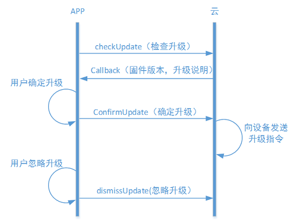

若使用场景为开启APP之后自动检测升级，建议把检测升级过程放在application里，并维护一个deviceId和ACOTAUpgradeInfo的映射关系，通过static修饰放到内存里，在进入OTA升级页面后可以直接取出来显示。如想实现用户取消升级之后不再提示功能，则可以自己维护一个变量记录。

一、获取OTA管理器对象
```
ACOTAMgr otaMgr = AC.otaMgr();
```
二、检查升级

检查设备是否有新的OTA版本，同时获取升级日志。

```
long deviceId = 1;   //设备逻辑id
int otaType = 1;      //升级类型，1为系统MCU升级
otaMgr.checkUpdate(subDomain, new ACOTACheckInfo(deviceId, otaType), new PayloadCallback<ACOTAUpgradeInfo>() {
    @Override
    public void success(ACOTAUpgradeInfo info) {
        //通过判断info.isUpdate()判断是否有新版本更新
    }
    @Override
    public void error(ACException e) {
        //网络错误或其他，根据e.getErrorCode()做不同的提示或处理
    }
});
```

三、确认升级
```
otaMgr.confirmUpdate(subDomain,deviceId, newVersion, otaType, new VoidCallback() {
    @Override
    public void success() {
        //确认升级     
    }
    @Override
    public void error(ACException e) {
        //网络错误或其他，根据e.getErrorCode()做不同的提示或处理
    }
});
```
2 蓝牙设备OTA
一、获取OTA管理器对象
```
ACOTAMgr otaMgr = AC.otaMgr();
```
二、查询OTA新版本信息
```
// 初始化当前设备的版本号等ACOtaCheckInfo信息,version为蓝牙设备当前版本
otaMgr.checkUpdate(subDomain, new ACOTACheckInfo(physicalDeviceId, version), new PayloadCallback<ACOTAUpgradeInfo>() {
    @Override
    public void success(ACOTAUpgradeInfo upgradeInfo) {
        if(!upgradeInfo.isUpdate()){
            //没有可升级的新版本
            return;
        }
        //获取升级类型
        if (upgradeInfo.getOtaMode() == 0) {
            //静默升级
        } else if(upgradeInfo.getOtaMode() == 1){
            //用户确认升级
        } else {
            //强制升级
        }
    }

    @Override
    public void error(ACException e) {
        // 查询失败    
    }
});
```
三、下载OTA文件
```
//upgradeInfo由上面接口获得；一般只有一个升级文件，所以取列表第一个文件
String url = upgradeInfo.getFiles().get(0).getDownloadUrl();
String checksum = upgradeInfo.getFiles().get(0).getCheckSum();
ACUtils.createSDDir("ota_download_path");
File file = null;
try {
    //建议首先执行垃圾文件清理工作，防止磁盘写满升级失败，同时也防止异常情况下下载文件不完整被使用 
    file = ACUtils.createSDFile("ota_download_path/file_name");
} catch (IOException e) {
}
AC.fileMgr().downloadFile(file, url, checksum, new ProgressCallback() {
    @Override
    public void progress(double progress) {
        //下载进度更新
    }, new VoidCallback() {
    @Override
    public void success() {
        //下载成功，建议调用otaMediaDone()接口通知云端下载文件成功，用于日志追踪
        //同时进行设备ota升级，另升级成功后，建议在此清理已完成升级的版本文件
    }

    @Override
    public void error(ACException e) {
        //下载失败，建议清理掉当前下载的不完整文件
    }
});
```
<h6 id='4.4.2.3.11'>推送</h6>
MAX的推送使用友盟推送提供的服务，集成步骤如下：

1 推送集成指南
参照友盟推送官方文档集成推送功能
注意

1、通过友盟后台创建应用时，安卓和iOS版本需要单独创建。
2、推送集成完毕的标准为通过友盟后台可以推送通知到APP，即代表该步骤集成完毕。
3、已经通过MAX提供的AC.notificationMgr()管理器中的接口集成友盟2.7.0版本的开发者，若需要升级到友盟最新版本的，请删除所有推送相关的代码，参照友盟推送官方文档重新集成。该步骤推送集成完毕的标准为通过友盟后台可以推送通知到APP。

2 设置推送用户别名(alias)
完成上述推送集成之后，需要设置推送的用户别名(alias)与MAX后台对接起来。步骤如下所示：
在用户调用MAX登录接口时，调用以下接口添加设置推送别名：
```
//userId为用户ID，通过登录接口返回的ACUserInfo可以获取到userId；第二个参数写死即可。
mPushAgent.addAlias(String.valueof(userId), "FnicIoTMax", new UTrack.ICallBack() {
    @Override
    public void onMessage(boolean isSuccess, String message) {

    }
});
```
用户注销退出登录时，调用以下接口移除别名：
```
//userId为用户ID，通过MAX登录接口返回的ACUserInfo可以获取到userId；第二个参数写死即可。
mPushAgent.removeAlias(String.valueof(userId), "FnicIoTMax", new UTrack.ICallBack(){
    @Override
    public void onMessage(boolean isSuccess, String message) {

    }
});
```
3 推送配置
通过以上步骤完成集成之后，创建的应用如下图所示。

记录“应用信息”中的AppKey和App Master Secret，将其填写到MAX控制台中。进入推送管理页面添加应用，并填写对应信息即可使用MAX提供的推送服务。

完成以上配置工作之后，即可以与MAX UDS服务进行对接下一步的开发测试。
<h6 id='4.4.2.3.12'>文件存储</h6>
注意：

1、下载文件到sdcard或者从sdcard上传文件到云端需要在 application 标签下增加如下权限

<uses-permission android:name="android.permission.WRITE_EXTERNAL_STORAGE"/>

2、使用文件存储需导入jar包android-async-http-1.4.9、qiniu-android-sdk-7.0.9、happy-dns-0.2.7和httpclient-4.4.1.1到libs目录下

3、上传下载支持断点续传功能
1 下载文件
1.1 获取文件管理器
```
ACFileMgr fileMgr = AC.fileMgr();
```
1.2 获取下载url
```
ACFileInfo fileInfo = new ACFileInfo(bucket, name);
//上传文件时若ACFileInfo中isPublic为true，则expireTime参数无效；默认情况为false，如下24*60*60代表url链接有效时间，即1天
fileMgr.getDownloadUrl(fileInfo, 24 * 60 * 60 ，new PayloadCallback<String>() {
    @Override
    public void success(String url) {
         //成功获取文件url
    }

    @Override
    public void error(ACException e) {
         //没有权限或其他网络错误
    }
});
```
1.3 根据url下载文件

1、下载文件到sdcard
```
ACUtils.createSDDir("myDir");
File file = null;
try {
     file = ACUtils.createSDFile("myDir/" + name);
} catch (IOException e) {
}
//0代表不校验checksum（除OTA升级外一般情况下不需要检查校验和）
fileMgr.downloadFile(file, url, 0, new ProgressCallback() {
    @Overrides
    public void progress(double progress) {
         //用于显示进度条，百分比，如99.99；如果没有显示进度条的需求则传null
    }
}, new VoidCallback() {
    @Override
    public void success() {
        //下载成功
    }

    @Override
    public void error(ACException e) {
         //支持断点续传，所以此处无网络错误，在恢复网络连接之后会继续下载
    }
});
```
2、下载文件到内存，比如头像下载
```
//0代表不校验checksum
fileMgr.downloadFile(url, 0, null, new PayloadCallback<byte[]>() {
    @Override
    public void success(byte[] bytes) {
         //下载成功
    }

    @Override
    public void error(ACException e) {
         //支持断点续传，所以此处无网络错误，在恢复网络连接之后会继续下载
    }
});
```
2 上传文件
2.1 获取文件管理器

ACFileMgr fileMgr = AC.fileMgr();
2.2 设置权限管理

如果对文件的管理有权限管理方面的需求的话，则需要使用到以下接口；如不设置情况下则默认所有用户都有读取权限，只有上传者本人有修改写文件的权限。
```
//acl为权限管理
ACACL acl = new ACACL();
//设置所有人可读，黑名单除外(或者设置所有人不可读，白名单除外)
acl.setPublicReadAccess(true);
//设置所有人可写，黑名单除外(或者设置所有人不可写，白名单除外)
acl.setPublicWriteAccess(true);
//设置黑名单，userId为1的用户没有读的权限
acl.setUserDeny(ACACL.OpType.READ, 1);
//设置白名单，userId为1的用户有写的权限
acl.setUserAccess(ACACL.OpType.WRITE, 1);
```
规则：优先判断黑名单，黑名单命中后其他设置无效，其次判断白名单，最后判断全局设置属性。例如同时设置userId为1的用户为黑名单和白名单，则设置的白名单无效。

2.3 上传文件

1、上传sdcard文件
```
//bucket可理解为文件存储在云端的目录，name为文件名。（开发者自己维护通过这两个参数保证上传的所有文件在云端不会重名，建议通过UUID的方式命名文件或者以用户／设备唯一标识命名bucket），重目录重名的情况下原文件会被覆盖。另外可通过这两个参数获取到下载的url。
ACFileInfo fileInfo = new ACFileInfo(bucket, name);
//设置acl权限，可选
fileInfo.setACL(acl);
//设置上传文件的sdcard路径
fileInfo.setFile(new File(Environment.getExternalStorageDirectory() + "/myDir/" + name));
fileMgr.uploadFile(fileInfo, new ProgressCallback() {
    @Override
    public void progress(double progress) {
         //用于显示进度条，百分比，如99.99；如果没有显示进度条的需求则传null
    }
}, new VoidCallback() {
    @Override
    public void success() {
         //上传成功
    }

    @Override
    public void error(ACException e) {
         //支持断点续传，所以此处无网络错误，在恢复网络连接之后会继续上传
    }
});
```
2、上传小文件，比如头像
```
//bucket可理解为文件存储在云端的目录，name为文件名。（开发者自己维护通过这两个参数保证上传的所有文件在云端不会重名，建议通过UUID的方式命名文件或者以用户／设备唯一标识命名bucket），重目录重名的情况下原文件会被覆盖。另外可通过这两个参数获取到下载的url。
ACFileInfo fileInfo = new ACFileInfo(bucket, name);
//设置acl权限，可选
fileInfo.setACL(acl);
//比如头像比特流数组
fileInfo.setData(bytes);
fileMgr.uploadFile(fileInfo, null, new VoidCallback() {
    @Override
    public void success() {
        //上传成功
    }

    @Override
    public void error(ACException e) {
        //支持断点续传，所以此处无网络错误，在恢复网络连接之后会继续上传
    }
});
```
<h6 id='4.4.2.3.13'>辅助功能</h6>
SDK提供了一些额外的辅助功能

1 用户意见反馈
注意：如意见反馈中包含图片则需导入jar包android-async-http-1.4.9、qiniu-android-sdk-7.0.9、happy-dns-0.2.7和httpclient-4.4.1.1到libs目录下
提供APP端的用户意见反馈接口。开发者可以开发用户提交意见的页面。用户意见反馈可以反馈的项由开发者自己定义。 使用意见反馈前,需要先在控制台设置反馈项参数


代码示例:
```
//picture1、picture2为图片的二进制流
byte[] picture1;
byte[] picture2;

ACFeedback feedback = new ACFeedback();
feedback.addFeedback("description", "App体验良好，继续加油哦");                  
feedback.addFeedback("telephoneNumber", "13333333333");                             
feedback.addFeedbackPicture("pictures", picture1);    
feedback.addFeedbackPicture("pictures", picture2);          
AC.feedbackMgr().submitFeedback(feedback, new VoidCallback(){
    @Override
    public void success(){                                 
        //成功提交用户反馈信息
    }

    @Override
    public void error(ACException e) {
        //网络错误或其他，根据e.getErrorCode()做不同的提示或处理，此处一般为参数错误，请对照MAX控制台填写的key与value类型
    }
});
```
2 获取室外天气
SDK可以获取到室外的pm2.5, AQI(空气质量)以及天气状况.

如获取最新pm25，代码如下：
```
AC.weatherMgr().getLatestPM25("北京", new PayloadCallback<ACPM25>() {
    @Override
    public void success(ACPM25 pm25) {
        //成功获取最新pm25信息
        LogUtil.d(TAG, pm25.toString());
    }

    @Override
    public void error(ACException e) {
        //通过e.toString()查看错误信息
    }
 });
```
3 排行榜
除了提供丰富的存储管理外，还提供了排行榜的功能需求，能够支持按照不同排行周期进行排行操作。

如下我们以记步排行为例，需求如下：

每天进行实时的记步排名，显示当前所有人的步数及排行（页面显示包含昵称与头像）；除此之外，我们还要求进行周统计，以周为单位显示每天的运动步数及排行。

新建排行榜

登录MAX管理平台，选择应用组件–>排行榜–>新建排行榜，如下图所示：


记步的统计周期一般都为每天，所以我们新建以天为统计周期的排行榜。时区我们以北京时间为例，选择东八区。
新建用户附加属性

登录MAX管理平台，选择应用组件–>用户服务–>用户属性设置，如下图所示：


由于我们需要显示所有用户的昵称、头像及排名名次，所以我们要新建用户附加属性，同时设置头像的访问权限为Public。（昵称为用户的基本属性，可以不用新建）
设置步行步数

当打开我们的app之后，我们从设备(手环)/手机获取到今天的步行步数，这时我们需要调用以下接口
```
//如我们获取到的当前步行步数为10000
double score = 10000;
//timestamp为0代表当前时间
AC.rankingMgr().set("Sports_step", 0, score, new VoidCallback(){
    public void success(){
        //步数设置成功
    }

    @Override
    public void error(ACException e) {
        //步数设置失败，通过e.toString()查看错误信息，并根据e.getErrorCode()错误码做不同处理。      
    }
});
```

获取所有用户的步数及排名
```
//timestamp为0代表当前时间，即今天实时的步数排名；startRank与endRank为1和-1，代表从第一名到最后一名；步数是越多排名越靠前，所以我们使用正序排名
AC.rankingMgr().scan("Sports_step", "day", 0, 1, -1, "ASC", new PayloadCallback<List<ACRankingValue>>() {
    public void success(List<ACRankingValue> values) {
        //values在云端已经进行排序处理，也就是说values.get(0).getPlace()为1
        for (ACRankingValue value : values) {
            //获取排名
            long place = value.getPlace();
            //获取当前步数
            double score = value.getScore();
            //获取该排名用户的附加属性
            ACObject profile = value.getProfile();
            //获取该排名用户的uid
            long uid = profile.get("uid");
            //获取该排名用户的昵称
            String nickName = profile.getString("nick_name");
            //检测该排名用户是否设置了头像,如设置了则获取头像url
            if (profile.contains("head_url")) {
                String headUrl = profile.getString("head_url");
            }
        }
    }

    @Override
    public void error(ACException e) {
        //获取所有人排名失败，通过e.toString()查看错误信息，并根据e.getErrorCode()错误码做不同处理。      
    }
});
```
获取当前用户最近一周每天的步数及排名

我们需要进行周统计（每周从周一开始），并画柱状图显示每天的步数及排名。如下为获取当周每天的步数及排名
```
//获取当前今天为星期几
int dayOfWeek = Calendar.getInstance().get(Calendar.DAY_OF_WEEK);
//dayOfWeek为1表示星期天，所以取最近7天的数据；dayOfWeek为2-7，即星期一到星期六，则取(dayOfWeek - 1)天的数据
int count = dayOfWeek == 1 ? 7 : dayOfWeek - 1;
//timestamp为0代表当前时间，向前取count天
AC.rankingMgr().ranks("Sports_step", "day", 0, count, "ASC", new PayloadCallback<List<ACRankingValue>>() {
    public void success(List<ACRankingValue> values) {
        for (ACRankingValue value : values) {
            //获取排名
            long place = value.getPlace();
            //获取当前步数
            double score = value.getScore();
            //时间，通过该字段转化为需要显示的时间，如下所示
            long timestamp = value.getTimestamp();
            String timeDisplay = new SimpleDateFormat("yyyy-MM-dd HH:mm:ss").format(timestamp);
        }
    }

    @Override
    public void error(ACException e) {
        //获取失败，通过e.toString()查看错误信息，并根据e.getErrorCode()错误码做不同处理。   
    }
});
```
据此，获取上周每天的步数及排名
```
int dayOfWeek = Calendar.getInstance().get(Calendar.DAY_OF_WEEK);
int count = dayOfWeek == 1 ? 7 : dayOfWeek - 1;
long timestamp = System.currentTimeMills()/1000 - count * 24 * 60 * 60;
AC.rankingMgr().ranks("Sports_step", "day", timestamp, 7, "ASC", new PayloadCallback<List<ACRankingValue>>() {
    public void success(List<ACRankingValue> values) {
        ...
    }

    @Override
    public void error(ACException e) {
        //获取失败，通过e.toString()查看错误信息，并根据e.getErrorCode()错误码做不同处理。    
    }
}
```

